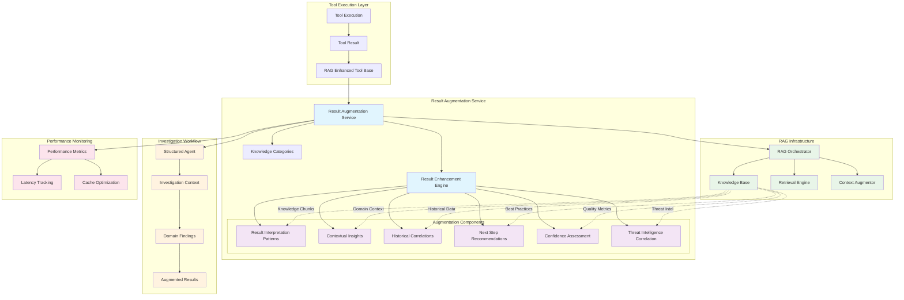
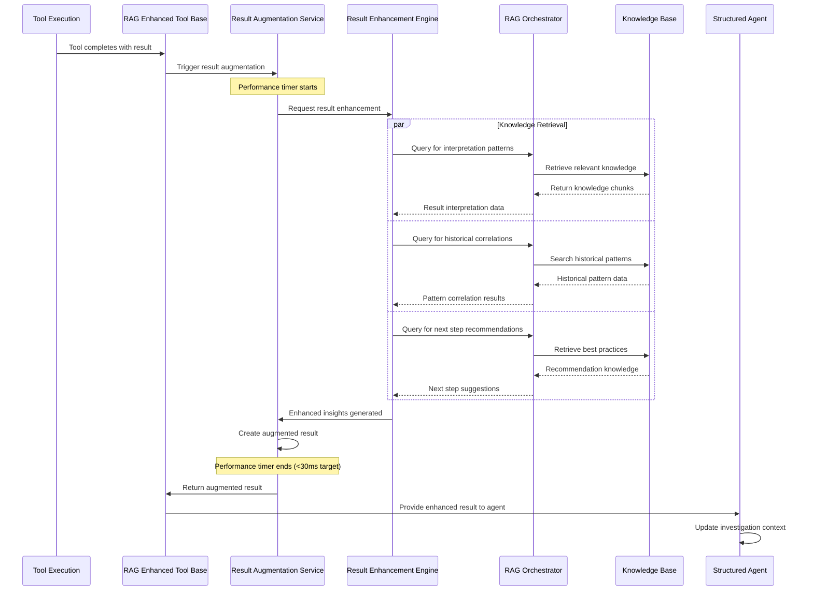
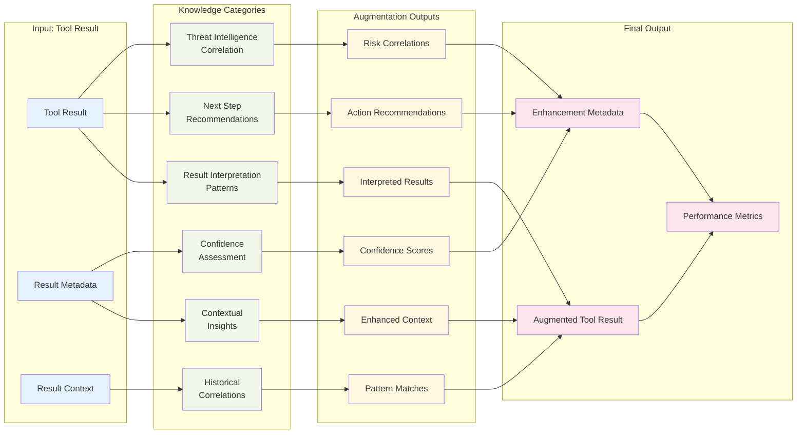
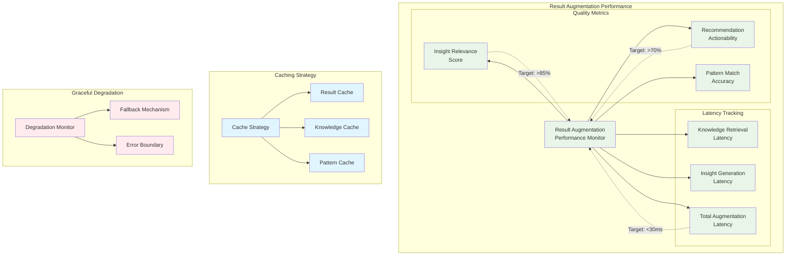
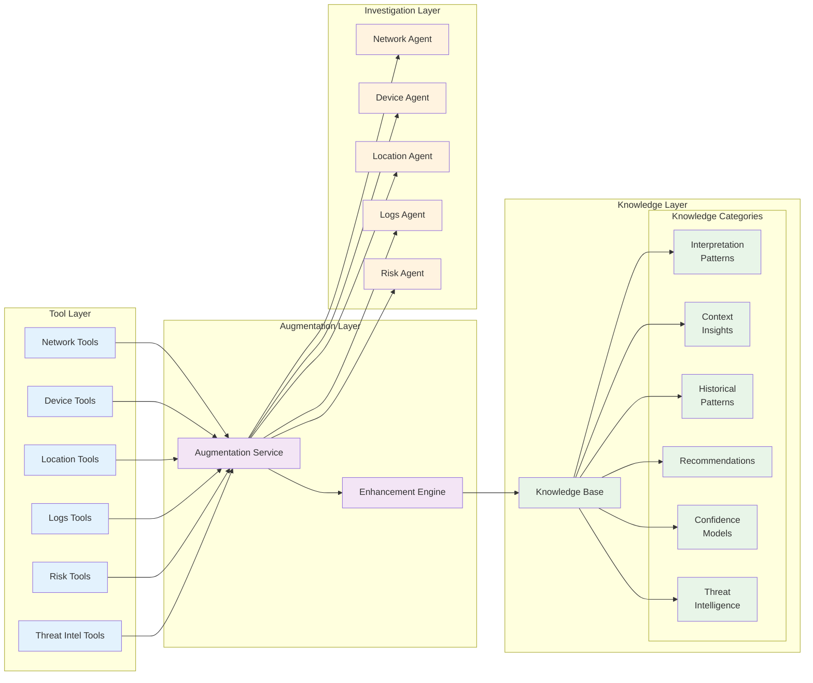

# Tool Result Knowledge Augmentation Architecture Diagram

**Date**: 2025-01-04  
**Plan**: [Tool Result Knowledge Augmentation Implementation Plan](/docs/plans/2025-01-04-tool-result-knowledge-augmentation-implementation-plan.md)  
**Author**: Gil Klainert

## System Architecture Overview

## Result Augmentation Process Flow

## Knowledge Categories Integration

## Performance and Monitoring Architecture

## Data Flow and Integration Points

## Integration Benefits and Outcomes

### Enhanced Investigation Workflow
- **Contextual Understanding**: Tool results include domain-specific interpretation
- **Historical Context**: Results correlated with similar past investigations  
- **Actionable Insights**: Knowledge-based next step recommendations
- **Confidence Scoring**: Reliability assessment based on knowledge coverage
- **Threat Intelligence**: Automatic correlation with threat intelligence data

### Performance Characteristics
- **Sub-30ms Latency**: Fast result augmentation maintaining workflow speed
- **High Cache Hit Rate**: >80% cache utilization for common patterns
- **Graceful Degradation**: Full functionality even when RAG unavailable
- **Scalable Processing**: Concurrent augmentation across multiple tools

### Knowledge Integration
- **6 Knowledge Categories**: Comprehensive coverage of result enhancement aspects
- **Dynamic Learning**: System learns from new investigation patterns
- **Cross-Domain Insights**: Knowledge sharing between investigation domains
- **Quality Assurance**: Built-in validation and confidence assessment