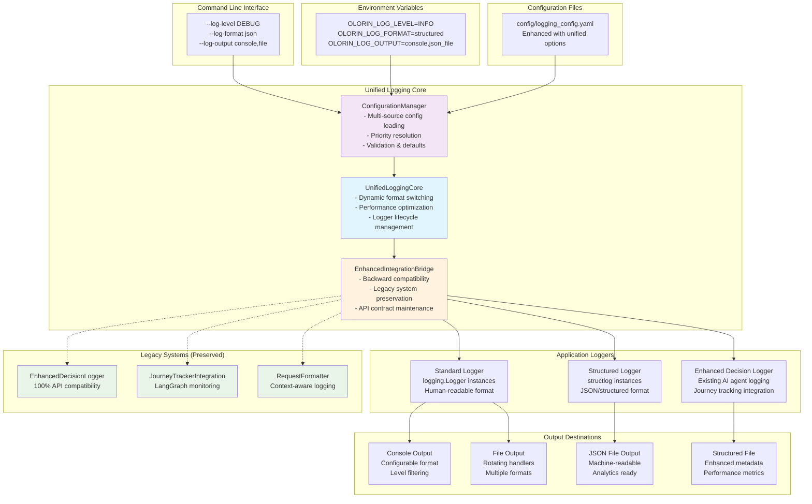
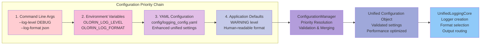
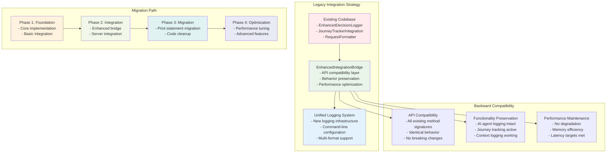
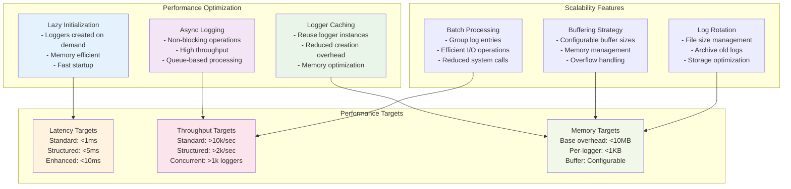
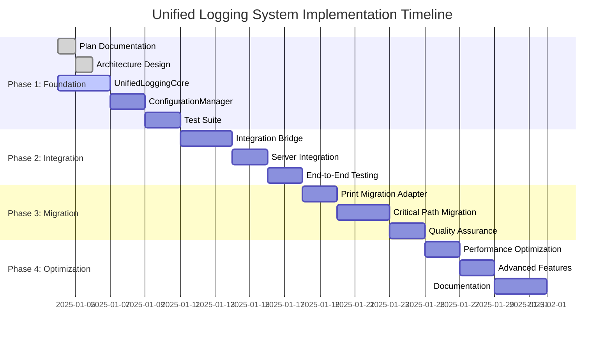

# Unified Logging System Architecture

**Date**: 2025-01-04  
**Plan Reference**: [2025-01-04-unified-logging-system-plan.md](/docs/plans/2025-01-04-unified-logging-system-plan.md)

## System Architecture Overview



## Configuration Flow Diagram



## Logger Creation and Management

```mermaid
graph TB
    subgraph "Logger Creation Process"
        APP[Application Request<br>get_unified_logger(__name__)]
        
        ULC[UnifiedLoggingCore<br>Logger factory]
        
        CHECK{Logger exists?}
        
        CREATE[Create New Logger<br>- Standard or Structured<br>- Apply configuration<br>- Set handlers & formatters]
        
        CACHE[Cache Logger Instance<br>Performance optimization]
        
        RETURN[Return Logger Instance<br>Ready for use]
        
        EXISTING[Return Cached Logger<br>Reuse existing instance]
    end
    
    APP --> ULC
    ULC --> CHECK
    CHECK -->|No| CREATE
    CHECK -->|Yes| EXISTING
    CREATE --> CACHE
    CACHE --> RETURN
    EXISTING --> RETURN
    
    subgraph "Logger Types"
        STD_LOG[Standard Logger<br>- Python logging module<br>- Human-readable format<br>- General application use]
        
        STRUCT_LOG[Structured Logger<br>- structlog library<br>- JSON/structured format<br>- Enhanced metadata]
        
        ENH_LOG[Enhanced Decision Logger<br>- AI agent decisions<br>- Performance metrics<br>- Journey tracking]
    end
    
    CREATE --> STD_LOG
    CREATE --> STRUCT_LOG
    CREATE --> ENH_LOG
    
    style CREATE fill:#c8e6c9
    style CACHE fill:#dcedc8
    style STD_LOG fill:#e3f2fd
    style STRUCT_LOG fill:#fce4ec
    style ENH_LOG fill:#fff8e1
```

## Integration with Existing Systems



## Performance and Scalability Architecture



## Implementation Status Tracking



---

**Architecture Status**: ✅ Complete - Ready for Implementation  
**Next Phase**: UnifiedLoggingCore Implementation