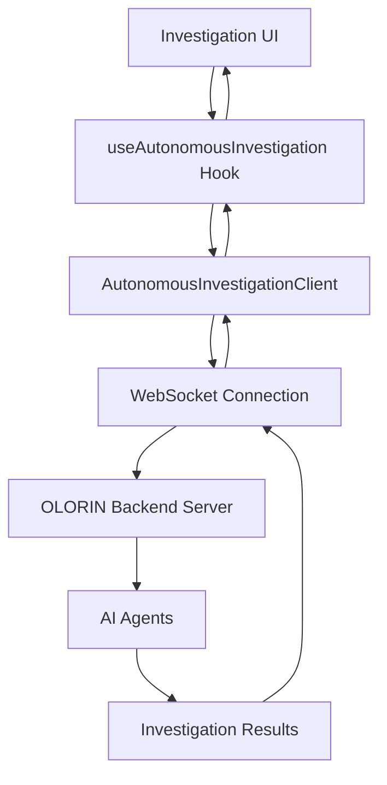

# 🤖 Autonomous Investigation Technical Guide

## Overview

The Autonomous Investigation system provides AI-powered fraud investigation
capabilities with real-time monitoring and control. This guide covers the
technical implementation, architecture, and development practices.

## Table of Contents

- [Architecture](#architecture)
- [Core Components](#core-components)
- [WebSocket Communication](#websocket-communication)
- [State Management](#state-management)
- [Error Handling](#error-handling)
- [Testing Strategy](#testing-strategy)
- [Performance Considerations](#performance-considerations)
- [Deployment](#deployment)
- [Troubleshooting](#troubleshooting)

## Architecture

### System Overview



### Component Hierarchy

```
InvestigationPage
├── Mode Toggle (Manual/Autonomous)
├── Manual Investigation Panel
└── AutonomousInvestigationPanel
    ├── Progress Tracking
    ├── Control Buttons
    ├── Status Display
    └── Results Display
```

## Core Components

### 1. AutonomousInvestigationClient

**Location**: `src/js/services/AutonomousInvestigationClient.ts`

**Purpose**: Manages WebSocket connections and investigation lifecycle.

**Key Methods**:

```typescript
class AutonomousInvestigationClient {
  // Connection management
  connect(investigationId: string, parallel: boolean): Promise<void>;
  disconnect(): void;

  // Investigation control
  startInvestigation(entityId: string, entityType: EntityType): Promise<void>;
  pauseInvestigation(): Promise<void>;
  resumeInvestigation(): Promise<void>;
  cancelInvestigation(): Promise<void>;

  // Event handling
  onPhaseUpdate(callback: (data: PhaseUpdateData) => void): void;
  onStatusUpdate(callback: (data: StatusUpdateData) => void): void;
  onError(callback: (error: InvestigationError) => void): void;
  onComplete(callback: (results: InvestigationResults) => void): void;
}
```

**Features**:

- Automatic reconnection with exponential backoff
- Message queuing during disconnection
- Heartbeat monitoring
- Error recovery mechanisms

### 2. useAutonomousInvestigation Hook

**Location**: `src/js/hooks/useAutonomousInvestigation.ts`

**Purpose**: React hook for autonomous investigation state management.

**Interface**:

```typescript
interface UseAutonomousInvestigationReturn {
  // State
  isConnected: boolean;
  currentPhase: InvestigationPhase;
  progress: number;
  status: InvestigationStatus;
  results: InvestigationResults;
  error: string | null;

  // Actions
  startInvestigation: (
    entityId: string,
    entityType: EntityType,
    parallel?: boolean,
  ) => Promise<void>;
  pauseInvestigation: () => Promise<void>;
  resumeInvestigation: () => Promise<void>;
  cancelInvestigation: () => Promise<void>;

  // Cleanup
  cleanup: () => void;
}
```

**Usage Example**:

```typescript
const {
  isConnected,
  currentPhase,
  progress,
  startInvestigation,
  pauseInvestigation,
  results,
} = useAutonomousInvestigation();

// Start investigation
await startInvestigation('user123', 'user_id', true);

// Monitor progress
useEffect(() => {
  console.log(`Phase: ${currentPhase}, Progress: ${progress}%`);
}, [currentPhase, progress]);
```

### 3. AutonomousInvestigationPanel Component

**Location**: `src/components/AutonomousInvestigationPanel.tsx`

**Purpose**: UI component for autonomous investigation interface.

**Features**:

- Real-time progress visualization
- Investigation phase indicators
- Control buttons (start/pause/resume/cancel)
- Results display with agent-specific data
- Error handling and user feedback

**Props Interface**:

```typescript
interface AutonomousInvestigationPanelProps {
  entityId: string;
  entityType: EntityType;
  onComplete?: (results: InvestigationResults) => void;
  onError?: (error: string) => void;
}
```

## WebSocket Communication

### Connection Management

**Endpoint**: `ws://localhost:8000/ws/{investigation_id}?parallel={true|false}`

**Connection Flow**:

1. Establish WebSocket connection
2. Send authentication headers
3. Receive connection confirmation
4. Start receiving real-time updates

**Message Types**:

```typescript
// Phase update message
interface PhaseUpdateMessage {
  type: 'phase_update';
  phase: InvestigationPhase;
  progress: number;
  message: string;
  agent_response?: AgentResponse;
  timestamp: string;
}

// Status update message
interface StatusUpdateMessage {
  type: 'status_update';
  investigation_id: string;
  status: InvestigationStatus;
  current_phase: InvestigationPhase;
  progress: number;
  message: string;
  timestamp: string;
}

// Error message
interface ErrorMessage {
  type: 'error';
  investigation_id: string;
  error_code: string;
  message: string;
  phase?: InvestigationPhase;
  timestamp: string;
  retry_available: boolean;
}

// Control message (client to server)
interface ControlMessage {
  type: 'control';
  action: 'pause' | 'resume' | 'cancel';
  investigation_id: string;
}
```

### Reconnection Strategy

```typescript
class ReconnectionManager {
  private maxRetries = 5;
  private baseDelay = 1000; // 1 second
  private maxDelay = 30000; // 30 seconds

  async reconnect(attempt: number): Promise<void> {
    const delay = Math.min(
      this.baseDelay * Math.pow(2, attempt),
      this.maxDelay,
    );

    await new Promise((resolve) => setTimeout(resolve, delay));

    try {
      await this.connect();
    } catch (error) {
      if (attempt < this.maxRetries) {
        return this.reconnect(attempt + 1);
      }
      throw error;
    }
  }
}
```

## State Management

### Investigation State

```typescript
interface InvestigationState {
  // Connection state
  isConnected: boolean;
  connectionStatus: 'connecting' | 'connected' | 'disconnected' | 'error';

  // Investigation state
  investigationId: string | null;
  status: InvestigationStatus;
  currentPhase: InvestigationPhase;
  progress: number;

  // Results
  results: Record<InvestigationPhase, AgentResponse>;
  finalResults: InvestigationResults | null;

  // Error handling
  error: string | null;
  lastError: InvestigationError | null;

  // Control state
  isPaused: boolean;
  isCancelled: boolean;
  canResume: boolean;
}
```

### State Transitions

```typescript
// State machine for investigation status
const investigationStateMachine = {
  IDLE: ['STARTING'],
  STARTING: ['IN_PROGRESS', 'FAILED'],
  IN_PROGRESS: ['PAUSED', 'COMPLETED', 'CANCELLED', 'FAILED'],
  PAUSED: ['IN_PROGRESS', 'CANCELLED'],
  COMPLETED: ['IDLE'],
  CANCELLED: ['IDLE'],
  FAILED: ['IDLE'],
};
```

## Error Handling

### Error Types

```typescript
enum InvestigationErrorType {
  CONNECTION_ERROR = 'CONNECTION_ERROR',
  AUTHENTICATION_ERROR = 'AUTHENTICATION_ERROR',
  AGENT_FAILURE = 'AGENT_FAILURE',
  TIMEOUT_ERROR = 'TIMEOUT_ERROR',
  VALIDATION_ERROR = 'VALIDATION_ERROR',
  UNKNOWN_ERROR = 'UNKNOWN_ERROR',
}

interface InvestigationError {
  type: InvestigationErrorType;
  message: string;
  phase?: InvestigationPhase;
  timestamp: string;
  retryable: boolean;
  details?: Record<string, any>;
}
```

### Error Recovery Strategies

1. **Connection Errors**: Automatic reconnection with exponential backoff
2. **Agent Failures**: Retry individual agents up to 3 times
3. **Timeout Errors**: Increase timeout and retry
4. **Authentication Errors**: Refresh tokens and reconnect
5. **Validation Errors**: Surface to user for correction

### Error Handling Implementation

```typescript
class ErrorHandler {
  handleError(error: InvestigationError): void {
    switch (error.type) {
      case InvestigationErrorType.CONNECTION_ERROR:
        this.handleConnectionError(error);
        break;
      case InvestigationErrorType.AGENT_FAILURE:
        this.handleAgentFailure(error);
        break;
      case InvestigationErrorType.TIMEOUT_ERROR:
        this.handleTimeoutError(error);
        break;
      default:
        this.handleGenericError(error);
    }
  }

  private async handleConnectionError(
    error: InvestigationError,
  ): Promise<void> {
    if (error.retryable) {
      await this.reconnectionManager.reconnect(0);
    } else {
      this.notifyUser('Connection failed permanently');
    }
  }

  private async handleAgentFailure(error: InvestigationError): Promise<void> {
    const retryCount = this.getRetryCount(error.phase);
    if (retryCount < 3) {
      await this.retryAgent(error.phase);
    } else {
      this.skipAgent(error.phase);
    }
  }
}
```

## Testing Strategy

### Unit Tests

**Test Coverage Areas**:

- AutonomousInvestigationClient methods
- WebSocket message handling
- Error scenarios and recovery
- State transitions
- Hook behavior

**Example Test**:

```typescript
describe('AutonomousInvestigationClient', () => {
  let client: AutonomousInvestigationClient;
  let mockWebSocket: jest.Mocked<WebSocket>;

  beforeEach(() => {
    mockWebSocket = createMockWebSocket();
    client = new AutonomousInvestigationClient();
  });

  it('should handle phase updates correctly', async () => {
    const phaseUpdateCallback = jest.fn();
    client.onPhaseUpdate(phaseUpdateCallback);

    // Simulate WebSocket message
    const phaseUpdate = {
      type: 'phase_update',
      phase: 'network_analysis',
      progress: 0.5,
      message: 'Network analysis in progress',
    };

    mockWebSocket.onmessage({ data: JSON.stringify(phaseUpdate) });

    expect(phaseUpdateCallback).toHaveBeenCalledWith(phaseUpdate);
  });

  it('should handle connection errors with retry', async () => {
    const errorCallback = jest.fn();
    client.onError(errorCallback);

    // Simulate connection error
    mockWebSocket.onerror(new Error('Connection failed'));

    // Should attempt reconnection
    expect(client.isReconnecting).toBe(true);
  });
});
```

### Integration Tests

**Test Scenarios**:

- End-to-end investigation flow
- WebSocket connection and disconnection
- Error recovery mechanisms
- UI component interactions

### E2E Tests

**Cypress Tests**:

```typescript
describe('Autonomous Investigation', () => {
  it('should complete full investigation flow', () => {
    cy.visit('/investigation?demo=true');

    // Switch to autonomous mode
    cy.get('[data-testid="mode-toggle"]').click();
    cy.get('[data-testid="autonomous-mode"]').should('be.visible');

    // Start investigation
    cy.get('[data-testid="entity-input"]').type('user123');
    cy.get('[data-testid="start-investigation"]').click();

    // Monitor progress
    cy.get('[data-testid="progress-bar"]').should('be.visible');
    cy.get('[data-testid="current-phase"]').should('contain', 'initialization');

    // Wait for completion
    cy.get('[data-testid="investigation-complete"]', { timeout: 60000 }).should(
      'be.visible',
    );

    // Verify results
    cy.get('[data-testid="final-risk-score"]').should('exist');
    cy.get('[data-testid="agent-results"]').should(
      'have.length.greaterThan',
      0,
    );
  });
});
```

## Performance Considerations

### WebSocket Optimization

1. **Message Batching**: Batch multiple updates to reduce UI re-renders
2. **Throttling**: Limit update frequency to prevent UI lag
3. **Memory Management**: Clean up event listeners and connections
4. **Connection Pooling**: Reuse connections when possible

### UI Performance

```typescript
// Throttle progress updates to prevent excessive re-renders
const throttledProgressUpdate = useCallback(
  throttle((progress: number) => {
    setProgress(progress);
  }, 100), // Update at most every 100ms
  [],
);

// Memoize expensive calculations
const riskScoreColor = useMemo(() => {
  return calculateRiskScoreColor(finalRiskScore);
}, [finalRiskScore]);

// Virtualize large result lists
const VirtualizedResultsList = ({ results }) => {
  return (
    <FixedSizeList height={400} itemCount={results.length} itemSize={60}>
      {({ index, style }) => (
        <div style={style}>
          <ResultItem result={results[index]} />
        </div>
      )}
    </FixedSizeList>
  );
};
```

### Memory Management

```typescript
// Cleanup function for the hook
useEffect(() => {
  return () => {
    // Clean up WebSocket connection
    client.disconnect();

    // Clear timers
    clearTimeout(heartbeatTimer);
    clearTimeout(reconnectionTimer);

    // Remove event listeners
    client.removeAllListeners();

    // Clear results cache
    setResults({});
  };
}, []);
```

## Deployment

### Environment Configuration

```typescript
// Environment-specific configuration
const config = {
  development: {
    websocketUrl: 'ws://localhost:8000',
    reconnectionAttempts: 3,
    heartbeatInterval: 30000,
  },
  staging: {
    websocketUrl: 'wss://staging-api.olorin.intuit.com',
    reconnectionAttempts: 5,
    heartbeatInterval: 60000,
  },
  production: {
    websocketUrl: 'wss://api.olorin.intuit.com',
    reconnectionAttempts: 10,
    heartbeatInterval: 60000,
  },
};
```

### Build Configuration

```javascript
// webpack.config.js
module.exports = {
  // ... other config
  resolve: {
    alias: {
      '@': path.resolve(__dirname, 'src'),
      '@components': path.resolve(__dirname, 'src/components'),
      '@services': path.resolve(__dirname, 'src/js/services'),
      '@hooks': path.resolve(__dirname, 'src/js/hooks'),
    },
  },
};
```

### Monitoring and Logging

```typescript
// Logging configuration
const logger = {
  info: (message: string, data?: any) => {
    console.log(`[AUTONOMOUS] ${message}`, data);
    // Send to monitoring service
    sendToMonitoring('info', message, data);
  },

  error: (message: string, error?: Error) => {
    console.error(`[AUTONOMOUS] ${message}`, error);
    // Send to error tracking service
    sendToErrorTracking(message, error);
  },

  performance: (metric: string, value: number) => {
    console.log(`[PERFORMANCE] ${metric}: ${value}ms`);
    // Send to performance monitoring
    sendToPerformanceMonitoring(metric, value);
  },
};
```

## Troubleshooting

### Common Issues

1. **WebSocket Connection Fails**

   - Check network connectivity
   - Verify WebSocket URL and authentication
   - Check firewall and proxy settings

2. **Investigation Hangs**

   - Check agent service status
   - Verify investigation ID is valid
   - Check for timeout configurations

3. **Memory Leaks**

   - Ensure proper cleanup in useEffect
   - Check for unclosed WebSocket connections
   - Monitor event listener cleanup

4. **Performance Issues**
   - Enable React DevTools Profiler
   - Check for unnecessary re-renders
   - Monitor WebSocket message frequency

### Debug Tools

```typescript
// Debug utility for autonomous investigations
class AutonomousInvestigationDebugger {
  private logs: DebugLog[] = []

  log(level: 'info' | 'warn' | 'error', message: string, data?: any): void {
    const log = {
      timestamp: new Date().toISOString(),
      level,
      message,
      data
    }

    this.logs.push(log)
    console.log(`[DEBUG] ${message}`, data)
  }

  exportLogs(): string {
    return JSON.stringify(this.logs, null, 2)
  }

  clearLogs(): void {
    this.logs = []
  }
}

// Usage
const debugger = new AutonomousInvestigationDebugger()
debugger.log('info', 'Investigation started', { investigationId, entityId })
```

### Performance Monitoring

```typescript
// Performance monitoring for autonomous investigations
class PerformanceMonitor {
  private metrics: Map<string, number> = new Map();

  startTimer(name: string): void {
    this.metrics.set(name, performance.now());
  }

  endTimer(name: string): number {
    const startTime = this.metrics.get(name);
    if (!startTime) return 0;

    const duration = performance.now() - startTime;
    this.metrics.delete(name);

    logger.performance(name, duration);
    return duration;
  }
}

// Usage
const monitor = new PerformanceMonitor();
monitor.startTimer('investigation-duration');
// ... investigation logic
const duration = monitor.endTimer('investigation-duration');
```

## Best Practices

1. **Error Handling**: Always implement comprehensive error handling
2. **State Management**: Use the provided hooks for consistent state
3. **Performance**: Monitor and optimize WebSocket message handling
4. **Testing**: Write tests for both success and failure scenarios
5. **Documentation**: Keep API documentation updated
6. **Security**: Validate all WebSocket messages
7. **Monitoring**: Implement proper logging and monitoring
8. **Cleanup**: Always clean up resources in useEffect cleanup functions

## Future Enhancements

1. **Investigation Templates**: Pre-configured investigation workflows
2. **Batch Investigations**: Process multiple entities simultaneously
3. **Custom Agents**: Allow users to add custom analysis agents
4. **Investigation Scheduling**: Schedule investigations for later execution
5. **Advanced Analytics**: Historical analysis and trend detection
6. **Mobile Support**: Responsive design for mobile devices
7. **Offline Support**: Cache results for offline viewing
8. **Export Features**: Export investigation reports in various formats
