# OLORIN MCP Architecture Documentation

## Table of Contents
1. [System Overview](#1-system-overview)
2. [MCP Integration Architecture](#2-mcp-integration-architecture)
3. [Authentication & Security](#3-authentication--security)
4. [Tool Ecosystem](#4-tool-ecosystem)
5. [Environment Configuration](#5-environment-configuration)
6. [API Specifications](#6-api-specifications)
7. [Data Flow & Processing](#7-data-flow--processing)
8. [Deployment Architecture](#8-deployment-architecture)

---

## 1. System Overview

### 1.1 High-Level Architecture

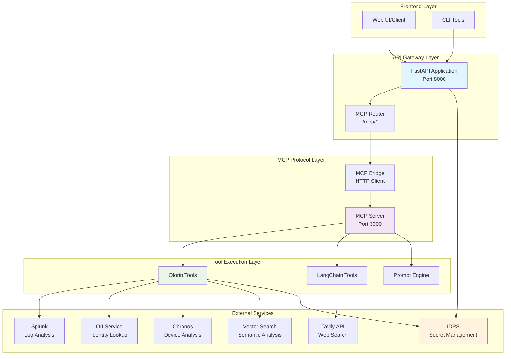

### 1.2 Component Responsibilities

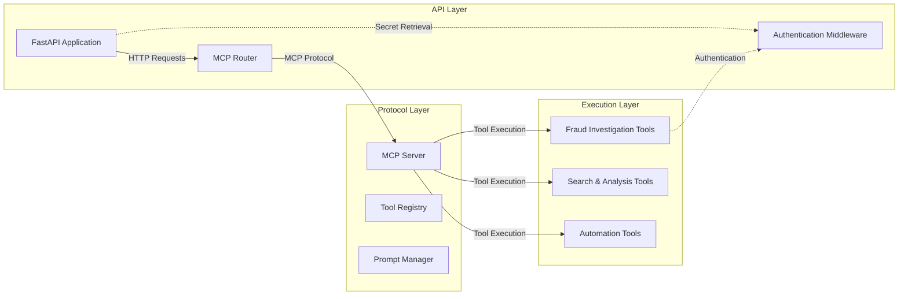

---

## 2. MCP Integration Architecture

### 2.1 MCP Protocol Flow

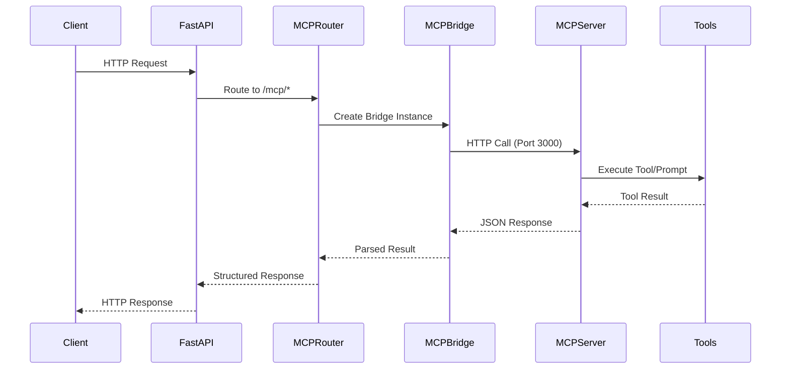

### 2.2 MCP Server Internal Architecture

```mermaid
graph TB
    subgraph "MCP Server (Port 3000)"
        subgraph "HTTP Endpoints"
            Health[/health]
            Status[/resources/olorin/status]
            Tools[/resources/olorin/tools]
            ToolCall[/tools/call]
            Prompts[/prompts]
            CustomPrompt[/prompts/custom]
            Templates[/prompts/templates/*]
        end
        
        subgraph "Tool Management"
            ToolRegistry[Tool Registry]
            OlorinToolsInit[Olorin Tools Initializer]
            LangChainInit[LangChain Tools Initializer]
        end
        
        subgraph "Prompt Management"
            PromptEngine[Prompt Engine]
            TemplateManager[Template Manager]
            CustomPrompts[Custom Prompt Executor]
        end
        
        subgraph "Authentication"
            AuthContext[Auth Context Creator]
            TokenManager[Token Manager]
            IDPSClient[IDPS Client]
        end
    end
    
    Health --> ToolRegistry
    Status --> ToolRegistry
    Tools --> ToolRegistry
    ToolCall --> ToolRegistry
    
    Prompts --> PromptEngine
    CustomPrompt --> CustomPrompts
    Templates --> TemplateManager
    
    ToolRegistry --> OlorinToolsInit
    ToolRegistry --> LangChainInit
    
    OlorinToolsInit --> AuthContext
    AuthContext --> TokenManager
    TokenManager --> IDPSClient
    
    style ToolRegistry fill:#e8f5e8
    style PromptEngine fill:#f3e5f5
    style AuthContext fill:#fff3e0
```

### 2.3 FastAPI Router Bridge Architecture

```mermaid
graph TB
    subgraph "FastAPI Router (/mcp)"
        subgraph "Endpoints"
            Status[GET /status]
            ToolsList[GET /tools]
            Categories[GET /tools/categories]
            Execute[POST /tools/{name}/execute]
            PromptsList[GET /prompts]
            PromptExec[POST /prompts/{name}/execute]
            Health[GET /health]
        end
        
        subgraph "Bridge Layer"
            MCPBridge[MCP Bridge Class]
            HTTPClient[HTTP Client Pool]
            ResponseParser[Response Parser]
            ErrorHandler[Error Handler]
        end
        
        subgraph "Models"
            ToolInfo[Tool Info Model]
            ToolCategory[Tool Category Model]
            ToolResponse[Tool Response Model]
            PromptResponse[Prompt Response Model]
        end
    end
    
    Status --> MCPBridge
    ToolsList --> MCPBridge
    Categories --> MCPBridge
    Execute --> MCPBridge
    PromptsList --> MCPBridge
    PromptExec --> MCPBridge
    Health --> MCPBridge
    
    MCPBridge --> HTTPClient
    MCPBridge --> ResponseParser
    MCPBridge --> ErrorHandler
    
    ResponseParser --> ToolInfo
    ResponseParser --> ToolCategory
    ResponseParser --> ToolResponse
    ResponseParser --> PromptResponse
    
    style MCPBridge fill:#e1f5fe
    style HTTPClient fill:#f3e5f5
```

---

## 3. Authentication & Security

### 3.1 IDPS Integration Flow

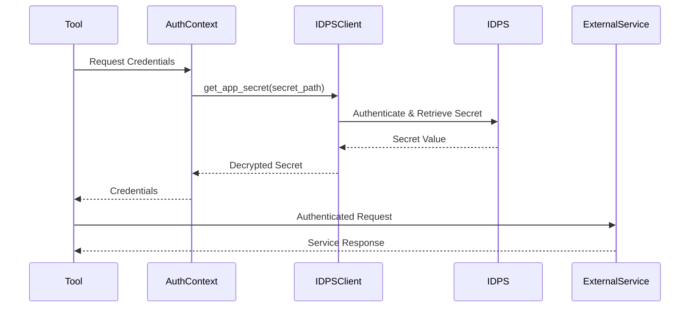

### 3.2 Secret Management Architecture

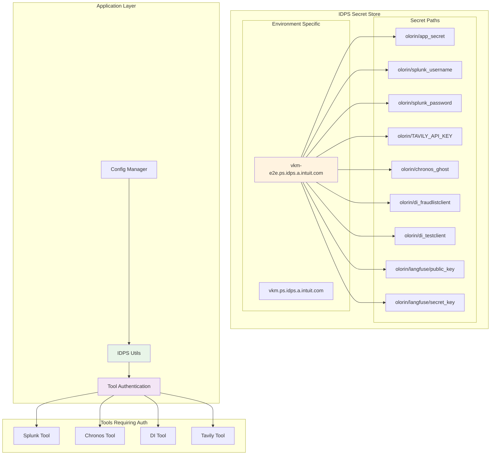

### 3.3 Environment-Specific Authentication

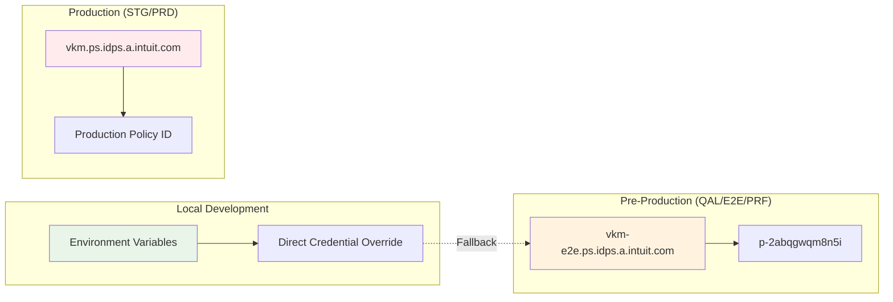

---

## 4. Tool Ecosystem

### 4.1 Tool Classification & Categories

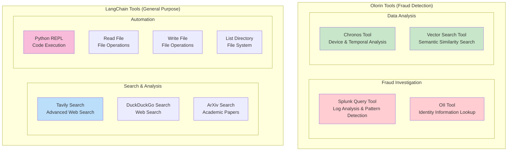

### 4.2 Tool Execution Flow

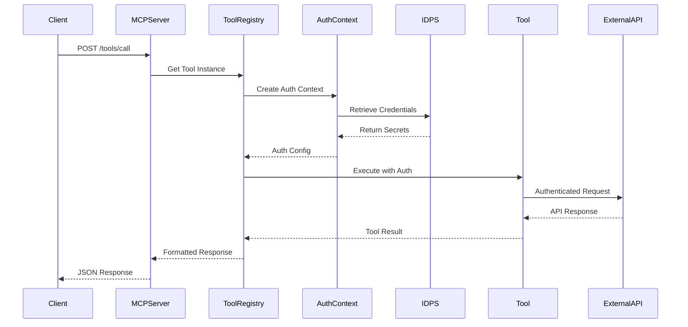

### 4.3 Tool Initialization Architecture

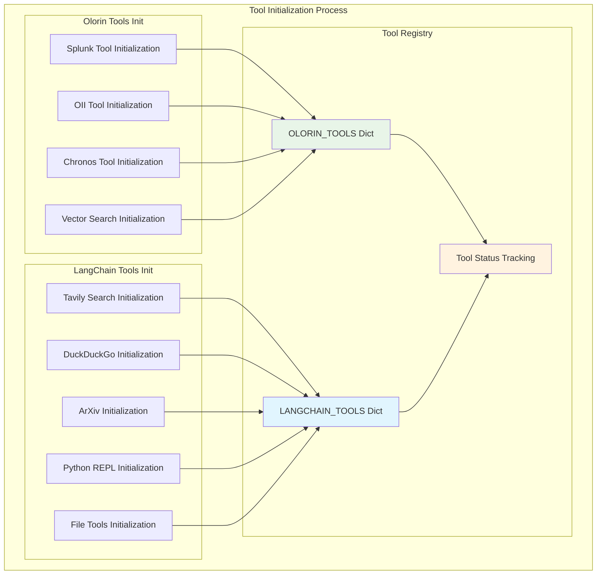

---

## 5. Environment Configuration

### 5.1 Multi-Environment Architecture

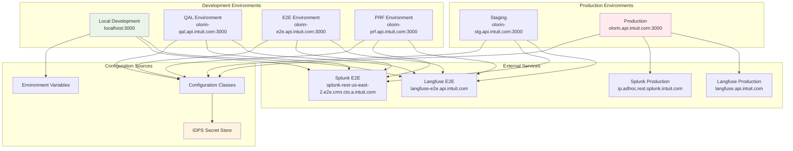

### 5.2 Configuration Hierarchy

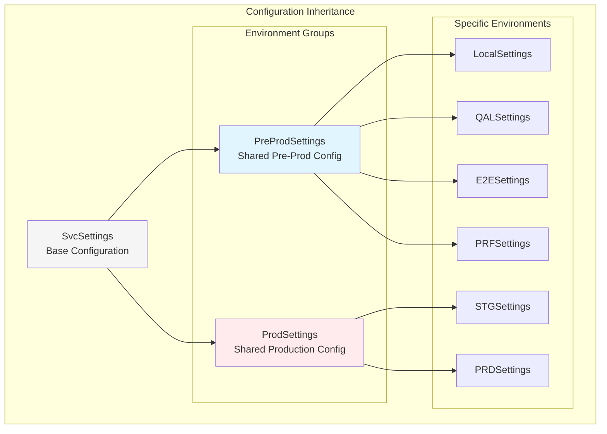

### 5.3 MCP Server URL Configuration

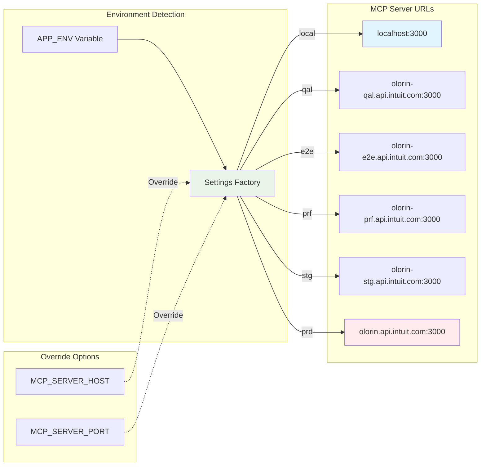

---

## 6. API Specifications

### 6.1 FastAPI Router Endpoints

```mermaid
graph TB
    subgraph "MCP Router (/mcp)"
        subgraph "Status & Health"
            GetStatus[GET /status<br/>Server Status & Health]
            GetHealth[GET /health<br/>Health Check]
        end
        
        subgraph "Tool Management"
            GetTools[GET /tools<br/>List All Tools]
            GetCategories[GET /tools/categories<br/>Tool Categories]
            ExecuteTool[POST /tools/{name}/execute<br/>Execute Tool]
        end
        
        subgraph "Prompt Management"
            GetPrompts[GET /prompts<br/>List Prompts]
            ExecutePrompt[POST /prompts/{name}/execute<br/>Execute Prompt]
        end
    end
    
    subgraph "Request/Response Models"
        ToolExecutionRequest[ToolExecutionRequest<br/>- tool_name: str<br/>- parameters: Dict]
        ToolExecutionResponse[ToolExecutionResponse<br/>- success: bool<br/>- result: str<br/>- error: str<br/>- execution_time: float]
        ToolsResponse[ToolsResponse<br/>- total_tools: int<br/>- olorin_tools: int<br/>- langchain_tools: int<br/>- categories: List[ToolCategory]<br/>- tools: List[ToolInfo]]
    end
    
    ExecuteTool --> ToolExecutionRequest
    ExecuteTool --> ToolExecutionResponse
    GetTools --> ToolsResponse
    
    style GetStatus fill:#e8f5e8
    style ExecuteTool fill:#f3e5f5
    style ToolsResponse fill:#fff3e0
```

### 6.2 MCP Server Direct Endpoints

```mermaid
graph TB
    subgraph "MCP Server Direct API (Port 3000)"
        subgraph "Core Endpoints"
            Health[GET /health<br/>Server Health Check]
            StatusResource[GET /resources/olorin/status<br/>Comprehensive Status]
            ToolsResource[GET /resources/olorin/tools<br/>Raw Tools Data]
        end
        
        subgraph "Tool Execution"
            ToolCall[POST /tools/call<br/>Direct Tool Execution]
        end
        
        subgraph "Prompt System"
            GetPrompts[GET /prompts<br/>Available Prompts]
            GetPromptsPost[POST /prompts/get<br/>Execute Predefined Prompt]
            CustomPrompt[POST /prompts/custom<br/>Execute Custom Prompt]
        end
        
        subgraph "Template Management"
            CreateTemplate[POST /prompts/templates/create<br/>Create Template]
            GetTemplates[GET /prompts/templates<br/>List Templates]
            ExecuteTemplate[POST /prompts/templates/{name}/execute<br/>Execute Template]
            DeleteTemplate[DELETE /prompts/templates/{name}<br/>Delete Template]
            GetExamples[GET /prompts/examples<br/>Example Prompts]
        end
    end
    
    style Health fill:#e8f5e8
    style ToolCall fill:#f3e5f5
    style CustomPrompt fill:#fff3e0
    style CreateTemplate fill:#e1f5fe
```

### 6.3 API Request/Response Flow

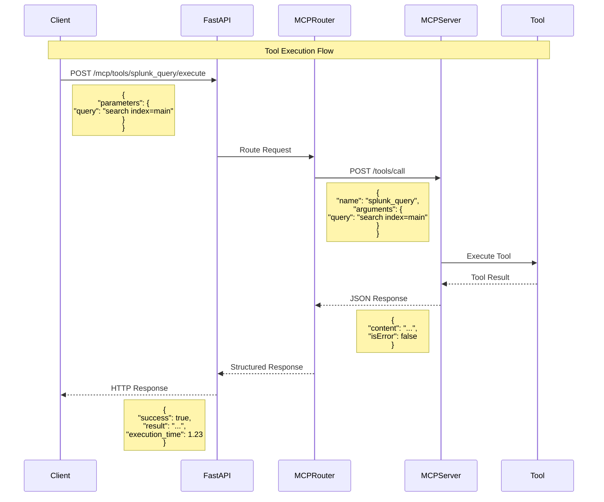

---

## 7. Data Flow & Processing

### 7.1 Fraud Investigation Data Flow

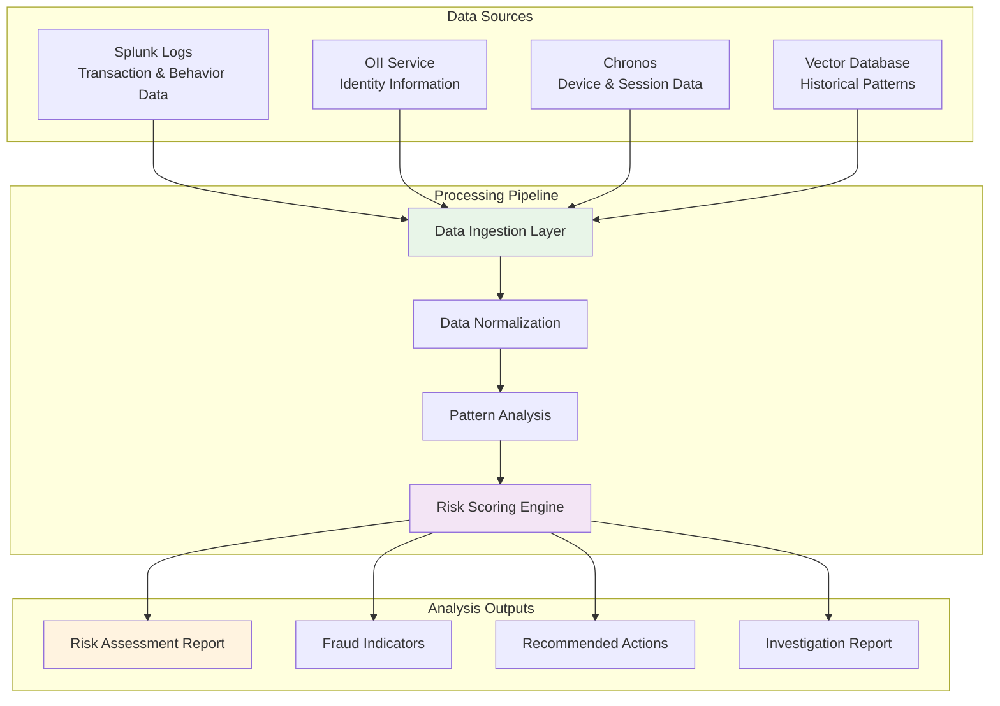

### 7.2 Tool Orchestration Flow

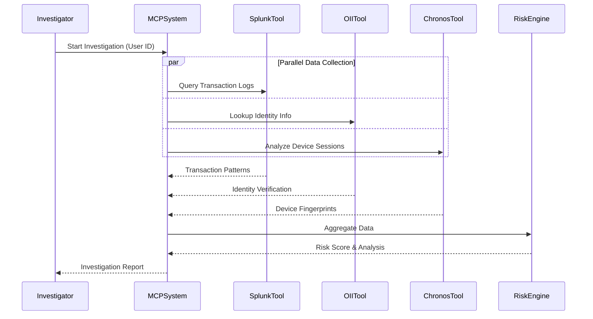

### 7.3 Prompt Processing Pipeline

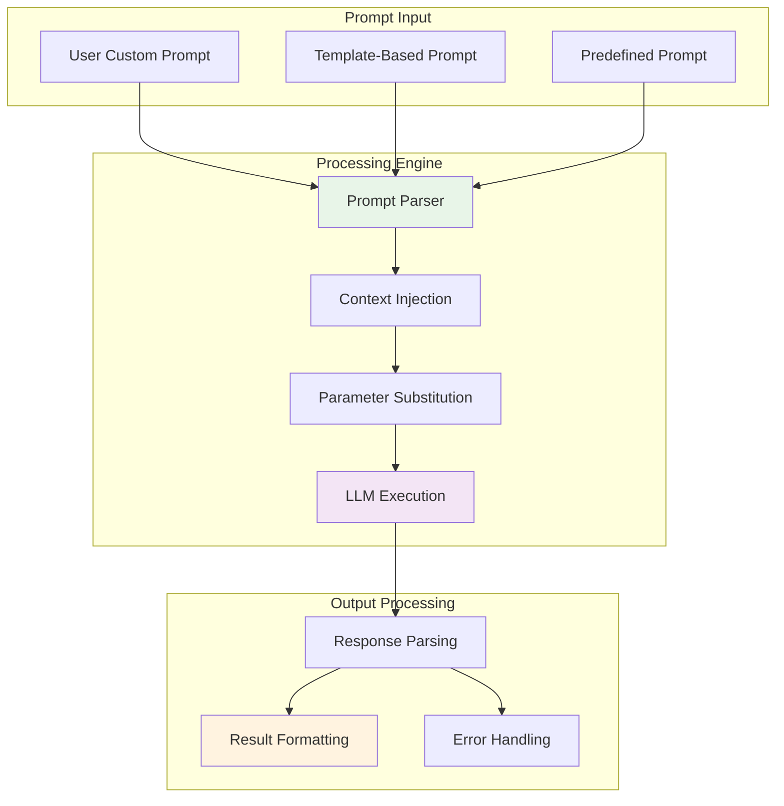

---

## 8. Deployment Architecture

### 8.1 Container Deployment Model

```mermaid
graph TB
    subgraph "Kubernetes Cluster"
        subgraph "Namespace: olorin"
            subgraph "FastAPI Pod"
                FastAPIContainer[FastAPI Application<br/>Port 8000]
                SidecarProxy[Istio Sidecar]
            end
            
            subgraph "MCP Server Pod"
                MCPContainer[MCP Server<br/>Port 3000]
                MCPSidecar[Istio Sidecar]
            end
            
            subgraph "Services"
                FastAPIService[FastAPI Service<br/>ClusterIP]
                MCPService[MCP Service<br/>ClusterIP]
            end
            
            subgraph "Ingress"
                IngressController[Ingress Controller]
                TLSTermination[TLS Termination]
            end
        end
        
        subgraph "External Dependencies"
            IDPSExternal[IDPS Service]
            SplunkExternal[Splunk Service]
            LangfuseExternal[Langfuse Service]
        end
    end
    
    IngressController --> FastAPIService
    FastAPIService --> FastAPIContainer
    FastAPIContainer --> MCPService
    MCPService --> MCPContainer
    
    FastAPIContainer --> IDPSExternal
    MCPContainer --> SplunkExternal
    MCPContainer --> LangfuseExternal
    
    style FastAPIContainer fill:#e1f5fe
    style MCPContainer fill:#f3e5f5
    style IDPSExternal fill:#fff3e0
```

### 8.2 Network Architecture

```mermaid
graph TB
    subgraph "External Network"
        Internet[Internet]
        IntuitNetwork[Intuit Internal Network]
    end
    
    subgraph "Load Balancer Layer"
        PublicLB[Public Load Balancer]
        InternalLB[Internal Load Balancer]
    end
    
    subgraph "API Gateway Layer"
        APIGateway[API Gateway<br/>Rate Limiting & Auth]
        ServiceMesh[Istio Service Mesh]
    end
    
    subgraph "Application Layer"
        FastAPICluster[FastAPI Cluster<br/>Multiple Replicas]
        MCPCluster[MCP Server Cluster<br/>Multiple Replicas]
    end
    
    subgraph "Service Layer"
        IDPSService[IDPS Service]
        SplunkService[Splunk Service]
        VectorService[Vector DB Service]
        ExternalAPIs[External APIs<br/>Tavily, etc.]
    end
    
    Internet --> PublicLB
    IntuitNetwork --> InternalLB
    
    PublicLB --> APIGateway
    InternalLB --> APIGateway
    
    APIGateway --> ServiceMesh
    ServiceMesh --> FastAPICluster
    FastAPICluster --> MCPCluster
    
    MCPCluster --> IDPSService
    MCPCluster --> SplunkService
    MCPCluster --> VectorService
    MCPCluster --> ExternalAPIs
    
    style APIGateway fill:#e8f5e8
    style ServiceMesh fill:#f3e5f5
    style FastAPICluster fill:#e1f5fe
    style MCPCluster fill:#fff3e0
```

### 8.3 Environment-Specific Deployment

```mermaid
graph TB
    subgraph "Development Pipeline"
        LocalDev[Local Development<br/>Docker Compose]
        QALDeploy[QAL Deployment<br/>K8s QAL Cluster]
        E2EDeploy[E2E Deployment<br/>K8s E2E Cluster]
        PRFDeploy[PRF Deployment<br/>K8s PRF Cluster]
    end
    
    subgraph "Production Pipeline"
        STGDeploy[Staging Deployment<br/>K8s STG Cluster]
        PRDDeploy[Production Deployment<br/>K8s PRD Cluster]
    end
    
    subgraph "CI/CD Pipeline"
        GitRepo[Git Repository]
        Jenkins[Jenkins Pipeline]
        DockerRegistry[Docker Registry]
        HelmCharts[Helm Charts]
    end
    
    subgraph "Monitoring & Observability"
        Prometheus[Prometheus Metrics]
        Grafana[Grafana Dashboards]
        Jaeger[Jaeger Tracing]
        ELK[ELK Stack Logging]
    end
    
    GitRepo --> Jenkins
    Jenkins --> DockerRegistry
    Jenkins --> HelmCharts
    
    HelmCharts --> QALDeploy
    HelmCharts --> E2EDeploy
    HelmCharts --> PRFDeploy
    HelmCharts --> STGDeploy
    HelmCharts --> PRDDeploy
    
    QALDeploy --> Prometheus
    E2EDeploy --> Prometheus
    PRFDeploy --> Prometheus
    STGDeploy --> Prometheus
    PRDDeploy --> Prometheus
    
    Prometheus --> Grafana
    QALDeploy --> Jaeger
    QALDeploy --> ELK
    
    style Jenkins fill:#e8f5e8
    style DockerRegistry fill:#f3e5f5
    style PRDDeploy fill:#ffebee
    style Prometheus fill:#fff3e0
```

---

## Summary

This comprehensive architecture documentation covers:

1. **System Overview**: High-level component relationships and responsibilities
2. **MCP Integration**: Protocol flow, server architecture, and router bridge design
3. **Authentication & Security**: IDPS integration, secret management, and environment-specific auth
4. **Tool Ecosystem**: Classification, execution flow, and initialization architecture
5. **Environment Configuration**: Multi-environment setup, configuration hierarchy, and URL management
6. **API Specifications**: Complete endpoint documentation with request/response models
7. **Data Flow & Processing**: Fraud investigation pipeline, tool orchestration, and prompt processing
8. **Deployment Architecture**: Container deployment, network architecture, and CI/CD pipeline

The OLORIN MCP system provides a robust, scalable architecture for fraud detection and investigation, with comprehensive tool integration, secure authentication, and multi-environment support.
