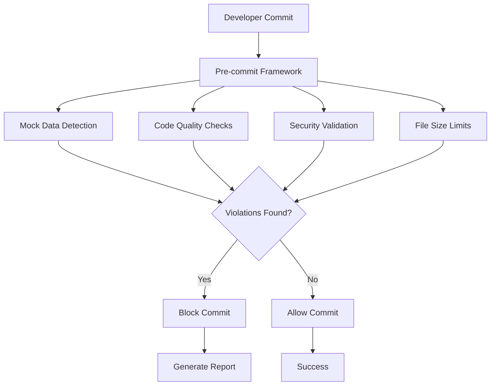

# Pre-commit Hooks Configuration Guide

**Author**: Gil Klainert  
**Created**: 2025-01-08  
**Version**: 1.0.0

This guide covers the comprehensive configuration and customization of the pre-commit hooks system for mock data detection and code quality enforcement.

## Table of Contents

- [Overview](#overview)
- [Installation](#installation)
- [Configuration Files](#configuration-files)
- [Hook Categories](#hook-categories)
- [Customization](#customization)
- [Advanced Configuration](#advanced-configuration)
- [Troubleshooting](#troubleshooting)

## Overview

The pre-commit hooks system provides enterprise-grade enforcement of:

- **Zero-tolerance mock data detection**
- **Code quality standards**
- **Security compliance**
- **File size and structure limits**
- **Dependency validation**

### Architecture



## Installation

### Quick Start

```bash
# Install and configure hooks
./scripts/setup-hooks.sh install

# Validate installation
./scripts/validate-hooks.sh

# Test functionality
pre-commit run --all-files
```

### Manual Installation

```bash
# Install pre-commit framework
pip install --user pre-commit

# Install hooks from configuration
pre-commit install --install-hooks

# Install additional hook types
pre-commit install --hook-type commit-msg
pre-commit install --hook-type pre-push
```

## Configuration Files

### .pre-commit-config.yaml

Primary configuration file defining all hooks:

```yaml
# Core configuration
default_stages: [commit]
default_language_version:
  python: python3.11
  node: system

repos:
  # Mock data detection (critical)
  - repo: local
    hooks:
      - id: detect-mock-data
        name: 🚨 Mock Data Detection
        entry: scripts/git-hooks/detect-mock-data.py
        args: ['--staged', '--fail-on', 'CRITICAL']
        # Additional configuration...
```

### .pre-commit-hooks.yaml

Hook definitions for reusability:

```yaml
hooks:
  - id: detect-mock-data
    name: Enterprise Mock Data Detection
    entry: scripts/git-hooks/detect-mock-data.py
    language: python
    language_version: python3.11
    # Hook specification...
```

### Mock Detection Configuration

`scripts/git-hooks/mock-detection-config.yml`:

```yaml
# Severity levels for different violation types
severity_levels:
  explicit_mock_variables: 'CRITICAL'
  implicit_data_patterns: 'HIGH'
  development_artifacts: 'CRITICAL'
  test_data_leakage: 'MEDIUM'

# Performance settings
context_lines: 3
max_file_size_mb: 10
parallel_workers: 4
confidence_threshold: 0.7
```

### .mockignore

Whitelist file for legitimate exclusions:

```bash
# Project-specific exclusions
test/fixtures/valid-test-data.json
docs/examples/.*
.*jest\.mock.*

# Framework-specific patterns
cypress/fixtures/.*
```

## Hook Categories

### 1. Critical Enforcement Hooks

#### Mock Data Detection
- **Priority**: CRITICAL
- **Execution**: Always runs first
- **Blocking**: Yes
- **Bypass**: Emergency only

```yaml
- id: detect-mock-data
  name: 🚨 Mock Data Detection (ZERO TOLERANCE)
  entry: scripts/git-hooks/detect-mock-data.py
  args: [
    '--staged',
    '--fail-on', 'CRITICAL',
    '--config', 'scripts/git-hooks/mock-detection-config.yml'
  ]
```

#### Secret Detection
- **Priority**: CRITICAL
- **Purpose**: Prevent credential leaks
- **Coverage**: API keys, passwords, tokens

```yaml
- id: validate-no-secrets
  name: 🔒 Secret Detection
  entry: bash
  args: ['-c', 'scripts/security/scan-secrets.sh']
```

### 2. Code Quality Hooks

#### Python Quality (olorin-server)

```yaml
# Code formatting
- repo: https://github.com/psf/black
  rev: 23.12.1
  hooks:
    - id: black
      files: 'olorin-server/.*\.py$'
      args: ['--line-length=88']

# Import sorting
- repo: https://github.com/pycqa/isort
  rev: 5.13.2
  hooks:
    - id: isort
      files: 'olorin-server/.*\.py$'
      args: ['--profile=black']

# Type checking
- repo: https://github.com/pre-commit/mirrors-mypy
  rev: v1.8.0
  hooks:
    - id: mypy
      files: 'olorin-server/.*\.py$'
      args: ['--ignore-missing-imports']
```

#### TypeScript/JavaScript Quality (olorin-front)

```yaml
# Linting
- repo: https://github.com/pre-commit/mirrors-eslint
  rev: v8.56.0
  hooks:
    - id: eslint
      files: 'olorin-front/.*\.(ts|tsx|js|jsx)$'
      args: ['--fix', '--max-warnings=0']

# Formatting
- repo: https://github.com/pre-commit/mirrors-prettier
  rev: v4.0.0-alpha.8
  hooks:
    - id: prettier
      files: 'olorin-front/.*\.(ts|tsx|js|jsx|json)$'
```

### 3. Structure and Compliance

#### File Size Enforcement

```yaml
- id: check-file-size-limit
  name: 📏 Check File Size Limit (200 lines)
  entry: python
  args: ['-c', '
    # Inline Python script to check file sizes
    # Fails if any file exceeds 200 lines
  ']
  files: '.*\.(py|ts|tsx|js|jsx)$'
```

#### General Quality Checks

```yaml
- repo: https://github.com/pre-commit/pre-commit-hooks
  rev: v4.5.0
  hooks:
    - id: trailing-whitespace
    - id: end-of-file-fixer
    - id: check-yaml
    - id: check-json
    - id: check-merge-conflict
    - id: check-added-large-files
```

## Customization

### Hook Arguments

Customize hook behavior through arguments:

```yaml
hooks:
  - id: detect-mock-data
    args: [
      '--staged',                    # Scan mode
      '--fail-on', 'HIGH',          # Severity threshold
      '--config', 'custom.yml',     # Custom config
      '--output-json', 'report.json', # Report output
      '--verbose'                    # Detailed logging
    ]
```

### File Filtering

Control which files are processed:

```yaml
hooks:
  - id: my-hook
    files: '.*\.(py|js|ts)$'        # Include patterns
    exclude: |                       # Exclude patterns
      (?x)^(
        .*/test/.*|
        .*\.min\.js$|
        .*/node_modules/.*
      )
```

### Execution Control

```yaml
hooks:
  - id: my-hook
    stages: [commit, push, manual]   # When to run
    require_serial: true            # No parallel execution
    pass_filenames: false           # Don't pass file list
    always_run: true                # Run even if no files match
```

### Environment Variables

```yaml
hooks:
  - id: my-hook
    entry: my-script.sh
    language: system
    env:
      CUSTOM_VAR: 'value'
      DEBUG_MODE: '1'
```

## Advanced Configuration

### CI Integration Settings

```yaml
ci:
  autofix_commit_msg: |
    🤖 pre-commit auto-fixes
    Auto-generated formatting and quality fixes.
  autofix_prs: true
  autoupdate_branch: 'main'
  autoupdate_schedule: weekly
```

### Performance Optimization

```yaml
# Global settings
fail_fast: false                    # Continue on failures
minimum_pre_commit_version: '3.0.0'

# Hook-specific optimization
hooks:
  - id: expensive-hook
    require_serial: true            # Prevent parallel conflicts
    stages: [manual]                # Only run manually
```

### Multi-Environment Support

```yaml
# Development environment
hooks:
  - id: dev-hook
    stages: [commit]
    files: '.*'

# CI environment  
hooks:
  - id: ci-hook
    stages: [push]
    args: ['--strict', '--ci-mode']
```

### Custom Hook Development

Create project-specific hooks:

```yaml
repos:
  - repo: local
    hooks:
      - id: custom-validation
        name: Custom Business Logic Validation
        entry: scripts/custom-validator.py
        language: python
        files: 'src/.*\.py$'
        args: ['--business-rules', 'strict']
```

## Error Handling and Recovery

### Bypass Mechanisms

#### Emergency Bypass (Authorized Users Only)

```bash
# Emergency bypass for critical fixes
git commit -m "fix: critical security patch [EMERGENCY-BYPASS]"
```

#### Temporary Hook Disable

```bash
# Disable hooks for single commit
SKIP=hook-id git commit -m "temporary bypass"

# Disable all hooks
git commit --no-verify -m "bypass all hooks"
```

#### Selective Hook Execution

```bash
# Run only specific hooks
pre-commit run hook-id --all-files

# Skip specific hooks
SKIP=black,mypy pre-commit run --all-files
```

### Recovery Procedures

#### Fix and Retry

```bash
# 1. Address violations
# 2. Stage fixed files
git add fixed-file.py

# 3. Retry commit
git commit -m "fix: address code quality issues"
```

#### Update Hook Configuration

```bash
# Update to latest versions
pre-commit autoupdate

# Reinstall with new configuration
pre-commit install --install-hooks --overwrite
```

#### Clean and Reset

```bash
# Clear pre-commit cache
pre-commit clean

# Reinstall everything
pre-commit uninstall
pre-commit install --install-hooks
```

## Configuration Validation

### Validate Configuration

```bash
# Validate pre-commit config
pre-commit validate-config

# Test hook configuration
pre-commit run --all-files --verbose

# Validate mock detection config
python -c "
import yaml
with open('scripts/git-hooks/mock-detection-config.yml') as f:
    yaml.safe_load(f)
print('✅ Mock detection config valid')
"
```

### Common Validation Errors

1. **Invalid YAML Syntax**
   ```bash
   # Fix: Validate YAML structure
   yamllint .pre-commit-config.yaml
   ```

2. **Missing Dependencies**
   ```bash
   # Fix: Install required packages
   pip install pyyaml pathspec jsonschema
   ```

3. **Invalid File Patterns**
   ```bash
   # Fix: Test regex patterns
   python -c "import re; re.compile('your-pattern')"
   ```

## Performance Tuning

### Optimization Strategies

1. **File Filtering**
   - Use specific `files` patterns
   - Add comprehensive `exclude` patterns
   - Skip unnecessary directories

2. **Parallel Execution**
   ```yaml
   hooks:
     - id: parallel-safe-hook
       require_serial: false  # Allow parallel execution
   ```

3. **Staged Files Only**
   ```yaml
   hooks:
     - id: fast-hook
       args: ['--staged']  # Only process staged files
   ```

4. **Conditional Execution**
   ```yaml
   hooks:
     - id: expensive-hook
       stages: [push]  # Only run on push, not commit
   ```

### Performance Monitoring

```bash
# Time hook execution
time pre-commit run --all-files

# Detailed timing per hook
pre-commit run --all-files --verbose

# Profile specific hook
time pre-commit run detect-mock-data --all-files
```

## Integration with Development Workflow

### IDE Integration

#### VS Code Settings

```json
{
  "python.linting.enabled": true,
  "python.formatting.provider": "black",
  "editor.formatOnSave": true,
  "git.preCommitHook": true
}
```

#### Git Configuration

```bash
# Enable pre-commit hooks by default
git config --global init.templateDir '~/.git-templates'

# Configure commit template
git config --global commit.template ~/.git-commit-template
```

### Team Workflow

1. **Onboarding**
   ```bash
   # New team member setup
   ./scripts/setup-hooks.sh install
   ./scripts/validate-hooks.sh
   ```

2. **Continuous Integration**
   - Hooks run automatically in CI/CD
   - Same configuration across all environments
   - Consistent quality standards

3. **Code Review**
   - Pre-commit ensures basic quality
   - Reviewers focus on business logic
   - Reduced review cycles

## Troubleshooting

### Common Issues

1. **Hook Not Running**
   ```bash
   # Check installation
   ls -la .git/hooks/pre-commit
   
   # Reinstall hooks
   pre-commit install --overwrite
   ```

2. **Python Version Issues**
   ```bash
   # Check Python version
   python3 --version
   
   # Update configuration
   vim .pre-commit-config.yaml
   # Set: python: python3.11
   ```

3. **Permission Errors**
   ```bash
   # Fix script permissions
   chmod +x scripts/git-hooks/detect-mock-data.py
   chmod +x scripts/setup-hooks.sh
   ```

4. **Configuration Conflicts**
   ```bash
   # Validate configuration
   pre-commit validate-config
   
   # Clean and reinstall
   pre-commit clean
   pre-commit install --install-hooks
   ```

### Debug Mode

```bash
# Enable verbose logging
export PRE_COMMIT_COLOR=always
pre-commit run --all-files --verbose

# Debug specific hook
pre-commit run detect-mock-data --all-files --verbose

# Check hook cache
pre-commit clean --repo-cache
```

### Support Resources

- **Documentation**: `docs/hooks/`
- **Issue Tracking**: GitHub repository issues
- **Configuration Examples**: `docs/hooks/examples/`
- **Team Chat**: Development Slack channel

---

## Next Steps

1. **Review Configuration**: Customize settings for your project needs
2. **Test Installation**: Run validation script to ensure everything works
3. **Train Team**: Share this guide with all developers
4. **Monitor Performance**: Track hook execution times and optimize as needed
5. **Stay Updated**: Regularly update hook versions and patterns

For more information, see:
- [Troubleshooting Guide](troubleshooting.md)
- [Mock Detection System](mock-detection-guide.md)
- [Contributing Guidelines](contributing.md)