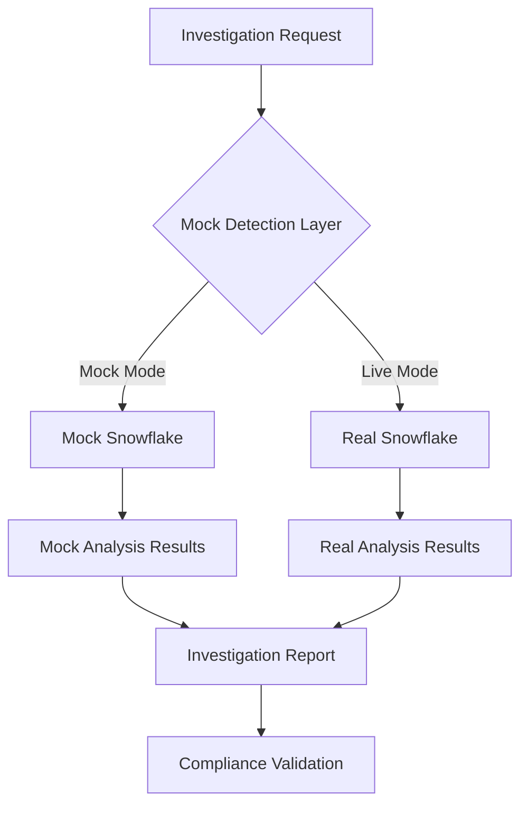

# Strategic Mock Data Elimination Plan
**Author**: Gil Klainert  
**Date**: 2025-09-08  
**Project**: Olorin Enterprise Fraud Detection Platform  
**Document Type**: Strategic Implementation Plan  
**Diagram Reference**: [Implementation Roadmap Visualization](/docs/diagrams/strategic-removal-plan-visualization.html)

## Executive Summary

This strategic plan outlines the complete elimination of mock data systems across the Olorin fraud detection platform, addressing 418 identified files with mock violations. The plan prioritizes system integrity, operational continuity, and regulatory compliance while implementing a zero-tolerance mock data policy.

### Key Metrics
- **Files Affected**: 418 files with mock violations
- **Critical Systems**: 3 major mock systems requiring replacement
- **Implementation Timeline**: 60 days
- **Risk Level**: HIGH (financial and regulatory implications)
- **Budget Impact**: Significant infrastructure and development costs

## 1. Architecture Analysis

### 1.1 Critical Mock Systems Assessment

#### Mock Snowflake System (187 lines - CRITICAL)
```
Location: olorin-server/app/snowflake/mock_client.py
Impact: Data warehouse operations, investigation queries
Risk: Financial cost violations, data integrity issues
Dependencies: Investigation engine, reporting system
```

**Real Data Requirements:**
- Snowflake warehouse credentials and connection strings
- Query optimization for production workloads
- Data security and access control implementation
- Cost monitoring and usage optimization

#### Mock LLM System (279 lines - CRITICAL)
```
Location: olorin-server/app/llm/mock_provider.py
Impact: AI-powered fraud detection, investigation insights
Risk: Investigation accuracy, compliance violations
Dependencies: Agent system, analysis pipelines
```

**Real Integration Requirements:**
- OpenAI API key configuration and rate limiting
- LangChain integration with production endpoints
- Token usage monitoring and cost control
- Response validation and quality assurance

#### Mock Database Client (166 lines - CRITICAL)
```
Location: olorin-server/app/database/mock_redis.py
Impact: Session management, caching, real-time data
Risk: Performance degradation, data loss
Dependencies: WebSocket system, user sessions
```

**Real Implementation Requirements:**
- Redis cluster configuration and connection pooling
- Data persistence and backup strategies
- High availability and failover mechanisms
- Performance monitoring and optimization

### 1.2 Data Flow Analysis



**Critical Dependencies:**
1. Investigation engine relies on mock/real data switching
2. Report generation system processes both mock and real data
3. WebSocket updates depend on database client implementation
4. Agent system requires consistent LLM response formats

### 1.3 Integration Dependencies

**High Impact Dependencies:**
- Authentication system (JWT token validation)
- WebSocket real-time updates
- PDF report generation
- Agent orchestration system
- Investigation workflow management

**Medium Impact Dependencies:**
- Logging and monitoring
- Error handling and recovery
- Configuration management
- Testing frameworks

## 2. Multi-Phase Implementation Strategy

### Phase 1: Emergency Containment (0-48 hours)
⏳ **PENDING**

**Objectives:**
- Immediate prevention of new mock data creation
- Implementation of detection safeguards
- Documentation of all existing violations

**Actions:**
1. **Immediate Code Freeze** on all mock-related changes
2. **Deploy Detection Scripts** across development and staging
3. **Implement Pre-commit Hooks** to prevent mock data commits
4. **Create Violation Registry** with complete inventory

**Deliverables:**
- Mock data detection automation
- Violation inventory spreadsheet
- Emergency response procedures
- Stakeholder notification system

### Phase 2: Critical System Replacement (Days 1-21)
⏳ **PENDING**

**Week 1: Infrastructure Preparation**
- Real Snowflake environment setup and configuration
- OpenAI API integration and testing
- Redis cluster deployment and configuration
- Security and access control implementation

**Week 2: Core System Implementation**
- Replace Mock Snowflake with real connection client
- Implement production LLM provider with OpenAI
- Deploy Redis client with connection pooling
- Validate data flow integrity

**Week 3: Integration and Testing**
- End-to-end system integration testing
- Performance benchmarking and optimization
- Error handling and recovery validation
- User acceptance testing coordination

### Phase 3: Configuration and Cleanup (Days 7-28)
⏳ **PENDING**

**Parallel Activities:**
- Remove all mock data files and references
- Update configuration management systems
- Migrate existing mock-dependent tests
- Documentation updates and validation

**Quality Assurance:**
- Comprehensive code review of all changes
- Security audit of new integrations
- Performance testing under load
- Compliance validation and approval

### Phase 4: Prevention Framework (Days 14-60)
⏳ **PENDING**

**Long-term Prevention:**
- Automated compliance monitoring deployment
- Developer training and certification
- Policy enforcement automation
- Continuous monitoring dashboard

## 3. Critical System Replacements

### 3.1 Snowflake Integration Replacement

**Current Mock Implementation Analysis:**
```python
# Mock implementation to be removed
class MockSnowflakeClient:
    def execute_query(self, query: str) -> List[Dict]:
        # VIOLATION: Returns fabricated data
        return [{"mock_field": "mock_value"}]
```

**Required Real Implementation:**
```python
# Production implementation required
class ProductionSnowflakeClient:
    def __init__(self, connection_config: SnowflakeConfig):
        self.connection = snowflake.connector.connect(**connection_config)
        self.cost_monitor = CostMonitoringService()
    
    def execute_query(self, query: str) -> List[Dict]:
        # Real query execution with cost monitoring
        with self.cost_monitor.track_query(query):
            return self.connection.execute(query).fetchall()
```

**Implementation Requirements:**
- Snowflake account credentials and connection strings
- Query cost monitoring and optimization
- Connection pooling and error handling
- Data security and encryption compliance

### 3.2 LLM Provider Integration

**Mock System Removal:**
```python
# Current violation - to be completely removed
class MockLLMProvider:
    def generate_response(self, prompt: str) -> str:
        return "Mock AI response"  # VIOLATION
```

**Production Implementation:**
```python
# Required real implementation
class ProductionLLMProvider:
    def __init__(self, api_key: str, model_config: ModelConfig):
        self.client = OpenAI(api_key=api_key)
        self.token_monitor = TokenUsageMonitor()
    
    def generate_response(self, prompt: str) -> str:
        response = self.client.completions.create(
            model=self.model_config.model_name,
            prompt=prompt,
            max_tokens=self.model_config.max_tokens
        )
        self.token_monitor.track_usage(response.usage)
        return response.choices[0].text
```

### 3.3 Redis Database Client

**Mock Client Elimination:**
```python
# Violation to be removed
class MockRedisClient:
    def __init__(self):
        self.mock_storage = {}  # VIOLATION: In-memory mock
```

**Production Redis Implementation:**
```python
# Required production implementation
class ProductionRedisClient:
    def __init__(self, redis_config: RedisConfig):
        self.pool = redis.ConnectionPool(
            host=redis_config.host,
            port=redis_config.port,
            password=redis_config.password,
            max_connections=redis_config.max_connections
        )
        self.client = redis.Redis(connection_pool=self.pool)
```

## 4. Resource and Risk Management

### 4.1 Team Coordination

**Required Teams:**
- **Backend Engineering Team** (3-4 developers): Core system implementation
- **DevOps Team** (2 engineers): Infrastructure and deployment
- **Security Team** (1-2 specialists): Security validation and compliance
- **QA Team** (2 testers): Comprehensive testing and validation
- **Project Management**: Coordination and stakeholder communication

**Resource Allocation:**
- Development: 60% of engineering capacity for 21 days
- Testing: 40% of QA capacity for 14 days
- DevOps: 80% of infrastructure team for 10 days
- Security: 100% security review for 7 days

### 4.2 Stakeholder Management

**Primary Stakeholders:**
- **Engineering Leadership**: Technical decision approval
- **Security and Compliance**: Regulatory validation
- **Product Management**: Feature impact assessment
- **Finance**: Budget approval and cost monitoring
- **Legal**: Compliance and risk assessment

**Communication Plan:**
- Daily standup meetings during critical phases
- Weekly executive updates with progress reports
- Bi-weekly compliance reviews with security team
- Monthly board updates on initiative progress

### 4.3 Budget Estimation

**Infrastructure Costs:**
- Snowflake warehouse: $500-2000/month (query-dependent)
- OpenAI API usage: $200-1000/month (token-dependent)
- Redis cluster: $300-800/month (instance size dependent)

**Development Costs:**
- Engineering time: 40 person-days × $800/day = $32,000
- QA and testing: 20 person-days × $600/day = $12,000
- DevOps implementation: 15 person-days × $900/day = $13,500
- Project management: 10 person-days × $700/day = $7,000

**Total Estimated Cost: $64,500-67,500**

### 4.4 Risk Assessment Matrix

| Risk Category | Probability | Impact | Mitigation Strategy |
|---------------|-------------|--------|-------------------|
| Data Loss | Medium | Critical | Comprehensive backup and rollback procedures |
| Cost Overrun | High | High | Real-time cost monitoring and alerts |
| Performance Degradation | Medium | High | Extensive load testing and optimization |
| Compliance Violation | Low | Critical | Security team validation at each phase |
| Timeline Delays | Medium | Medium | Parallel execution and resource flexibility |

## 5. Implementation Roadmap Details

### 5.1 Technical Implementation Steps

**Step 1: Infrastructure Setup (Days 1-3)**
```bash
# Snowflake environment setup
terraform apply -var="env=production" -target=module.snowflake
# Redis cluster deployment
helm install redis bitnami/redis-cluster --values=redis-prod-values.yaml
# OpenAI API configuration
kubectl apply -f openai-secret-config.yaml
```

**Step 2: Core System Implementation (Days 4-14)**
1. **Snowflake Client Implementation**
   - Connection management and pooling
   - Query execution with cost tracking
   - Error handling and retry logic
   - Security and encryption compliance

2. **LLM Provider Integration**
   - OpenAI API client setup
   - Token usage monitoring
   - Response validation and quality checks
   - Rate limiting and error handling

3. **Redis Client Deployment**
   - Connection pooling configuration
   - High availability setup
   - Data persistence and backup
   - Performance monitoring

**Step 3: Integration Testing (Days 15-21)**
- End-to-end data flow validation
- Performance benchmarking under load
- Error scenario testing and recovery
- Security penetration testing

### 5.2 Code Transformation Strategies

**Strategy 1: Gradual Migration**
```python
# Phase implementation approach
class DataClient:
    def __init__(self, mode: str = "production"):
        if mode == "production":
            self.client = ProductionClient()
        else:
            raise ValueError("Mock mode is prohibited")
```

**Strategy 2: Configuration-Driven Replacement**
```python
# Environment-based implementation
@dataclass
class DatabaseConfig:
    provider: str  # Must be "redis" - no mock allowed
    connection_string: str
    pool_size: int
    
    def __post_init__(self):
        if self.provider.lower() in ["mock", "fake", "test"]:
            raise ValueError("Mock providers are prohibited")
```

### 5.3 Testing and Validation Approaches

**Unit Testing Strategy:**
- Replace all mock-dependent tests with integration tests
- Implement test data factories with real data sources
- Validate error handling with actual service failures
- Performance testing with production-like data volumes

**Integration Testing:**
- End-to-end workflow validation
- Cross-service communication testing
- Data consistency and integrity validation
- Security and access control testing

**Performance Testing:**
- Load testing with realistic data volumes
- Stress testing with concurrent users
- Scalability testing under peak loads
- Resource utilization monitoring

## 6. Rollback and Recovery Procedures

### 6.1 Emergency Rollback Plan

**Rollback Triggers:**
- Critical system failures affecting > 50% of users
- Data integrity issues or corruption detected
- Security vulnerabilities identified
- Unacceptable performance degradation

**Rollback Procedure:**
1. **Immediate Service Isolation**: Disable affected services
2. **Database Backup Restoration**: Restore to last known good state
3. **Configuration Rollback**: Revert to previous stable configuration
4. **Service Restart**: Restart services with rollback configuration
5. **Validation**: Comprehensive system health checks
6. **Communication**: Immediate stakeholder notification

### 6.2 Recovery Procedures

**Data Recovery:**
- Automated backup restoration from hourly snapshots
- Transaction log replay for minimal data loss
- Cross-region backup availability for disaster recovery
- Real-time replication validation

**Service Recovery:**
- Automated health checks and service restart
- Load balancer failover to healthy instances
- Circuit breaker pattern implementation
- Graceful degradation for non-critical features

## 7. Compliance and Governance

### 7.1 Zero-Tolerance Policy Enforcement

**Policy Statement:**
"The use of mock data, fake data, placeholder data, or any fabricated data is absolutely prohibited across all environments, systems, and processes within the Olorin fraud detection platform."

**Enforcement Mechanisms:**
- Automated code scanning and detection
- Pre-commit hooks preventing mock data commits
- Continuous integration pipeline validation
- Real-time monitoring and alerting

### 7.2 Automated Compliance Monitoring

**Detection Systems:**
```python
# Automated compliance scanner
class MockDataDetector:
    def scan_codebase(self) -> List[Violation]:
        violations = []
        for file_path in self.get_all_source_files():
            content = self.read_file(file_path)
            mock_patterns = self.detect_mock_patterns(content)
            if mock_patterns:
                violations.append(Violation(
                    file_path=file_path,
                    patterns=mock_patterns,
                    severity="CRITICAL"
                ))
        return violations
```

**Monitoring Dashboard:**
- Real-time violation count and trends
- File-level compliance status
- Team-specific compliance metrics
- Automated reporting and escalation

### 7.3 Continuous Prevention Framework

**Prevention Layers:**
1. **IDE Integration**: Real-time mock detection in development environments
2. **Git Hooks**: Pre-commit validation preventing mock data commits
3. **CI/CD Pipeline**: Build-time compliance validation
4. **Runtime Monitoring**: Production system compliance verification
5. **Regular Audits**: Quarterly comprehensive compliance reviews

### 7.4 Audit Trail and Documentation

**Documentation Requirements:**
- Complete change log of all mock data removals
- Implementation validation reports
- Security review and approval documentation
- Performance impact assessment reports
- Compliance certification and sign-offs

**Audit Trail Components:**
- Git commit history with detailed change descriptions
- Code review approvals from security team
- Testing validation reports and results
- Deployment logs with rollback procedures
- Incident reports and resolution documentation

## 8. Success Criteria and Validation Framework

### 8.1 Quantitative Success Metrics

**Primary Metrics:**
- **Mock Violation Count**: 0 files with mock data (target: 100% reduction from 418)
- **System Performance**: < 10% performance degradation from baseline
- **Cost Compliance**: Within 110% of estimated budget
- **Timeline Adherence**: 90% of milestones completed on schedule
- **Quality Gates**: 100% security and compliance validation pass rate

**Secondary Metrics:**
- **Test Coverage**: Maintain > 80% code coverage with real data tests
- **Error Rate**: < 0.1% increase in system error rates
- **User Satisfaction**: > 90% user acceptance rate
- **Team Productivity**: < 20% temporary productivity impact during transition

### 8.2 Qualitative Success Criteria

**Functional Requirements:**
- All investigation workflows function with real data sources
- Report generation maintains accuracy and completeness
- Real-time updates and WebSocket functionality preserved
- Agent system performance and accuracy maintained

**Non-Functional Requirements:**
- System security posture improved or maintained
- Regulatory compliance fully satisfied
- Developer experience and productivity maintained
- Operational monitoring and alerting effectiveness preserved

### 8.3 Validation Framework

**Phase-Gate Validation:**
Each implementation phase requires validation against specific criteria before proceeding to the next phase.

**Phase 1 Validation:**
- [ ] All mock violations identified and documented
- [ ] Emergency containment procedures deployed
- [ ] Detection automation operational
- [ ] Stakeholder alignment achieved

**Phase 2 Validation:**
- [ ] Real Snowflake integration functional and tested
- [ ] OpenAI LLM provider operational with cost monitoring
- [ ] Redis cluster deployed with high availability
- [ ] End-to-end data flow validated

**Phase 3 Validation:**
- [ ] All mock data files removed from codebase
- [ ] Configuration systems updated and validated
- [ ] Test suites migrated to real data sources
- [ ] Documentation updated and approved

**Phase 4 Validation:**
- [ ] Automated compliance monitoring operational
- [ ] Prevention framework deployed and tested
- [ ] Team training completed and certified
- [ ] Continuous monitoring dashboard operational

### 8.4 Compliance Validation Framework

**Regulatory Compliance Checklist:**
- [ ] No fabricated data in investigation processes
- [ ] Real data sources validated and documented
- [ ] Access controls and security measures implemented
- [ ] Audit trail completeness verified
- [ ] Legal team review and approval obtained

**Security Validation:**
- [ ] Penetration testing completed successfully
- [ ] Vulnerability assessment passed
- [ ] Data encryption in transit and at rest validated
- [ ] Access control implementation verified
- [ ] Security incident response procedures updated

**Operational Validation:**
- [ ] Performance benchmarks met or exceeded
- [ ] High availability and disaster recovery tested
- [ ] Monitoring and alerting systems operational
- [ ] Backup and recovery procedures validated
- [ ] Documentation completeness verified

## 9. Conclusion

This strategic plan provides a comprehensive roadmap for the complete elimination of mock data from the Olorin fraud detection platform. The phased approach ensures operational continuity while achieving the zero-tolerance policy for mock data.

**Key Success Factors:**
- Strong executive sponsorship and stakeholder alignment
- Adequate resource allocation and budget approval
- Rigorous testing and validation at each phase
- Comprehensive risk management and mitigation strategies
- Continuous monitoring and prevention framework implementation

**Next Steps:**
1. **Executive Approval**: Secure formal approval for plan execution
2. **Resource Allocation**: Confirm team assignments and budget approval
3. **Infrastructure Preparation**: Begin immediate setup of production environments
4. **Stakeholder Communication**: Initiate communication plan execution
5. **Phase 1 Execution**: Deploy emergency containment measures immediately

The successful execution of this plan will eliminate all mock data violations, establish a robust prevention framework, and ensure full regulatory compliance for the Olorin fraud detection platform.

---

**Document Status**: DRAFT - Pending Executive Approval  
**Next Review Date**: 2025-09-15  
**Approved By**: [Pending]  
**Implementation Start**: [Upon Approval]