# MCP Operations and Monitoring Guide
## Comprehensive Operations Management for Fraud Investigation Platform

**Author**: Gil Klainert  
**Date**: 2025-08-31  
**Version**: 1.0  
**Audience**: Operations Teams, System Administrators, DevOps Engineers

---

## 🎯 Operations Overview

The Olorin MCP (Model Context Protocol) operations framework provides comprehensive monitoring, management, and optimization capabilities for the fraud investigation platform. This guide covers system monitoring, performance optimization, capacity planning, and operational procedures for maintaining a high-performance, reliable investigation environment.

### Operational Objectives

- **High Availability**: 99.9% uptime with automated failover capabilities
- **Performance Excellence**: Sub-second response times for investigation queries
- **Scalability**: Dynamic scaling to handle investigation workload variations  
- **Security Operations**: Continuous security monitoring and threat detection
- **Cost Optimization**: Efficient resource utilization and cost management
- **Compliance Monitoring**: Automated compliance validation and reporting

### Service Level Agreements (SLAs)

| Metric | Target | Monitoring | Alerting |
|--------|--------|------------|----------|
| **System Availability** | 99.9% | Real-time | < 1 minute |
| **Investigation Response Time** | < 2 seconds | Continuous | < 30 seconds |
| **Tool Execution Success Rate** | > 99% | Real-time | < 1 minute |
| **Data Processing Latency** | < 500ms | Continuous | < 15 seconds |
| **Security Incident Detection** | < 5 minutes | Real-time | Immediate |
| **Backup Success Rate** | 100% | Daily | < 1 hour |

---

## 🏗️ Monitoring Architecture

### Multi-Layer Monitoring Framework

```mermaid
graph TB
    subgraph "Application Monitoring"
        AM[Application Metrics]
        TM[Tool Execution Metrics]  
        IM[Investigation Metrics]
        PM[Performance Metrics]
    end
    
    subgraph "Infrastructure Monitoring"
        SH[System Health]
        RM[Resource Metrics]
        NM[Network Monitoring]
        SM[Storage Monitoring]
    end
    
    subgraph "Security Monitoring"
        SEC[Security Events]
        TD[Threat Detection]
        AL[Access Logging]
        CM[Compliance Monitoring]
    end
    
    subgraph "Business Monitoring"
        IA[Investigation Analytics]
        UA[User Analytics]
        QM[Quality Metrics]
        CA[Cost Analytics]
    end
    
    subgraph "Monitoring Platform"
        PROM[Prometheus]
        GRAF[Grafana]
        ELK[ELK Stack]
        ALERT[AlertManager]
    end
    
    subgraph "Notification Systems"
        EMAIL[Email Alerts]
        SLACK[Slack Integration]
        SMS[SMS Alerts]
        WEBHOOK[Webhook Notifications]
    end
    
    AM --> PROM
    TM --> PROM
    IM --> PROM
    PM --> PROM
    
    SH --> PROM
    RM --> PROM
    NM --> PROM
    SM --> PROM
    
    SEC --> ELK
    TD --> ELK
    AL --> ELK
    CM --> ELK
    
    IA --> PROM
    UA --> PROM
    QM --> PROM
    CA --> PROM
    
    PROM --> GRAF
    PROM --> ALERT
    ELK --> GRAF
    ELK --> ALERT
    
    ALERT --> EMAIL
    ALERT --> SLACK
    ALERT --> SMS
    ALERT --> WEBHOOK
```



### Monitoring Stack Configuration

#### Prometheus Configuration
```yaml
# Prometheus configuration for MCP monitoring
global:
  scrape_interval: 15s
  evaluation_interval: 15s

rule_files:
  - "mcp_alert_rules.yml"
  - "investigation_rules.yml"
  - "security_rules.yml"

scrape_configs:
  - job_name: 'olorin-mcp-server'
    static_configs:
      - targets: ['localhost:8000']
    metrics_path: '/metrics'
    scrape_interval: 10s
    
  - job_name: 'olorin-investigation-tools'
    static_configs:
      - targets: ['localhost:8001']
    metrics_path: '/tool-metrics'
    scrape_interval: 30s
    
  - job_name: 'system-metrics'
    static_configs:
      - targets: ['localhost:9100']  # Node Exporter
    scrape_interval: 15s
    
  - job_name: 'redis-metrics'
    static_configs:
      - targets: ['localhost:9121']  # Redis Exporter
    scrape_interval: 30s

alerting:
  alertmanagers:
    - static_configs:
        - targets:
          - localhost:9093
```

#### Grafana Dashboard Configuration
```json
{
  "dashboard": {
    "title": "Olorin MCP Investigation Platform",
    "panels": [
      {
        "title": "Investigation Success Rate",
        "type": "stat",
        "targets": [
          {
            "expr": "rate(investigation_success_total[5m]) / rate(investigation_total[5m]) * 100",
            "legendFormat": "Success Rate"
          }
        ],
        "thresholds": [
          {"value": 95, "color": "red"},
          {"value": 99, "color": "green"}
        ]
      },
      {
        "title": "Tool Execution Performance",
        "type": "graph",
        "targets": [
          {
            "expr": "histogram_quantile(0.95, rate(tool_execution_duration_seconds_bucket[5m]))",
            "legendFormat": "95th Percentile"
          },
          {
            "expr": "histogram_quantile(0.50, rate(tool_execution_duration_seconds_bucket[5m]))",
            "legendFormat": "Median"
          }
        ]
      },
      {
        "title": "System Resource Utilization",
        "type": "graph",
        "targets": [
          {
            "expr": "100 - (avg(irate(node_cpu_seconds_total{mode=\"idle\"}[5m])) * 100)",
            "legendFormat": "CPU Usage %"
          },
          {
            "expr": "100 * (1 - (node_memory_MemAvailable_bytes / node_memory_MemTotal_bytes))",
            "legendFormat": "Memory Usage %"
          }
        ]
      }
    ]
  }
}
```

---

## 📊 Performance Monitoring

### Application Performance Metrics

#### Core Investigation Metrics
```python
# Investigation Performance Monitoring
from olorin_mcp.monitoring import MetricsCollector, PerformanceTracker

class InvestigationMetrics:
    """Comprehensive investigation performance monitoring."""
    
    def __init__(self):
        self.metrics = MetricsCollector()
        self.tracker = PerformanceTracker()
        
    async def track_investigation_performance(
        self,
        investigation_id: str,
        user_id: str,
        investigation_type: str
    ) -> None:
        """
        Track comprehensive investigation performance metrics.
        
        Metrics Tracked:
        - Investigation initiation time
        - Tool execution times and success rates
        - Data processing latency
        - Result generation time
        - User response time
        - Resource utilization during investigation
        """
        
        # Investigation timing metrics
        self.metrics.histogram(
            'investigation_duration_seconds',
            labels={'type': investigation_type, 'user': user_id}
        )
        
        # Tool execution metrics
        self.metrics.counter(
            'tool_executions_total',
            labels={'investigation_type': investigation_type}
        )
        
        # Success rate metrics
        self.metrics.counter(
            'investigation_success_total',
            labels={'type': investigation_type}
        )
        
        # Resource utilization metrics
        self.metrics.gauge(
            'investigation_memory_usage_bytes',
            labels={'investigation_id': investigation_id}
        )
        
        # Quality metrics
        self.metrics.histogram(
            'investigation_quality_score',
            labels={'type': investigation_type}
        )
```

#### Tool Execution Monitoring
```python
# Tool-Specific Performance Monitoring
from olorin_mcp.monitoring import ToolMetricsCollector

class ToolPerformanceMonitor:
    """Detailed monitoring for individual investigation tools."""
    
    def __init__(self):
        self.tool_metrics = ToolMetricsCollector()
        
    async def monitor_tool_execution(
        self,
        tool_name: str,
        execution_context: Dict[str, Any],
        start_time: datetime,
        end_time: datetime,
        success: bool,
        error_details: Optional[str] = None
    ) -> None:
        """
        Monitor individual tool execution performance and reliability.
        
        Tool Metrics:
        - Execution duration and latency distribution
        - Success/failure rates by tool and user
        - Error patterns and failure modes
        - Resource consumption per tool
        - Cache hit rates and effectiveness
        - Data processing volume and throughput
        """
        
        execution_duration = (end_time - start_time).total_seconds()
        
        # Execution time distribution
        self.tool_metrics.histogram(
            'tool_execution_duration_seconds',
            value=execution_duration,
            labels={
                'tool_name': tool_name,
                'user_role': execution_context.get('user_role'),
                'data_source': execution_context.get('data_source')
            }
        )
        
        # Success/failure tracking
        if success:
            self.tool_metrics.counter(
                'tool_execution_success_total',
                labels={'tool_name': tool_name}
            )
        else:
            self.tool_metrics.counter(
                'tool_execution_failure_total',
                labels={
                    'tool_name': tool_name,
                    'error_type': self.classify_error(error_details)
                }
            )
        
        # Resource utilization
        self.tool_metrics.gauge(
            'tool_memory_usage_bytes',
            value=execution_context.get('memory_used', 0),
            labels={'tool_name': tool_name}
        )
        
        # Cache effectiveness
        if execution_context.get('cache_hit') is not None:
            self.tool_metrics.counter(
                'tool_cache_hits_total' if execution_context['cache_hit'] else 'tool_cache_misses_total',
                labels={'tool_name': tool_name}
            )
```

### System Performance Monitoring

#### Infrastructure Metrics Collection
```python
# Infrastructure Performance Monitoring
from olorin_mcp.monitoring import SystemMetrics, ResourceMonitor

class InfrastructureMonitor:
    """Comprehensive infrastructure performance monitoring."""
    
    def __init__(self):
        self.system_metrics = SystemMetrics()
        self.resource_monitor = ResourceMonitor()
        
    async def collect_system_performance(self) -> SystemPerformanceReport:
        """
        Collect comprehensive system performance metrics.
        
        System Metrics:
        - CPU utilization and load averages
        - Memory usage and allocation patterns
        - Disk I/O performance and space utilization  
        - Network throughput and connection metrics
        - Database performance and query statistics
        - Cache hit rates and memory efficiency
        """
        
        # CPU metrics
        cpu_metrics = await self.system_metrics.get_cpu_metrics()
        
        # Memory metrics
        memory_metrics = await self.system_metrics.get_memory_metrics()
        
        # Disk I/O metrics
        disk_metrics = await self.system_metrics.get_disk_metrics()
        
        # Network metrics
        network_metrics = await self.system_metrics.get_network_metrics()
        
        # Database metrics
        db_metrics = await self.system_metrics.get_database_metrics()
        
        # Cache metrics
        cache_metrics = await self.system_metrics.get_cache_metrics()
        
        return SystemPerformanceReport(
            timestamp=datetime.utcnow(),
            cpu=cpu_metrics,
            memory=memory_metrics,
            disk=disk_metrics,
            network=network_metrics,
            database=db_metrics,
            cache=cache_metrics,
            overall_health_score=self.calculate_health_score([
                cpu_metrics, memory_metrics, disk_metrics,
                network_metrics, db_metrics, cache_metrics
            ])
        )
```

#### Performance Baseline and Trending
```python
# Performance Baseline and Trend Analysis
from olorin_mcp.analytics import PerformanceAnalyzer, TrendDetector

class PerformanceBaselineManager:
    """Performance baseline establishment and trend analysis."""
    
    def __init__(self):
        self.analyzer = PerformanceAnalyzer()
        self.trend_detector = TrendDetector()
        
    async def establish_performance_baselines(
        self,
        baseline_period: timedelta = timedelta(days=30)
    ) -> PerformanceBaseline:
        """
        Establish performance baselines for key metrics.
        
        Baseline Metrics:
        - Investigation response time percentiles
        - Tool execution time distributions
        - System resource utilization patterns
        - Error rates and failure patterns
        - User experience metrics
        """
        
        end_time = datetime.utcnow()
        start_time = end_time - baseline_period
        
        # Investigation performance baselines
        investigation_baseline = await self.analyzer.calculate_baseline(
            metric_name='investigation_duration_seconds',
            start_time=start_time,
            end_time=end_time,
            percentiles=[50, 75, 90, 95, 99]
        )
        
        # Tool execution baselines
        tool_baseline = await self.analyzer.calculate_baseline(
            metric_name='tool_execution_duration_seconds',
            start_time=start_time,
            end_time=end_time,
            group_by=['tool_name']
        )
        
        # System resource baselines
        resource_baseline = await self.analyzer.calculate_baseline(
            metric_name='system_resource_utilization',
            start_time=start_time,
            end_time=end_time,
            group_by=['resource_type']
        )
        
        return PerformanceBaseline(
            baseline_period=baseline_period,
            investigation_performance=investigation_baseline,
            tool_performance=tool_baseline,
            system_resources=resource_baseline,
            established_at=datetime.utcnow()
        )
        
    async def detect_performance_anomalies(
        self,
        baseline: PerformanceBaseline,
        current_metrics: SystemPerformanceReport
    ) -> List[PerformanceAnomaly]:
        """
        Detect performance anomalies compared to established baselines.
        
        Anomaly Detection:
        - Statistical outlier detection (>3 standard deviations)
        - Trend analysis for degradation patterns
        - Seasonal adjustment for time-based variations
        - Machine learning-based anomaly scoring
        """
        
        anomalies = []
        
        # Investigation performance anomalies
        if current_metrics.investigation_response_time > baseline.investigation_performance.p95 * 1.5:
            anomalies.append(PerformanceAnomaly(
                type='INVESTIGATION_RESPONSE_DEGRADATION',
                severity='HIGH',
                current_value=current_metrics.investigation_response_time,
                baseline_value=baseline.investigation_performance.p95,
                deviation_percentage=((current_metrics.investigation_response_time / baseline.investigation_performance.p95) - 1) * 100
            ))
        
        # System resource anomalies
        if current_metrics.cpu.utilization > baseline.system_resources.cpu.p90 * 1.3:
            anomalies.append(PerformanceAnomaly(
                type='CPU_UTILIZATION_SPIKE',
                severity='MEDIUM',
                current_value=current_metrics.cpu.utilization,
                baseline_value=baseline.system_resources.cpu.p90,
                recommended_actions=['scale_compute_resources', 'investigate_cpu_intensive_operations']
            ))
        
        return anomalies
```

---

## 🚨 Alerting and Incident Management

### Alert Configuration Framework

#### Critical Alert Definitions
```yaml
# Critical Alert Rules for MCP Platform
groups:
  - name: olorin_mcp_critical
    rules:
      - alert: InvestigationPlatformDown
        expr: up{job="olorin-mcp-server"} == 0
        for: 1m
        labels:
          severity: critical
          service: mcp_platform
        annotations:
          summary: "MCP server is down"
          description: "The MCP server has been down for more than 1 minute"
          runbook_url: "https://docs.olorin.com/runbooks/mcp-server-down"
          
      - alert: HighInvestigationFailureRate
        expr: rate(investigation_failure_total[5m]) / rate(investigation_total[5m]) > 0.05
        for: 2m
        labels:
          severity: critical
          service: investigation_engine
        annotations:
          summary: "High investigation failure rate detected"
          description: "Investigation failure rate is {{ $value | humanizePercentage }} over the last 5 minutes"
          
      - alert: DatabaseConnectionFailure
        expr: increase(database_connection_failures_total[1m]) > 10
        for: 1m
        labels:
          severity: critical
          service: database
        annotations:
          summary: "Database connection failures detected"
          description: "{{ $value }} database connection failures in the last minute"
          
      - alert: SecurityBreachDetected
        expr: increase(security_breach_indicators_total[1m]) > 0
        for: 0s
        labels:
          severity: critical
          service: security
        annotations:
          summary: "Security breach indicators detected"
          description: "Potential security breach detected - immediate investigation required"
          runbook_url: "https://docs.olorin.com/runbooks/security-incident-response"

  - name: olorin_mcp_warning
    rules:
      - alert: HighResponseTime
        expr: histogram_quantile(0.95, rate(investigation_duration_seconds_bucket[5m])) > 10
        for: 5m
        labels:
          severity: warning
          service: investigation_engine
        annotations:
          summary: "High investigation response time"
          description: "95th percentile response time is {{ $value }}s"
          
      - alert: LowCacheHitRate
        expr: rate(cache_hits_total[5m]) / (rate(cache_hits_total[5m]) + rate(cache_misses_total[5m])) < 0.8
        for: 10m
        labels:
          severity: warning
          service: caching
        annotations:
          summary: "Low cache hit rate"
          description: "Cache hit rate is {{ $value | humanizePercentage }}"
          
      - alert: HighMemoryUsage
        expr: (node_memory_MemTotal_bytes - node_memory_MemAvailable_bytes) / node_memory_MemTotal_bytes > 0.9
        for: 5m
        labels:
          severity: warning
          service: infrastructure
        annotations:
          summary: "High memory usage"
          description: "Memory usage is {{ $value | humanizePercentage }}"
```

#### Incident Response Automation
```python
# Automated Incident Response System
from olorin_mcp.incident import IncidentManager, ResponseAutomation

class AutomatedIncidentResponse:
    """Automated incident response and escalation system."""
    
    def __init__(self):
        self.incident_manager = IncidentManager()
        self.response_automation = ResponseAutomation()
        
    async def handle_critical_alert(
        self,
        alert: Alert,
        context: AlertContext
    ) -> IncidentResponse:
        """
        Handle critical alerts with automated response procedures.
        
        Automated Response Actions:
        - Incident creation and classification
        - Immediate stakeholder notification
        - Automated remediation attempt
        - Escalation to on-call engineer
        - Documentation and audit trail
        """
        
        # Create incident from alert
        incident = await self.incident_manager.create_incident(
            alert_id=alert.id,
            severity=alert.severity,
            service=alert.labels.get('service'),
            description=alert.annotations.get('description'),
            context=context
        )
        
        # Determine automated response actions
        response_actions = await self.determine_response_actions(alert, incident)
        
        # Execute automated responses
        for action in response_actions:
            try:
                result = await self.response_automation.execute_action(action, incident)
                await self.incident_manager.log_response_action(incident.id, action, result)
                
                if result.resolved_incident:
                    await self.incident_manager.resolve_incident(
                        incident.id, 
                        resolution='AUTOMATED_REMEDIATION',
                        details=result.details
                    )
                    return IncidentResponse(
                        incident_id=incident.id,
                        status='RESOLVED',
                        resolution_method='AUTOMATED'
                    )
                    
            except Exception as e:
                await self.incident_manager.log_response_failure(incident.id, action, str(e))
        
        # If automated remediation failed, escalate to human operators
        await self.escalate_to_human_operators(incident, response_actions)
        
        return IncidentResponse(
            incident_id=incident.id,
            status='ESCALATED',
            resolution_method='MANUAL_REQUIRED'
        )
        
    async def determine_response_actions(
        self,
        alert: Alert,
        incident: Incident
    ) -> List[ResponseAction]:
        """
        Determine appropriate automated response actions based on alert type and context.
        
        Response Action Types:
        - Service restart and health check
        - Traffic rerouting and load balancing
        - Resource scaling and allocation
        - Cache clearing and data refresh
        - Database connection pool refresh
        - Security isolation and containment
        """
        
        action_map = {
            'InvestigationPlatformDown': [
                ResponseAction('RESTART_SERVICE', target='mcp-server'),
                ResponseAction('HEALTH_CHECK', target='all-dependencies'),
                ResponseAction('FAILOVER_TRAFFIC', target='secondary-instance')
            ],
            'HighInvestigationFailureRate': [
                ResponseAction('ANALYZE_ERROR_PATTERNS', target='investigation-logs'),
                ResponseAction('CLEAR_CACHE', target='tool-cache'),
                ResponseAction('REFRESH_CONNECTIONS', target='database-pool')
            ],
            'DatabaseConnectionFailure': [
                ResponseAction('RESTART_CONNECTION_POOL', target='database'),
                ResponseAction('CHECK_DATABASE_HEALTH', target='primary-db'),
                ResponseAction('FAILOVER_DATABASE', target='secondary-db')
            ],
            'SecurityBreachDetected': [
                ResponseAction('ISOLATE_AFFECTED_SYSTEMS', target='security-perimeter'),
                ResponseAction('COLLECT_FORENSIC_DATA', target='security-logs'),
                ResponseAction('NOTIFY_SECURITY_TEAM', target='security-oncall')
            ]
        }
        
        return action_map.get(alert.alert_name, [
            ResponseAction('LOG_INCIDENT', target='incident-log'),
            ResponseAction('NOTIFY_ONCALL', target='operations-team')
        ])
```

### On-Call Management

#### On-Call Rotation and Escalation
```python
# On-Call Management System
from olorin_mcp.oncall import OnCallManager, EscalationPolicy

class OnCallManagement:
    """Comprehensive on-call management and escalation system."""
    
    def __init__(self):
        self.oncall_manager = OnCallManager()
        self.escalation_policies = self.load_escalation_policies()
        
    def load_escalation_policies(self) -> Dict[str, EscalationPolicy]:
        """
        Load escalation policies for different service types and severity levels.
        
        Escalation Tiers:
        - Tier 1: Primary on-call engineer (immediate)
        - Tier 2: Senior engineer escalation (15 minutes)
        - Tier 3: Engineering manager (30 minutes)
        - Tier 4: Director/VP escalation (1 hour)
        """
        
        return {
            'critical_security': EscalationPolicy(
                name='Critical Security Incident',
                tiers=[
                    EscalationTier(level=1, delay=timedelta(0), contacts=['security-oncall']),
                    EscalationTier(level=2, delay=timedelta(minutes=5), contacts=['ciso', 'security-manager']),
                    EscalationTier(level=3, delay=timedelta(minutes=15), contacts=['ceo', 'general-counsel'])
                ]
            ),
            
            'platform_outage': EscalationPolicy(
                name='Platform Outage',
                tiers=[
                    EscalationTier(level=1, delay=timedelta(0), contacts=['primary-oncall']),
                    EscalationTier(level=2, delay=timedelta(minutes=15), contacts=['secondary-oncall', 'engineering-manager']),
                    EscalationTier(level=3, delay=timedelta(minutes=30), contacts=['director-engineering'])
                ]
            ),
            
            'performance_degradation': EscalationPolicy(
                name='Performance Degradation',
                tiers=[
                    EscalationTier(level=1, delay=timedelta(0), contacts=['primary-oncall']),
                    EscalationTier(level=2, delay=timedelta(minutes=30), contacts=['senior-engineer']),
                    EscalationTier(level=3, delay=timedelta(hours=2), contacts=['engineering-manager'])
                ]
            )
        }
    
    async def execute_escalation(
        self,
        incident: Incident,
        alert: Alert
    ) -> EscalationResult:
        """
        Execute escalation policy for incident based on severity and service type.
        
        Escalation Process:
        - Determine appropriate escalation policy
        - Contact tier 1 responders immediately
        - Set timers for subsequent tier escalations
        - Track acknowledgment and response
        - Continue escalation until incident is acknowledged
        """
        
        policy_key = self.determine_escalation_policy(incident, alert)
        policy = self.escalation_policies.get(policy_key, self.escalation_policies['platform_outage'])
        
        escalation_result = EscalationResult(
            incident_id=incident.id,
            policy_name=policy.name,
            escalation_started_at=datetime.utcnow()
        )
        
        for tier in policy.tiers:
            # Wait for tier delay
            if tier.delay > timedelta(0):
                await asyncio.sleep(tier.delay.total_seconds())
            
            # Check if incident was already acknowledged
            if await self.incident_manager.is_acknowledged(incident.id):
                escalation_result.resolved_at_tier = tier.level
                break
            
            # Contact tier responders
            contact_results = await self.contact_tier_responders(
                incident, alert, tier
            )
            
            escalation_result.tier_results.append(contact_results)
            
            # Wait for acknowledgment timeout
            acknowledgment = await self.wait_for_acknowledgment(
                incident.id, 
                timeout=policy.acknowledgment_timeout
            )
            
            if acknowledgment.acknowledged:
                escalation_result.acknowledged_by = acknowledgment.responder
                escalation_result.acknowledged_at = acknowledgment.timestamp
                break
        
        return escalation_result
```

---

## 📈 Capacity Planning and Scaling

### Capacity Planning Framework

#### Resource Utilization Analysis
```python
# Capacity Planning and Resource Analysis
from olorin_mcp.capacity import CapacityPlanner, ResourceAnalyzer

class CapacityPlanningManager:
    """Comprehensive capacity planning for MCP investigation platform."""
    
    def __init__(self):
        self.capacity_planner = CapacityPlanner()
        self.resource_analyzer = ResourceAnalyzer()
        
    async def analyze_current_capacity(
        self,
        analysis_period: timedelta = timedelta(days=30)
    ) -> CapacityAnalysis:
        """
        Analyze current capacity utilization and performance patterns.
        
        Capacity Analysis Areas:
        - Investigation workload patterns and peaks
        - Tool execution resource consumption
        - Database query performance and scaling
        - Cache utilization and effectiveness
        - Network bandwidth and throughput
        - Storage growth rates and patterns
        """
        
        end_time = datetime.utcnow()
        start_time = end_time - analysis_period
        
        # Investigation workload analysis
        workload_analysis = await self.resource_analyzer.analyze_investigation_workload(
            start_time, end_time
        )
        
        # Resource consumption patterns
        resource_patterns = await self.resource_analyzer.analyze_resource_patterns(
            start_time, end_time
        )
        
        # Performance correlation analysis
        performance_correlation = await self.resource_analyzer.correlate_performance_resources(
            start_time, end_time
        )
        
        # Growth trend analysis
        growth_trends = await self.resource_analyzer.analyze_growth_trends(
            start_time, end_time
        )
        
        return CapacityAnalysis(
            analysis_period=analysis_period,
            workload_patterns=workload_analysis,
            resource_utilization=resource_patterns,
            performance_correlation=performance_correlation,
            growth_trends=growth_trends,
            current_capacity_utilization=self.calculate_capacity_utilization(
                workload_analysis, resource_patterns
            )
        )
    
    async def generate_capacity_recommendations(
        self,
        capacity_analysis: CapacityAnalysis,
        projection_period: timedelta = timedelta(days=90)
    ) -> CapacityRecommendations:
        """
        Generate capacity planning recommendations based on analysis and projections.
        
        Recommendation Categories:
        - Immediate scaling needs (next 30 days)
        - Medium-term capacity planning (30-90 days)
        - Long-term architecture considerations (90+ days)
        - Cost optimization opportunities
        - Performance improvement recommendations
        """
        
        # Project future capacity needs
        capacity_projection = await self.capacity_planner.project_capacity_needs(
            capacity_analysis, projection_period
        )
        
        # Identify scaling triggers and thresholds
        scaling_triggers = await self.capacity_planner.identify_scaling_triggers(
            capacity_analysis
        )
        
        # Generate specific recommendations
        recommendations = []
        
        # Immediate scaling needs
        if capacity_projection.peak_utilization > 0.8:
            recommendations.append(CapacityRecommendation(
                category='IMMEDIATE_SCALING',
                priority='HIGH',
                description='Scale compute resources to handle projected peak load',
                resource_type='CPU',
                recommended_increase='50%',
                estimated_cost_impact='+$2,000/month',
                implementation_timeline='1 week'
            ))
        
        # Database scaling recommendations
        if capacity_analysis.resource_utilization.database.connection_pool_utilization > 0.9:
            recommendations.append(CapacityRecommendation(
                category='DATABASE_SCALING',
                priority='MEDIUM',
                description='Increase database connection pool size',
                resource_type='DATABASE_CONNECTIONS',
                recommended_increase='25%',
                estimated_cost_impact='+$500/month',
                implementation_timeline='2 weeks'
            ))
        
        return CapacityRecommendations(
            analysis_base=capacity_analysis,
            projection_period=projection_period,
            capacity_projection=capacity_projection,
            scaling_triggers=scaling_triggers,
            recommendations=recommendations,
            total_estimated_cost_impact=sum(
                rec.estimated_cost_impact for rec in recommendations
            )
        )
```

#### Auto-Scaling Configuration
```python
# Auto-Scaling Management
from olorin_mcp.scaling import AutoScaler, ScalingPolicy

class AutoScalingManager:
    """Intelligent auto-scaling for MCP investigation platform."""
    
    def __init__(self):
        self.auto_scaler = AutoScaler()
        self.scaling_policies = self.initialize_scaling_policies()
        
    def initialize_scaling_policies(self) -> Dict[str, ScalingPolicy]:
        """
        Initialize auto-scaling policies for different components.
        
        Scaling Policies:
        - Investigation workers: Scale based on queue depth and response time
        - Tool executors: Scale based on tool execution load and latency
        - Cache layers: Scale based on hit rates and memory utilization
        - Database connections: Scale based on connection pool utilization
        """
        
        return {
            'investigation_workers': ScalingPolicy(
                name='Investigation Worker Scaling',
                metric_source='investigation_queue_depth',
                scale_up_threshold=10,
                scale_down_threshold=2,
                scale_up_adjustment=2,
                scale_down_adjustment=1,
                cooldown_period=timedelta(minutes=5),
                min_instances=2,
                max_instances=20
            ),
            
            'tool_executors': ScalingPolicy(
                name='Tool Executor Scaling',
                metric_source='tool_execution_latency_p95',
                scale_up_threshold=5.0,  # seconds
                scale_down_threshold=1.0,  # seconds
                scale_up_adjustment=3,
                scale_down_adjustment=1,
                cooldown_period=timedelta(minutes=3),
                min_instances=5,
                max_instances=50
            ),
            
            'database_connections': ScalingPolicy(
                name='Database Connection Scaling',
                metric_source='db_connection_pool_utilization',
                scale_up_threshold=0.8,
                scale_down_threshold=0.3,
                scale_up_adjustment=5,
                scale_down_adjustment=2,
                cooldown_period=timedelta(minutes=10),
                min_instances=10,
                max_instances=100
            )
        }
    
    async def execute_auto_scaling(self) -> Dict[str, ScalingResult]:
        """
        Execute auto-scaling decisions for all configured components.
        
        Scaling Process:
        - Collect current metrics for all scaling policies
        - Evaluate scaling decisions based on thresholds
        - Execute scaling actions with proper cooldown periods
        - Monitor scaling effectiveness and adjust if needed
        """
        
        scaling_results = {}
        
        for component, policy in self.scaling_policies.items():
            try:
                # Get current metric value
                current_metric = await self.auto_scaler.get_metric_value(
                    policy.metric_source
                )
                
                # Determine scaling action
                scaling_decision = await self.auto_scaler.evaluate_scaling_decision(
                    policy, current_metric
                )
                
                if scaling_decision.action != 'NO_ACTION':
                    # Execute scaling action
                    scaling_result = await self.auto_scaler.execute_scaling(
                        component, scaling_decision
                    )
                    
                    scaling_results[component] = scaling_result
                    
                    # Log scaling action
                    await self.log_scaling_action(
                        component, policy, scaling_decision, scaling_result
                    )
                    
            except Exception as e:
                scaling_results[component] = ScalingResult(
                    component=component,
                    action='ERROR',
                    error=str(e),
                    success=False
                )
        
        return scaling_results
```

---

## 🔧 Maintenance and Operations

### Routine Maintenance Procedures

#### Daily Operations Checklist
```python
# Daily Operations Checklist Automation
from olorin_mcp.maintenance import MaintenanceManager, HealthChecker

class DailyOperationsManager:
    """Automated daily operations and maintenance procedures."""
    
    def __init__(self):
        self.maintenance_manager = MaintenanceManager()
        self.health_checker = HealthChecker()
        
    async def execute_daily_operations_checklist(self) -> OperationsReport:
        """
        Execute comprehensive daily operations checklist.
        
        Daily Operations Tasks:
        - System health validation and reporting
        - Performance metrics review and analysis
        - Backup verification and testing
        - Security log analysis and threat assessment
        - Capacity utilization review
        - Alert and incident review
        """
        
        report = OperationsReport(date=datetime.utcnow().date())
        
        # System health check
        health_status = await self.health_checker.comprehensive_health_check()
        report.system_health = health_status
        
        # Performance metrics analysis
        performance_summary = await self.analyze_daily_performance()
        report.performance_summary = performance_summary
        
        # Backup verification
        backup_status = await self.verify_backup_integrity()
        report.backup_status = backup_status
        
        # Security assessment
        security_summary = await self.analyze_security_events()
        report.security_summary = security_summary
        
        # Capacity review
        capacity_status = await self.review_capacity_utilization()
        report.capacity_status = capacity_status
        
        # Alert analysis
        alert_summary = await self.analyze_alerts_and_incidents()
        report.alert_summary = alert_summary
        
        # Generate recommendations
        report.recommendations = await self.generate_daily_recommendations(report)
        
        return report
        
    async def comprehensive_health_check(self) -> SystemHealthStatus:
        """
        Perform comprehensive system health validation.
        
        Health Check Categories:
        - MCP server availability and response time
        - Database connectivity and performance
        - Cache system health and hit rates
        - External service dependencies
        - Network connectivity and latency
        - Security system functionality
        """
        
        health_checks = [
            self.health_checker.check_mcp_server_health(),
            self.health_checker.check_database_health(),
            self.health_checker.check_cache_health(),
            self.health_checker.check_external_dependencies(),
            self.health_checker.check_network_connectivity(),
            self.health_checker.check_security_systems()
        ]
        
        check_results = await asyncio.gather(*health_checks, return_exceptions=True)
        
        # Aggregate health status
        overall_health = 'HEALTHY'
        failed_checks = []
        warning_checks = []
        
        for i, result in enumerate(check_results):
            if isinstance(result, Exception):
                failed_checks.append(f"Health check {i} failed: {str(result)}")
                overall_health = 'UNHEALTHY'
            elif result.status == 'WARNING':
                warning_checks.append(result)
                if overall_health == 'HEALTHY':
                    overall_health = 'WARNING'
            elif result.status == 'FAILED':
                failed_checks.append(result)
                overall_health = 'UNHEALTHY'
        
        return SystemHealthStatus(
            overall_status=overall_health,
            individual_checks=check_results,
            failed_checks=failed_checks,
            warning_checks=warning_checks,
            health_score=self.calculate_health_score(check_results)
        )
```

#### Scheduled Maintenance Windows
```python
# Maintenance Window Management
from olorin_mcp.maintenance import MaintenanceWindow, ScheduledMaintenance

class MaintenanceWindowManager:
    """Comprehensive maintenance window management and execution."""
    
    def __init__(self):
        self.scheduled_maintenance = ScheduledMaintenance()
        self.maintenance_procedures = self.load_maintenance_procedures()
        
    async def execute_maintenance_window(
        self,
        window_id: str,
        maintenance_type: str
    ) -> MaintenanceResult:
        """
        Execute scheduled maintenance window with comprehensive procedures.
        
        Maintenance Types:
        - ROUTINE: Regular system updates and optimization
        - SECURITY: Security patches and vulnerability fixes
        - PERFORMANCE: Performance optimization and tuning
        - CAPACITY: Infrastructure scaling and capacity expansion
        - EMERGENCY: Emergency maintenance for critical issues
        """
        
        maintenance_window = await self.scheduled_maintenance.get_window(window_id)
        procedures = self.maintenance_procedures[maintenance_type]
        
        # Pre-maintenance validation
        pre_maintenance_status = await self.validate_pre_maintenance_conditions(
            maintenance_window
        )
        
        if not pre_maintenance_status.ready:
            return MaintenanceResult(
                window_id=window_id,
                status='ABORTED',
                reason=pre_maintenance_status.blocking_issues
            )
        
        # Execute maintenance procedures
        maintenance_results = []
        
        try:
            # Begin maintenance window
            await self.scheduled_maintenance.begin_window(window_id)
            
            for procedure in procedures:
                procedure_result = await self.execute_maintenance_procedure(
                    procedure, maintenance_window
                )
                maintenance_results.append(procedure_result)
                
                if not procedure_result.success and procedure.critical:
                    # Critical procedure failed - abort maintenance
                    await self.scheduled_maintenance.abort_window(
                        window_id, f"Critical procedure {procedure.name} failed"
                    )
                    break
            
            # Post-maintenance validation
            post_maintenance_status = await self.validate_post_maintenance_conditions(
                maintenance_window
            )
            
            # Complete maintenance window
            await self.scheduled_maintenance.complete_window(
                window_id, maintenance_results, post_maintenance_status
            )
            
            return MaintenanceResult(
                window_id=window_id,
                status='COMPLETED',
                procedures_executed=len(maintenance_results),
                procedures_successful=len([r for r in maintenance_results if r.success]),
                post_maintenance_health=post_maintenance_status.health_score
            )
            
        except Exception as e:
            await self.scheduled_maintenance.abort_window(
                window_id, f"Maintenance failed with exception: {str(e)}"
            )
            
            return MaintenanceResult(
                window_id=window_id,
                status='FAILED',
                error=str(e),
                procedures_executed=len(maintenance_results)
            )
```

---

## 📊 Operational Reporting and Analytics

### Operational KPI Dashboard

#### Key Performance Indicators
```python
# Operational KPI Calculation and Reporting
from olorin_mcp.analytics import KPICalculator, OperationalReporter

class OperationalKPIManager:
    """Comprehensive operational KPI calculation and reporting."""
    
    def __init__(self):
        self.kpi_calculator = KPICalculator()
        self.reporter = OperationalReporter()
        
    async def calculate_operational_kpis(
        self,
        reporting_period: timedelta = timedelta(days=7)
    ) -> OperationalKPIs:
        """
        Calculate comprehensive operational KPIs for reporting period.
        
        Key Performance Indicators:
        - System Availability: Uptime percentage and MTTR
        - Performance: Response time percentiles and throughput
        - Quality: Investigation success rates and accuracy
        - Efficiency: Resource utilization and cost per investigation
        - User Experience: User satisfaction and productivity metrics
        - Security: Incident rates and response times
        """
        
        end_time = datetime.utcnow()
        start_time = end_time - reporting_period
        
        # System availability KPIs
        availability_kpis = await self.kpi_calculator.calculate_availability_kpis(
            start_time, end_time
        )
        
        # Performance KPIs
        performance_kpis = await self.kpi_calculator.calculate_performance_kpis(
            start_time, end_time
        )
        
        # Quality KPIs
        quality_kpis = await self.kpi_calculator.calculate_quality_kpis(
            start_time, end_time
        )
        
        # Efficiency KPIs
        efficiency_kpis = await self.kpi_calculator.calculate_efficiency_kpis(
            start_time, end_time
        )
        
        # User experience KPIs
        user_experience_kpis = await self.kpi_calculator.calculate_user_experience_kpis(
            start_time, end_time
        )
        
        # Security KPIs
        security_kpis = await self.kpi_calculator.calculate_security_kpis(
            start_time, end_time
        )
        
        return OperationalKPIs(
            reporting_period=reporting_period,
            availability=availability_kpis,
            performance=performance_kpis,
            quality=quality_kpis,
            efficiency=efficiency_kpis,
            user_experience=user_experience_kpis,
            security=security_kpis,
            overall_health_score=self.calculate_overall_health_score([
                availability_kpis, performance_kpis, quality_kpis,
                efficiency_kpis, user_experience_kpis, security_kpis
            ])
        )
        
    async def generate_executive_report(
        self,
        kpis: OperationalKPIs
    ) -> ExecutiveReport:
        """
        Generate executive-level operational report with key insights and recommendations.
        
        Executive Report Sections:
        - Executive Summary with key metrics and trends
        - Performance Highlights and achievements
        - Key Issues and risk areas identified
        - Recommendations for improvement
        - Resource and budget impact analysis
        - Strategic initiatives and roadmap updates
        """
        
        # Identify key trends and insights
        trends = await self.analyze_kpi_trends(kpis)
        
        # Generate performance highlights
        highlights = self.generate_performance_highlights(kpis, trends)
        
        # Identify key issues and risks
        issues = self.identify_key_issues(kpis, trends)
        
        # Generate improvement recommendations
        recommendations = await self.generate_improvement_recommendations(
            kpis, trends, issues
        )
        
        return ExecutiveReport(
            reporting_period=kpis.reporting_period,
            executive_summary=self.generate_executive_summary(
                kpis, trends, highlights, issues
            ),
            performance_highlights=highlights,
            key_issues=issues,
            recommendations=recommendations,
            financial_impact=await self.calculate_financial_impact(kpis),
            strategic_initiatives=await self.get_strategic_initiative_status()
        )
```

### Cost Analysis and Optimization

#### Cost Tracking and Analysis
```python
# Cost Analysis and Optimization
from olorin_mcp.cost import CostAnalyzer, CostOptimizer

class CostManagementSystem:
    """Comprehensive cost tracking, analysis, and optimization."""
    
    def __init__(self):
        self.cost_analyzer = CostAnalyzer()
        self.cost_optimizer = CostOptimizer()
        
    async def analyze_operational_costs(
        self,
        analysis_period: timedelta = timedelta(days=30)
    ) -> CostAnalysis:
        """
        Analyze operational costs across all platform components.
        
        Cost Categories:
        - Infrastructure: Compute, storage, network costs
        - Software Licenses: Third-party tools and services
        - Personnel: Operations and maintenance staff costs
        - External Services: Cloud services and API costs
        - Support and Maintenance: Vendor support costs
        """
        
        end_time = datetime.utcnow()
        start_time = end_time - analysis_period
        
        # Infrastructure costs
        infrastructure_costs = await self.cost_analyzer.analyze_infrastructure_costs(
            start_time, end_time
        )
        
        # Software licensing costs
        software_costs = await self.cost_analyzer.analyze_software_costs(
            start_time, end_time
        )
        
        # Personnel costs
        personnel_costs = await self.cost_analyzer.analyze_personnel_costs(
            start_time, end_time
        )
        
        # External service costs
        external_costs = await self.cost_analyzer.analyze_external_service_costs(
            start_time, end_time
        )
        
        return CostAnalysis(
            analysis_period=analysis_period,
            total_cost=sum([
                infrastructure_costs.total,
                software_costs.total,
                personnel_costs.total,
                external_costs.total
            ]),
            infrastructure=infrastructure_costs,
            software=software_costs,
            personnel=personnel_costs,
            external_services=external_costs,
            cost_per_investigation=await self.calculate_cost_per_investigation(
                analysis_period
            ),
            cost_trends=await self.analyze_cost_trends(analysis_period)
        )
        
    async def generate_cost_optimization_recommendations(
        self,
        cost_analysis: CostAnalysis
    ) -> List[CostOptimizationRecommendation]:
        """
        Generate specific cost optimization recommendations based on analysis.
        
        Optimization Areas:
        - Resource right-sizing and utilization optimization
        - Reserved capacity purchasing for predictable workloads
        - Auto-scaling optimization to reduce over-provisioning
        - Service consolidation and vendor negotiation
        - Process automation to reduce operational overhead
        """
        
        recommendations = []
        
        # Infrastructure optimization
        if cost_analysis.infrastructure.utilization_average < 0.7:
            recommendations.append(CostOptimizationRecommendation(
                category='INFRASTRUCTURE_RIGHTSIZING',
                description='Right-size compute resources based on utilization patterns',
                potential_savings=cost_analysis.infrastructure.total * 0.25,
                implementation_effort='MEDIUM',
                estimated_timeline='2-4 weeks',
                risk_level='LOW'
            ))
        
        # Auto-scaling optimization
        if cost_analysis.infrastructure.peak_to_average_ratio > 2.0:
            recommendations.append(CostOptimizationRecommendation(
                category='AUTO_SCALING_OPTIMIZATION',
                description='Implement aggressive auto-scaling to reduce over-provisioning',
                potential_savings=cost_analysis.infrastructure.total * 0.15,
                implementation_effort='HIGH',
                estimated_timeline='4-6 weeks',
                risk_level='MEDIUM'
            ))
        
        # Software license optimization
        underutilized_licenses = [
            license for license in cost_analysis.software.licenses
            if license.utilization < 0.6
        ]
        
        if underutilized_licenses:
            recommendations.append(CostOptimizationRecommendation(
                category='LICENSE_OPTIMIZATION',
                description=f'Optimize {len(underutilized_licenses)} underutilized software licenses',
                potential_savings=sum(license.annual_cost * (1 - license.utilization) 
                                    for license in underutilized_licenses),
                implementation_effort='LOW',
                estimated_timeline='1-2 weeks',
                risk_level='LOW'
            ))
        
        return recommendations
```

---

## 📋 Conclusion

The Olorin MCP Operations and Monitoring framework provides comprehensive operational excellence for the fraud investigation platform. Through advanced monitoring, automated incident response, intelligent scaling, and continuous optimization, the platform maintains high availability, performance, and cost-effectiveness while delivering exceptional investigation capabilities.

### Operational Excellence Achievements

- **99.9% System Availability**: Robust monitoring and automated failover capabilities
- **Sub-Second Response Times**: Advanced performance monitoring and optimization
- **Proactive Issue Resolution**: Automated incident detection and response
- **Intelligent Resource Management**: Dynamic scaling and capacity optimization
- **Cost-Effective Operations**: Comprehensive cost analysis and optimization
- **Continuous Improvement**: Data-driven operational insights and recommendations

### Monitoring and Alerting Excellence

- **Real-Time Visibility**: Comprehensive metrics and dashboards across all system components
- **Predictive Analytics**: Trend analysis and anomaly detection for proactive management
- **Automated Response**: Intelligent incident response with automated remediation
- **Escalation Management**: Comprehensive on-call management and escalation procedures
- **Performance Optimization**: Continuous performance monitoring and optimization

### Capacity and Cost Management

- **Intelligent Scaling**: Automated scaling based on workload patterns and performance requirements
- **Capacity Planning**: Data-driven capacity planning with predictive analysis
- **Cost Optimization**: Comprehensive cost analysis with specific optimization recommendations
- **Resource Efficiency**: Maximum resource utilization while maintaining performance standards

### Operational Procedures

- **Daily Operations**: Automated daily operations checklist with comprehensive health validation
- **Maintenance Windows**: Structured maintenance procedures with validation and rollback capabilities
- **Incident Response**: Comprehensive incident management with automated response and escalation
- **Reporting and Analytics**: Executive-level reporting with actionable insights and recommendations

The operations framework ensures that the MCP fraud investigation platform operates at peak performance while maintaining cost-effectiveness, security, and reliability standards that support critical fraud investigation workflows.

---

**Document Version**: 1.0  
**Last Updated**: 2025-08-31  
**Next Review**: 2025-11-30  
**Classification**: Internal Use  
**Maintained By**: Olorin Operations Team