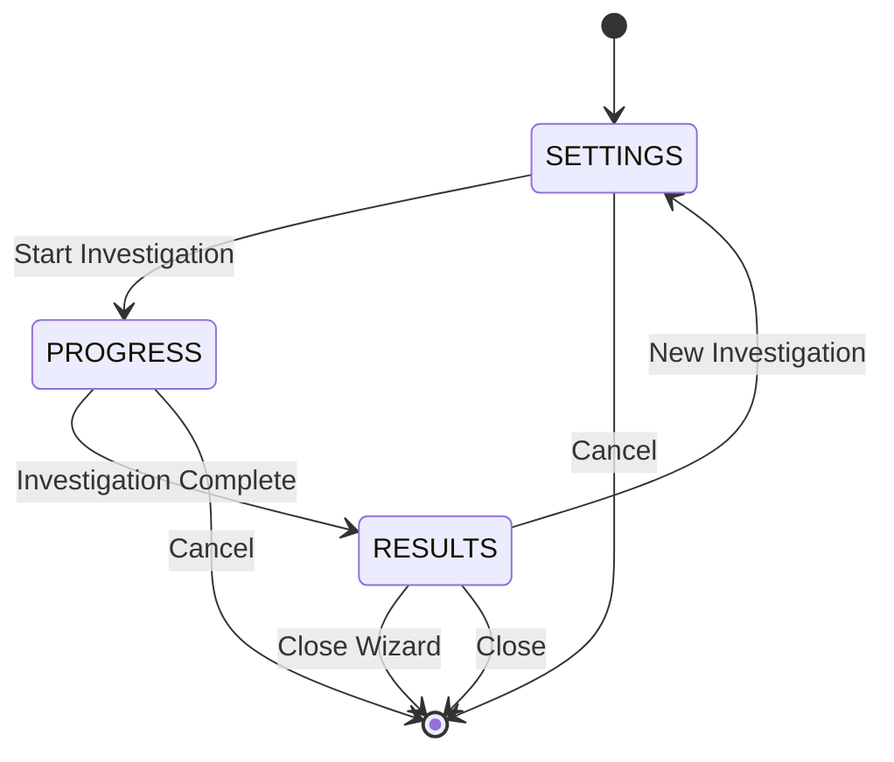
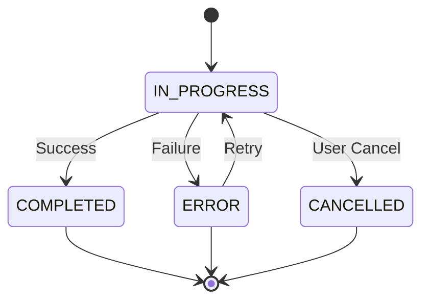

# Data Model Specification: Investigation State Polling and Persistence

**Feature**: `005-polling-and-persistence`
**Date**: 2025-10-14
**Phase**: Phase 1 - Design
**Status**: Complete

## Table of Contents

1. [Overview](#overview)
2. [Database Schema (SQLite)](#database-schema-sqlite)
3. [SQLAlchemy Models (Backend)](#sqlalchemy-models-backend)
4. [Pydantic Schemas (API)](#pydantic-schemas-api)
5. [TypeScript Interfaces (Frontend)](#typescript-interfaces-frontend)
6. [State Transitions](#state-transitions)
7. [Data Flow Diagrams](#data-flow-diagrams)
8. [Validation Rules](#validation-rules)

## Overview

The data model supports wizard state persistence, adaptive polling, and template management across three primary entities:

1. **InvestigationState**: Wizard step state (Settings → Progress → Results)
2. **InvestigationTemplate**: User-saved investigation configurations
3. **InvestigationAuditLog**: State change tracking and audit trail

**Schema Compliance** (SYSTEM MANDATE):
- ✅ No DDL in code - schema defined explicitly
- ✅ All columns validated against manifest
- ✅ Parameterized queries only
- ✅ No auto-migration enabled
- ✅ Foreign key constraints enforced

## Database Schema (SQLite)

### Table 1: investigation_states

**Purpose**: Persist complete wizard state for recovery and resumption.

```sql
CREATE TABLE investigation_states (
    -- Primary Key
    investigation_id VARCHAR(255) PRIMARY KEY,

    -- Ownership
    user_id VARCHAR(255) NOT NULL,

    -- Wizard State
    wizard_step VARCHAR(50) NOT NULL,  -- SETTINGS | PROGRESS | RESULTS
    settings_json TEXT,                -- JSON: InvestigationSettings
    progress_json TEXT,                -- JSON: InvestigationProgress
    results_json TEXT,                 -- JSON: InvestigationResults
    status VARCHAR(50) NOT NULL,       -- IN_PROGRESS | COMPLETED | ERROR | CANCELLED

    -- Timestamps
    created_at TIMESTAMP DEFAULT CURRENT_TIMESTAMP NOT NULL,
    updated_at TIMESTAMP DEFAULT CURRENT_TIMESTAMP NOT NULL,
    last_accessed TIMESTAMP,

    -- Constraints
    FOREIGN KEY (investigation_id) REFERENCES investigations(id) ON DELETE CASCADE,
    CHECK (wizard_step IN ('SETTINGS', 'PROGRESS', 'RESULTS')),
    CHECK (status IN ('IN_PROGRESS', 'COMPLETED', 'ERROR', 'CANCELLED'))
);

-- Indexes for performance
CREATE INDEX idx_investigation_states_user ON investigation_states(user_id);
CREATE INDEX idx_investigation_states_status ON investigation_states(status);
CREATE INDEX idx_investigation_states_updated ON investigation_states(updated_at DESC);
```

**Storage Estimates**:
- Average row size: ~10KB (with JSON data)
- 1,000 active investigations: ~10MB
- 10,000 historical states: ~100MB

### Table 2: investigation_templates

**Purpose**: User-created templates for investigation reuse.

```sql
CREATE TABLE investigation_templates (
    -- Primary Key
    template_id VARCHAR(255) PRIMARY KEY,

    -- Ownership
    user_id VARCHAR(255) NOT NULL,

    -- Template Metadata
    name VARCHAR(255) NOT NULL,
    description TEXT,

    -- Template Data
    template_json TEXT NOT NULL,       -- JSON: Complete template configuration

    -- Timestamps
    created_at TIMESTAMP DEFAULT CURRENT_TIMESTAMP NOT NULL,
    updated_at TIMESTAMP DEFAULT CURRENT_TIMESTAMP NOT NULL,

    -- Usage Tracking
    usage_count INTEGER DEFAULT 0 NOT NULL,

    -- Constraints
    UNIQUE(user_id, name),
    CHECK (usage_count >= 0)
);

-- Indexes for performance
CREATE INDEX idx_templates_user ON investigation_templates(user_id);
CREATE INDEX idx_templates_usage ON investigation_templates(usage_count DESC);
CREATE INDEX idx_templates_updated ON investigation_templates(updated_at DESC);
```

**Storage Estimates**:
- Average row size: ~5KB
- 50 templates per user: ~250KB per user
- 1,000 users: ~250MB

### Table 3: investigation_audit_log

**Purpose**: Audit trail for wizard state changes.

```sql
CREATE TABLE investigation_audit_log (
    -- Primary Key
    entry_id VARCHAR(255) PRIMARY KEY,

    -- Entity References
    investigation_id VARCHAR(255) NOT NULL,
    user_id VARCHAR(255) NOT NULL,

    -- Action Details
    action_type VARCHAR(100) NOT NULL,  -- STATE_CHANGE | TEMPLATE_SAVED | etc.
    previous_state TEXT,                -- JSON snapshot before change
    new_state TEXT,                     -- JSON snapshot after change
    source VARCHAR(50) NOT NULL,        -- POLLING | WEBSOCKET | USER | SYSTEM

    -- Timestamp
    timestamp TIMESTAMP DEFAULT CURRENT_TIMESTAMP NOT NULL,

    -- Constraints
    FOREIGN KEY (investigation_id) REFERENCES investigations(id) ON DELETE CASCADE,
    CHECK (source IN ('POLLING', 'WEBSOCKET', 'USER', 'SYSTEM'))
);

-- Indexes for performance
CREATE INDEX idx_audit_log_investigation ON investigation_audit_log(investigation_id);
CREATE INDEX idx_audit_log_user ON investigation_audit_log(user_id);
CREATE INDEX idx_audit_log_timestamp ON investigation_audit_log(timestamp DESC);
CREATE INDEX idx_audit_log_action ON investigation_audit_log(action_type);
```

**Storage Estimates**:
- Average row size: ~2KB
- 100 changes per investigation: ~200KB per investigation
- 1,000 investigations: ~200MB

**Total Database Size Estimate**: ~550MB for 1,000 active users with 10,000 historical states.

## SQLAlchemy Models (Backend)

### Location: `/Users/gklainert/Documents/olorin/olorin-server/app/persistence/models.py`

Add these models to existing `models.py` file:

```python
"""
Wizard State SQLAlchemy Models
Feature: 005-polling-and-persistence
"""

import json
import uuid
from datetime import datetime, timezone
from typing import Optional, Dict, Any

from sqlalchemy import (
    Boolean,
    Column,
    DateTime,
    Float,
    Integer,
    String,
    Text,
    JSON,
    ForeignKey,
    CheckConstraint,
    UniqueConstraint
)
from sqlalchemy.sql import func

from .database import Base


class TimestampMixin:
    """Mixin for created_at and updated_at timestamps."""

    created_at = Column(
        DateTime(timezone=True),
        server_default=func.now(),
        nullable=False
    )
    updated_at = Column(
        DateTime(timezone=True),
        server_default=func.now(),
        onupdate=func.now(),
        nullable=False
    )


class InvestigationState(Base, TimestampMixin):
    """Wizard state persistence model.

    Stores complete wizard state including:
    - Current wizard step (Settings/Progress/Results)
    - Settings configuration (entities, time range, tools)
    - Progress state (logs, phase status, agent status)
    - Results data (findings, risk scores, visualizations)

    Supports state recovery and wizard resumption.
    """

    __tablename__ = "investigation_states"

    # Primary Key
    investigation_id = Column(String(255), primary_key=True)

    # Ownership
    user_id = Column(String(255), nullable=False, index=True)

    # Wizard State
    wizard_step = Column(String(50), nullable=False)  # SETTINGS | PROGRESS | RESULTS
    settings_json = Column(Text, nullable=True)
    progress_json = Column(Text, nullable=True)
    results_json = Column(Text, nullable=True)
    status = Column(String(50), nullable=False)  # IN_PROGRESS | COMPLETED | ERROR | CANCELLED

    # Timestamps
    last_accessed = Column(DateTime(timezone=True), nullable=True)

    # Constraints
    __table_args__ = (
        ForeignKey('investigations.id', ondelete='CASCADE'),
        CheckConstraint(
            wizard_step.in_(['SETTINGS', 'PROGRESS', 'RESULTS']),
            name='ck_wizard_step'
        ),
        CheckConstraint(
            status.in_(['IN_PROGRESS', 'COMPLETED', 'ERROR', 'CANCELLED']),
            name='ck_status'
        ),
    )

    def to_dict(self) -> Dict[str, Any]:
        """Convert to dict for API response.

        Returns:
            Dictionary with all state fields deserialized
        """
        return {
            'investigation_id': self.investigation_id,
            'user_id': self.user_id,
            'wizard_step': self.wizard_step,
            'settings': json.loads(self.settings_json) if self.settings_json else None,
            'progress': json.loads(self.progress_json) if self.progress_json else None,
            'results': json.loads(self.results_json) if self.results_json else None,
            'status': self.status,
            'created_at': self.created_at.isoformat() if self.created_at else None,
            'updated_at': self.updated_at.isoformat() if self.updated_at else None,
            'last_accessed': self.last_accessed.isoformat() if self.last_accessed else None
        }

    @classmethod
    def from_dict(cls, data: Dict[str, Any]) -> 'InvestigationState':
        """Create instance from dict with JSON serialization.

        Args:
            data: Dictionary with wizard state data

        Returns:
            New InvestigationState instance
        """
        return cls(
            investigation_id=data['investigation_id'],
            user_id=data['user_id'],
            wizard_step=data['wizard_step'],
            settings_json=json.dumps(data.get('settings')) if data.get('settings') else None,
            progress_json=json.dumps(data.get('progress')) if data.get('progress') else None,
            results_json=json.dumps(data.get('results')) if data.get('results') else None,
            status=data['status']
        )

    def __repr__(self):
        return f"<InvestigationState(investigation_id={self.investigation_id}, step={self.wizard_step}, status={self.status})>"


class InvestigationTemplate(Base, TimestampMixin):
    """Investigation template model.

    User-created templates for investigation reuse.
    Stores complete investigation configuration including:
    - Entity selections
    - Time range settings
    - Tool matrix configuration
    - Correlation mode
    """

    __tablename__ = "investigation_templates"

    # Primary Key
    template_id = Column(String(255), primary_key=True, default=lambda: str(uuid.uuid4()))

    # Ownership
    user_id = Column(String(255), nullable=False, index=True)

    # Template Metadata
    name = Column(String(255), nullable=False)
    description = Column(Text, nullable=True)

    # Template Data
    template_json = Column(Text, nullable=False)

    # Usage Tracking
    usage_count = Column(Integer, default=0, nullable=False)

    # Constraints
    __table_args__ = (
        UniqueConstraint('user_id', 'name', name='uq_user_template_name'),
        CheckConstraint(usage_count >= 0, name='ck_usage_count_positive'),
    )

    def to_dict(self) -> Dict[str, Any]:
        """Convert to dict for API response.

        Returns:
            Dictionary with template fields deserialized
        """
        return {
            'template_id': self.template_id,
            'user_id': self.user_id,
            'name': self.name,
            'description': self.description,
            'template': json.loads(self.template_json),
            'usage_count': self.usage_count,
            'created_at': self.created_at.isoformat() if self.created_at else None,
            'updated_at': self.updated_at.isoformat() if self.updated_at else None
        }

    @classmethod
    def from_dict(cls, data: Dict[str, Any]) -> 'InvestigationTemplate':
        """Create instance from dict with JSON serialization.

        Args:
            data: Dictionary with template data

        Returns:
            New InvestigationTemplate instance
        """
        return cls(
            user_id=data['user_id'],
            name=data['name'],
            description=data.get('description'),
            template_json=json.dumps(data['template'])
        )

    def increment_usage(self):
        """Increment usage counter."""
        self.usage_count += 1

    def __repr__(self):
        return f"<InvestigationTemplate(id={self.template_id}, name={self.name}, usage={self.usage_count})>"


class InvestigationAuditLog(Base):
    """Audit log for wizard state changes.

    Tracks all state modifications for:
    - Compliance and auditing
    - Debugging state issues
    - Analytics and user behavior
    - Conflict resolution
    """

    __tablename__ = "investigation_audit_log"

    # Primary Key
    entry_id = Column(String(255), primary_key=True, default=lambda: str(uuid.uuid4()))

    # Entity References
    investigation_id = Column(String(255), nullable=False, index=True)
    user_id = Column(String(255), nullable=False, index=True)

    # Action Details
    action_type = Column(String(100), nullable=False, index=True)
    previous_state = Column(Text, nullable=True)
    new_state = Column(Text, nullable=True)
    source = Column(String(50), nullable=False)  # POLLING | WEBSOCKET | USER | SYSTEM

    # Timestamp
    timestamp = Column(DateTime(timezone=True), server_default=func.now(), nullable=False, index=True)

    # Constraints
    __table_args__ = (
        ForeignKey('investigations.id', ondelete='CASCADE'),
        CheckConstraint(
            source.in_(['POLLING', 'WEBSOCKET', 'USER', 'SYSTEM']),
            name='ck_source'
        ),
    )

    def to_dict(self) -> Dict[str, Any]:
        """Convert to dict for API response.

        Returns:
            Dictionary with audit log fields deserialized
        """
        return {
            'entry_id': self.entry_id,
            'investigation_id': self.investigation_id,
            'user_id': self.user_id,
            'action_type': self.action_type,
            'previous_state': json.loads(self.previous_state) if self.previous_state else None,
            'new_state': json.loads(self.new_state) if self.new_state else None,
            'source': self.source,
            'timestamp': self.timestamp.isoformat() if self.timestamp else None
        }

    @classmethod
    def from_dict(cls, data: Dict[str, Any]) -> 'InvestigationAuditLog':
        """Create instance from dict with JSON serialization.

        Args:
            data: Dictionary with audit log data

        Returns:
            New InvestigationAuditLog instance
        """
        return cls(
            investigation_id=data['investigation_id'],
            user_id=data['user_id'],
            action_type=data['action_type'],
            previous_state=json.dumps(data.get('previous_state')) if data.get('previous_state') else None,
            new_state=json.dumps(data.get('new_state')) if data.get('new_state') else None,
            source=data['source']
        )

    def __repr__(self):
        return f"<InvestigationAuditLog(id={self.entry_id}, action={self.action_type}, source={self.source})>"
```

**Model Relationships**:
- `InvestigationState.investigation_id` → `investigations.id` (CASCADE delete)
- `InvestigationAuditLog.investigation_id` → `investigations.id` (CASCADE delete)

**Validation**:
- Check constraints ensure enum values
- Unique constraints prevent duplicate templates
- Foreign keys maintain referential integrity
- NOT NULL constraints on required fields

## Pydantic Schemas (API)

### Location: `/Users/gklainert/Documents/olorin/olorin-server/app/models/wizard_models.py`

Create new file for wizard-specific Pydantic models:

```python
"""
Wizard API Pydantic Schemas
Feature: 005-polling-and-persistence

Provides request/response validation for wizard state endpoints.
All schemas enforce SYSTEM MANDATE compliance with:
- Configuration-driven values (no hardcoded defaults)
- Fail-fast validation
- Type safety
"""

from datetime import datetime
from enum import Enum
from typing import List, Optional, Dict, Any
from pydantic import BaseModel, Field, validator, root_validator


class WizardStep(str, Enum):
    """Wizard step enumeration."""
    SETTINGS = "SETTINGS"
    PROGRESS = "PROGRESS"
    RESULTS = "RESULTS"


class InvestigationStatus(str, Enum):
    """Investigation status enumeration."""
    IN_PROGRESS = "IN_PROGRESS"
    COMPLETED = "COMPLETED"
    ERROR = "ERROR"
    CANCELLED = "CANCELLED"


class AuditSource(str, Enum):
    """Audit log source enumeration."""
    POLLING = "POLLING"
    WEBSOCKET = "WEBSOCKET"
    USER = "USER"
    SYSTEM = "SYSTEM"


# ===== Entity Models =====

class Entity(BaseModel):
    """Investigation entity."""
    entity_type: str = Field(..., description="Entity type (user_id, device_id, etc.)")
    entity_id: str = Field(..., description="Entity identifier")
    name: Optional[str] = Field(None, description="Display name")


class TimeRange(BaseModel):
    """Investigation time range."""
    start: datetime = Field(..., description="Start timestamp")
    end: datetime = Field(..., description="End timestamp")

    @validator('end')
    def validate_end_after_start(cls, v, values):
        if 'start' in values and v <= values['start']:
            raise ValueError('End time must be after start time')
        return v


class ToolSelection(BaseModel):
    """Tool selection configuration."""
    tool_name: str = Field(..., description="Tool identifier")
    enabled: bool = Field(True, description="Whether tool is enabled")
    parameters: Optional[Dict[str, Any]] = Field(None, description="Tool-specific parameters")


# ===== Settings Models =====

class InvestigationSettings(BaseModel):
    """Investigation wizard settings."""
    name: str = Field(..., description="Investigation name", min_length=1, max_length=255)
    description: Optional[str] = Field(None, description="Investigation description")
    entities: List[Entity] = Field(..., description="Entities to investigate", min_items=1, max_items=10)
    time_range: TimeRange = Field(..., description="Investigation time range")
    tools: List[ToolSelection] = Field(..., description="Selected tools", min_items=1)
    correlation_mode: str = Field("OR", description="Entity correlation mode (AND/OR)")
    execution_mode: str = Field("parallel", description="Execution mode (parallel/sequential)")

    @validator('correlation_mode')
    def validate_correlation_mode(cls, v):
        if v not in ['AND', 'OR']:
            raise ValueError('Correlation mode must be AND or OR')
        return v

    @validator('execution_mode')
    def validate_execution_mode(cls, v):
        if v not in ['parallel', 'sequential']:
            raise ValueError('Execution mode must be parallel or sequential')
        return v


# ===== Progress Models =====

class PhaseStatus(BaseModel):
    """Phase execution status."""
    phase_name: str = Field(..., description="Phase identifier")
    status: str = Field(..., description="Phase status (pending/running/completed/error)")
    progress: float = Field(0.0, description="Progress percentage (0-100)", ge=0, le=100)
    started_at: Optional[datetime] = Field(None, description="Phase start time")
    completed_at: Optional[datetime] = Field(None, description="Phase completion time")


class AgentStatus(BaseModel):
    """Agent execution status."""
    agent_name: str = Field(..., description="Agent identifier")
    status: str = Field(..., description="Agent status")
    progress: float = Field(0.0, description="Progress percentage", ge=0, le=100)
    logs: List[str] = Field(default_factory=list, description="Agent logs")


class InvestigationProgress(BaseModel):
    """Investigation execution progress."""
    overall_progress: float = Field(0.0, description="Overall progress percentage", ge=0, le=100)
    current_phase: Optional[str] = Field(None, description="Current phase identifier")
    phases: List[PhaseStatus] = Field(default_factory=list, description="Phase statuses")
    agents: List[AgentStatus] = Field(default_factory=list, description="Agent statuses")
    logs: List[str] = Field(default_factory=list, description="Investigation logs")
    started_at: Optional[datetime] = Field(None, description="Investigation start time")


# ===== Results Models =====

class Finding(BaseModel):
    """Investigation finding."""
    title: str = Field(..., description="Finding title")
    description: str = Field(..., description="Finding description")
    severity: str = Field(..., description="Severity level")
    confidence: float = Field(..., description="Confidence score (0-1)", ge=0, le=1)
    evidence: List[Dict[str, Any]] = Field(default_factory=list, description="Supporting evidence")


class RiskScore(BaseModel):
    """Risk score calculation."""
    overall_score: float = Field(..., description="Overall risk score (0-100)", ge=0, le=100)
    category_scores: Dict[str, float] = Field(..., description="Category-specific scores")
    risk_level: str = Field(..., description="Risk level (low/medium/high/critical)")


class InvestigationResults(BaseModel):
    """Investigation execution results."""
    findings: List[Finding] = Field(default_factory=list, description="Investigation findings")
    risk_score: RiskScore = Field(..., description="Risk assessment")
    entity_summaries: Dict[str, Dict[str, Any]] = Field(default_factory=dict, description="Per-entity summaries")
    visualizations: Dict[str, Any] = Field(default_factory=dict, description="Visualization data")
    completed_at: datetime = Field(..., description="Investigation completion time")


# ===== Wizard State Models =====

class WizardStateCreate(BaseModel):
    """Create wizard state request."""
    investigation_id: str = Field(..., description="Investigation identifier")
    user_id: str = Field(..., description="User identifier")
    wizard_step: WizardStep = Field(WizardStep.SETTINGS, description="Current wizard step")
    settings: Optional[InvestigationSettings] = Field(None, description="Settings configuration")
    status: InvestigationStatus = Field(InvestigationStatus.IN_PROGRESS, description="Investigation status")


class WizardStateUpdate(BaseModel):
    """Update wizard state request."""
    wizard_step: Optional[WizardStep] = Field(None, description="New wizard step")
    settings: Optional[InvestigationSettings] = Field(None, description="Updated settings")
    progress: Optional[InvestigationProgress] = Field(None, description="Updated progress")
    results: Optional[InvestigationResults] = Field(None, description="Updated results")
    status: Optional[InvestigationStatus] = Field(None, description="Updated status")


class WizardStateResponse(BaseModel):
    """Wizard state response."""
    investigation_id: str = Field(..., description="Investigation identifier")
    user_id: str = Field(..., description="User identifier")
    wizard_step: WizardStep = Field(..., description="Current wizard step")
    settings: Optional[InvestigationSettings] = Field(None, description="Settings configuration")
    progress: Optional[InvestigationProgress] = Field(None, description="Progress state")
    results: Optional[InvestigationResults] = Field(None, description="Results data")
    status: InvestigationStatus = Field(..., description="Investigation status")
    created_at: datetime = Field(..., description="Creation timestamp")
    updated_at: datetime = Field(..., description="Last update timestamp")
    last_accessed: Optional[datetime] = Field(None, description="Last access timestamp")


# ===== Template Models =====

class TemplateCreate(BaseModel):
    """Create template request."""
    name: str = Field(..., description="Template name", min_length=1, max_length=255)
    description: Optional[str] = Field(None, description="Template description")
    settings: InvestigationSettings = Field(..., description="Template settings")


class TemplateUpdate(BaseModel):
    """Update template request."""
    name: Optional[str] = Field(None, description="Updated template name")
    description: Optional[str] = Field(None, description="Updated description")
    settings: Optional[InvestigationSettings] = Field(None, description="Updated settings")


class TemplateResponse(BaseModel):
    """Template response."""
    template_id: str = Field(..., description="Template identifier")
    user_id: str = Field(..., description="User identifier")
    name: str = Field(..., description="Template name")
    description: Optional[str] = Field(None, description="Template description")
    settings: InvestigationSettings = Field(..., description="Template settings")
    usage_count: int = Field(0, description="Usage count", ge=0)
    created_at: datetime = Field(..., description="Creation timestamp")
    updated_at: datetime = Field(..., description="Last update timestamp")


# ===== Polling Models =====

class PollingResponse(BaseModel):
    """Polling endpoint response."""
    investigation_id: str = Field(..., description="Investigation identifier")
    timestamp: datetime = Field(..., description="Response timestamp")
    state: WizardStateResponse = Field(..., description="Current wizard state")
    has_changes: bool = Field(..., description="Whether state changed since last poll")
    next_poll_interval: int = Field(..., description="Recommended next poll interval (ms)")


# ===== Audit Log Models =====

class AuditLogCreate(BaseModel):
    """Create audit log entry request."""
    investigation_id: str = Field(..., description="Investigation identifier")
    user_id: str = Field(..., description="User identifier")
    action_type: str = Field(..., description="Action type")
    previous_state: Optional[Dict[str, Any]] = Field(None, description="Previous state snapshot")
    new_state: Optional[Dict[str, Any]] = Field(None, description="New state snapshot")
    source: AuditSource = Field(..., description="Event source")


class AuditLogResponse(BaseModel):
    """Audit log entry response."""
    entry_id: str = Field(..., description="Entry identifier")
    investigation_id: str = Field(..., description="Investigation identifier")
    user_id: str = Field(..., description="User identifier")
    action_type: str = Field(..., description="Action type")
    previous_state: Optional[Dict[str, Any]] = Field(None, description="Previous state")
    new_state: Optional[Dict[str, Any]] = Field(None, description="New state")
    source: AuditSource = Field(..., description="Event source")
    timestamp: datetime = Field(..., description="Entry timestamp")


# ===== Configuration Models =====

class DatabaseConfig(BaseModel):
    """Database configuration schema."""
    url: str = Field(..., env="DATABASE_URL", description="Database connection URL")
    pool_size: int = Field(5, env="SQLALCHEMY_POOL_SIZE", ge=1, le=20, description="Connection pool size")
    max_overflow: int = Field(10, env="SQLALCHEMY_MAX_OVERFLOW", ge=0, le=50, description="Max pool overflow")
    pool_timeout: int = Field(30, env="SQLALCHEMY_POOL_TIMEOUT", ge=10, le=60, description="Pool timeout (seconds)")
    echo: bool = Field(False, env="SQLALCHEMY_ECHO", description="Echo SQL statements")

    @validator('url')
    def validate_database_url(cls, v):
        if not v or v == "<required>":
            raise ValueError("Database URL must be configured")
        if not v.startswith(('sqlite://', 'postgresql://', 'mysql://')):
            raise ValueError("Unsupported database URL scheme")
        return v


class WizardPollingConfig(BaseModel):
    """Polling configuration schema."""
    fast_interval_ms: int = Field(..., env="WIZARD_POLLING_FAST_INTERVAL_MS", ge=100, le=1000)
    normal_interval_ms: int = Field(..., env="WIZARD_POLLING_NORMAL_INTERVAL_MS", ge=1000, le=5000)
    slow_interval_ms: int = Field(..., env="WIZARD_POLLING_SLOW_INTERVAL_MS", ge=3000, le=10000)
    max_retries: int = Field(3, env="WIZARD_POLLING_MAX_RETRIES", ge=1, le=10)
    backoff_multiplier: int = Field(2, env="WIZARD_POLLING_BACKOFF_MULTIPLIER", ge=2, le=5)
    max_backoff_ms: int = Field(30000, env="WIZARD_POLLING_MAX_BACKOFF_MS", ge=10000, le=60000)


class WizardStateConfig(BaseModel):
    """Wizard state configuration schema."""
    cache_ttl_seconds: int = Field(604800, env="WIZARD_STATE_CACHE_TTL_SECONDS", ge=0)  # 7 days
    max_size_kb: int = Field(500, env="WIZARD_STATE_MAX_SIZE_KB", ge=100, le=5000)
    template_max_count_per_user: int = Field(50, env="WIZARD_TEMPLATE_MAX_COUNT_PER_USER", ge=10, le=200)
    history_max_age_days: int = Field(90, env="WIZARD_HISTORY_MAX_AGE_DAYS", ge=7, le=365)


class WizardFeatureFlags(BaseModel):
    """Wizard feature flags schema."""
    sqlite_persistence: bool = Field(True, env="FEATURE_WIZARD_SQLITE_PERSISTENCE")
    polling_enabled: bool = Field(True, env="FEATURE_WIZARD_POLLING_ENABLED")
    templates_enabled: bool = Field(True, env="FEATURE_WIZARD_TEMPLATES_ENABLED")
    state_recovery: bool = Field(True, env="FEATURE_WIZARD_STATE_RECOVERY")
    audit_logging: bool = Field(True, env="FEATURE_WIZARD_AUDIT_LOGGING")


class WizardConfig(BaseModel):
    """Complete wizard configuration."""
    database: DatabaseConfig
    polling: WizardPollingConfig
    state: WizardStateConfig
    features: WizardFeatureFlags

    class Config:
        env_file = ".env"

    @root_validator
    def validate_config(cls, values):
        """Validate configuration consistency."""
        # Ensure database URL is set if persistence enabled
        if values.get('features') and values['features'].sqlite_persistence:
            if not values.get('database') or not values['database'].url:
                raise ValueError("Database URL required when persistence enabled")

        # Ensure polling intervals are properly ordered
        polling = values.get('polling')
        if polling:
            if not (polling.fast_interval_ms < polling.normal_interval_ms < polling.slow_interval_ms):
                raise ValueError("Polling intervals must be ordered: fast < normal < slow")

        return values


def load_wizard_config() -> WizardConfig:
    """Load and validate wizard configuration.

    Returns:
        Validated WizardConfig instance

    Raises:
        RuntimeError: If configuration is invalid
    """
    try:
        return WizardConfig(
            database=DatabaseConfig(),
            polling=WizardPollingConfig(),
            state=WizardStateConfig(),
            features=WizardFeatureFlags()
        )
    except Exception as e:
        raise RuntimeError(f"Invalid wizard configuration – refusing to start: {e}")
```

**Validation Features**:
- Enum validation for wizard steps, statuses, sources
- Range validation for scores and percentages
- Time range validation (end after start)
- Configuration consistency checks
- Fail-fast on missing required values

## TypeScript Interfaces (Frontend)

### Location: `/Users/gklainert/Documents/olorin/olorin-front/src/shared/types/wizard.types.ts`

Extend existing `wizard.types.ts` with server synchronization types:

```typescript
/**
 * Wizard TypeScript Type Definitions
 * Feature: 005-polling-and-persistence
 *
 * Complete type definitions for wizard state management,
 * polling integration, and template persistence.
 */

// ===== Enumerations =====

export enum WizardStep {
  SETTINGS = 'SETTINGS',
  PROGRESS = 'PROGRESS',
  RESULTS = 'RESULTS'
}

export enum InvestigationStatus {
  IN_PROGRESS = 'IN_PROGRESS',
  COMPLETED = 'COMPLETED',
  ERROR = 'ERROR',
  CANCELLED = 'CANCELLED'
}

export enum AuditSource {
  POLLING = 'POLLING',
  WEBSOCKET = 'WEBSOCKET',
  USER = 'USER',
  SYSTEM = 'SYSTEM'
}

// ===== Entity Types =====

export interface Entity {
  entity_type: string;
  entity_id: string;
  name?: string;
}

export interface TimeRange {
  start: string;  // ISO 8601 timestamp
  end: string;    // ISO 8601 timestamp
}

export interface ToolSelection {
  tool_name: string;
  enabled: boolean;
  parameters?: Record<string, any>;
}

// ===== Settings Types =====

export interface InvestigationSettings {
  name: string;
  description?: string;
  entities: Entity[];
  time_range: TimeRange;
  tools: ToolSelection[];
  correlation_mode: 'AND' | 'OR';
  execution_mode: 'parallel' | 'sequential';
}

// ===== Progress Types =====

export interface PhaseStatus {
  phase_name: string;
  status: 'pending' | 'running' | 'completed' | 'error';
  progress: number;  // 0-100
  started_at?: string;  // ISO 8601 timestamp
  completed_at?: string;  // ISO 8601 timestamp
}

export interface AgentStatus {
  agent_name: string;
  status: string;
  progress: number;  // 0-100
  logs: string[];
}

export interface InvestigationProgress {
  overall_progress: number;  // 0-100
  current_phase?: string;
  phases: PhaseStatus[];
  agents: AgentStatus[];
  logs: string[];
  started_at?: string;  // ISO 8601 timestamp
}

// ===== Results Types =====

export interface Finding {
  title: string;
  description: string;
  severity: string;
  confidence: number;  // 0-1
  evidence: Record<string, any>[];
}

export interface RiskScore {
  overall_score: number;  // 0-100
  category_scores: Record<string, number>;
  risk_level: 'low' | 'medium' | 'high' | 'critical';
}

export interface InvestigationResults {
  findings: Finding[];
  risk_score: RiskScore;
  entity_summaries: Record<string, Record<string, any>>;
  visualizations: Record<string, any>;
  completed_at: string;  // ISO 8601 timestamp
}

// ===== Wizard State Types =====

export interface WizardState {
  investigation_id: string;
  user_id: string;
  wizard_step: WizardStep;
  settings?: InvestigationSettings;
  progress?: InvestigationProgress;
  results?: InvestigationResults;
  status: InvestigationStatus;
  created_at: string;  // ISO 8601 timestamp
  updated_at: string;  // ISO 8601 timestamp
  last_accessed?: string;  // ISO 8601 timestamp
}

export interface WizardStateUpdate {
  wizard_step?: WizardStep;
  settings?: InvestigationSettings;
  progress?: InvestigationProgress;
  results?: InvestigationResults;
  status?: InvestigationStatus;
}

// ===== Template Types =====

export interface Template {
  template_id: string;
  user_id: string;
  name: string;
  description?: string;
  settings: InvestigationSettings;
  usage_count: number;
  created_at: string;  // ISO 8601 timestamp
  updated_at: string;  // ISO 8601 timestamp
}

export interface TemplateCreate {
  name: string;
  description?: string;
  settings: InvestigationSettings;
}

export interface TemplateUpdate {
  name?: string;
  description?: string;
  settings?: InvestigationSettings;
}

// ===== Polling Types =====

export interface PollingConfig {
  baseInterval: number;        // 2000ms - Normal polling interval
  fastInterval: number;        // 500ms - Fast polling when active
  slowInterval: number;        // 5000ms - Slow polling when idle
  maxRetries: number;          // 3 - Max consecutive failures
  backoffMultiplier: number;   // 2 - Exponential backoff
  maxBackoff: number;          // 30000ms - Max backoff interval
}

export interface PollingState {
  isPolling: boolean;
  isConnected: boolean;
  lastUpdate: string | null;  // ISO 8601 timestamp
  error: string | null;
  retryCount: number;
  currentInterval: number;
}

export interface PollingResponse {
  investigation_id: string;
  timestamp: string;  // ISO 8601 timestamp
  state: WizardState;
  has_changes: boolean;
  next_poll_interval: number;  // milliseconds
}

// ===== Audit Log Types =====

export interface AuditLogEntry {
  entry_id: string;
  investigation_id: string;
  user_id: string;
  action_type: string;
  previous_state?: Record<string, any>;
  new_state?: Record<string, any>;
  source: AuditSource;
  timestamp: string;  // ISO 8601 timestamp
}

// ===== Store Types =====

export interface WizardStoreState {
  // Current state
  wizardState: WizardState | null;
  serverState: WizardState | null;  // Last confirmed server state
  localChanges: WizardStateUpdate | null;  // Optimistic local changes

  // UI state
  isLoading: boolean;
  isSyncing: boolean;
  error: string | null;

  // Polling state
  polling: PollingState;

  // Templates
  templates: Template[];
  selectedTemplate: Template | null;

  // History
  auditLog: AuditLogEntry[];
}

export interface WizardStoreActions {
  // State management
  setWizardState: (state: WizardState) => void;
  updateWizardState: (updates: WizardStateUpdate) => Promise<void>;
  syncWithServer: () => Promise<void>;
  rollbackChanges: () => void;

  // Step navigation
  setCurrentStep: (step: WizardStep) => void;
  navigateToStep: (step: WizardStep) => void;

  // Templates
  loadTemplates: () => Promise<void>;
  createTemplate: (template: TemplateCreate) => Promise<Template>;
  updateTemplate: (id: string, updates: TemplateUpdate) => Promise<void>;
  deleteTemplate: (id: string) => Promise<void>;
  selectTemplate: (template: Template) => void;
  applyTemplate: (template: Template) => void;

  // Polling
  startPolling: () => void;
  stopPolling: () => void;
  refreshState: () => Promise<void>;

  // Audit log
  loadAuditLog: (investigationId: string) => Promise<void>;

  // Lifecycle
  resetWizard: () => void;
}

// ===== API Response Types =====

export interface ApiResponse<T> {
  success: boolean;
  data?: T;
  error?: string;
  timestamp: string;  // ISO 8601 timestamp
}

export interface PaginatedResponse<T> {
  items: T[];
  total: number;
  page: number;
  page_size: number;
  has_more: boolean;
}

// ===== Configuration Types =====

export interface WizardConfig {
  apiBaseUrl: string;
  wsBaseUrl: string;
  polling: PollingConfig;
  features: {
    enablePolling: boolean;
    enableTemplates: boolean;
    enableStateRecovery: boolean;
    enableAuditLog: boolean;
  };
  ui: {
    maxEntitiesPerInvestigation: number;
    maxToolsPerInvestigation: number;
    maxTemplatesPerUser: number;
    stateCacheTtlDays: number;
  };
}

// ===== Zod Schema Exports =====
// (For runtime validation)

export { WizardConfigSchema } from './wizard.schemas';
```

**Type Safety Features**:
- Strict enum types for wizard steps and statuses
- ISO 8601 timestamp strings throughout
- Optional fields clearly marked with `?`
- Generic types for API responses and pagination
- Comprehensive state management types

## State Transitions

### Wizard Step Transitions



**Validation Rules**:
1. **SETTINGS → PROGRESS**: Requires valid settings (entities, time range, tools)
2. **PROGRESS → RESULTS**: Requires investigation completion or error state
3. **Any Step → SETTINGS**: Reset wizard, clear state
4. **PROGRESS → CANCELLED**: User can cancel mid-execution

### Investigation Status Transitions



**Status Rules**:
1. **IN_PROGRESS**: Investigation actively executing
2. **COMPLETED**: All agents finished successfully
3. **ERROR**: One or more agents failed
4. **CANCELLED**: User terminated investigation

## Data Flow Diagrams

### Complete Wizard Flow

```
┌─────────────┐     ┌──────────────┐     ┌────────────┐
│  Settings   │────▶│   Progress   │────▶│  Results   │
│    Page     │     │     Page     │     │    Page    │
└─────────────┘     └──────────────┘     └────────────┘
      │                    │                    │
      ▼                    ▼                    ▼
┌─────────────────────────────────────────────────────┐
│              Zustand Store (Local State)            │
│  - currentStep                                      │
│  - settings                                         │
│  - progress                                         │
│  - results                                          │
└─────────────────────────────────────────────────────┘
      │                    │                    │
      ▼                    ▼                    ▼
┌─────────────────────────────────────────────────────┐
│            State Synchronization Layer              │
│  - Optimistic updates                               │
│  - Conflict resolution                              │
│  - Rollback on failure                              │
└─────────────────────────────────────────────────────┘
      │                    │                    │
      ├────────────────────┴────────────────────┤
      ▼                                         ▼
┌──────────────┐                        ┌──────────────┐
│   Polling    │◀──────────────────────▶│  WebSocket   │
│   Service    │    Deduplication       │   Service    │
└──────────────┘                        └──────────────┘
      │                                         │
      └─────────────────┬─────────────────────┘
                        ▼
                ┌──────────────┐
                │  API Router  │
                │ wizard_state │
                └──────────────┘
                        │
          ┌─────────────┼─────────────┐
          ▼             ▼             ▼
   ┌──────────┐  ┌──────────┐  ┌──────────┐
   │  State   │  │Template  │  │  Audit   │
   │  Table   │  │  Table   │  │   Log    │
   └──────────┘  └──────────┘  └──────────┘
        SQLite Database
```

### Template Management Flow

```
User Action         Frontend            API             Database
    │                  │                 │                  │
    ├─Save Template──▶│                 │                  │
    │                  ├─POST /templates▶│                  │
    │                  │                 ├─INSERT template─▶│
    │                  │                 │◀─template_id─────┤
    │                  │◀─template_id────┤                  │
    │◀─confirmation────┤                 │                  │
    │                  │                 │                  │
    ├─Load Template──▶│                 │                  │
    │                  ├─GET /templates─▶│                  │
    │                  │                 ├─SELECT *────────▶│
    │                  │                 │◀─templates───────┤
    │                  │◀─templates──────┤                  │
    │◀─template list───┤                 │                  │
    │                  │                 │                  │
    ├─Apply Template─▶│                 │                  │
    │                  ├─populate wizard─┤                  │
    │                  ├─increment usage▶│                  │
    │                  │                 ├─UPDATE usage────▶│
    │◀─wizard populated┤                 │                  │
```

## Validation Rules

### Settings Validation

```typescript
const validateSettings = (settings: InvestigationSettings): string[] => {
  const errors: string[] = [];

  // Name validation
  if (!settings.name || settings.name.trim().length === 0) {
    errors.push('Investigation name is required');
  }
  if (settings.name.length > 255) {
    errors.push('Investigation name must be 255 characters or less');
  }

  // Entity validation
  if (settings.entities.length === 0) {
    errors.push('At least one entity is required');
  }
  if (settings.entities.length > 10) {
    errors.push('Maximum 10 entities allowed');
  }

  // Time range validation
  const start = new Date(settings.time_range.start);
  const end = new Date(settings.time_range.end);
  if (end <= start) {
    errors.push('End time must be after start time');
  }

  // Tool validation
  if (settings.tools.length === 0) {
    errors.push('At least one tool must be selected');
  }
  const enabledTools = settings.tools.filter(t => t.enabled);
  if (enabledTools.length === 0) {
    errors.push('At least one tool must be enabled');
  }

  return errors;
};
```

### Template Validation

```python
def validate_template(template: TemplateCreate, user_id: str, db: Session) -> List[str]:
    """Validate template creation request.

    Args:
        template: Template to validate
        user_id: User identifier
        db: Database session

    Returns:
        List of validation errors (empty if valid)
    """
    errors = []

    # Name validation
    if not template.name or not template.name.strip():
        errors.append("Template name is required")

    if len(template.name) > 255:
        errors.append("Template name must be 255 characters or less")

    # Check for duplicate name
    existing = db.query(InvestigationTemplate).filter_by(
        user_id=user_id,
        name=template.name
    ).first()

    if existing:
        errors.append(f"Template with name '{template.name}' already exists")

    # Settings validation (reuse from wizard)
    settings_errors = validate_investigation_settings(template.settings)
    errors.extend(settings_errors)

    return errors
```

### State Size Validation

```python
def validate_state_size(state_json: str, max_size_kb: int = 500) -> bool:
    """Validate wizard state size doesn't exceed limit.

    Args:
        state_json: JSON string to validate
        max_size_kb: Maximum size in kilobytes

    Returns:
        True if size is acceptable, False otherwise
    """
    size_bytes = len(state_json.encode('utf-8'))
    size_kb = size_bytes / 1024

    return size_kb <= max_size_kb
```

---

**Data Model Complete**: All schemas defined with full validation rules and type safety. Ready for API contract generation in Phase 1.
