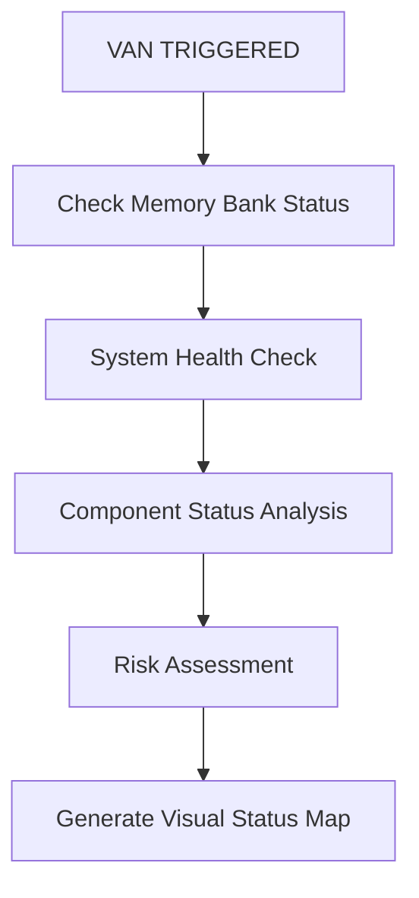

# OLORIN VAN MODE - VISUAL ANALYSIS & NOTIFICATION MAP

## VAN MODE PROCESS DEFINITION
**VAN**: Visual Analysis & Notification - Comprehensive system assessment with visual status reporting

## 🎯 VAN MODE EXECUTION WORKFLOW

### PHASE 1: SYSTEM OVERVIEW ANALYSIS (5 min)

### PHASE 2: COMPONENT ASSESSMENT MATRIX

| Component | Status Check | Key Metrics | Risk Level |
|-----------|-------------|-------------|------------|
| **olorin-server** | ⚡ Test Suite, API Endpoints | 1,050+ tests, 25+ APIs | 🟢 LOW |
| **olorin-front** | 🔍 Security, Integration | React SPA, TypeScript | 🟡 MEDIUM |
| **olorin-web-portal** | 🌐 Multi-language, Deployment | Marketing site | 🟢 LOW |
| **Documentation** | 📚 Currency, Completeness | 77 files, Enterprise-ready | 🟢 LOW |

### PHASE 3: VISUAL STATUS GENERATION

#### 🔍 ASSESSMENT CRITERIA
1. **Technical Health**: Code quality, test coverage, performance
2. **Security Posture**: Vulnerabilities, authentication, data protection  
3. **Documentation Quality**: Completeness, accuracy, usability
4. **Deployment Readiness**: Production stability, monitoring
5. **Business Value**: Fraud detection capability, ROI potential

#### 📊 VAN NOTIFICATION LEVELS

**🟢 LEVEL 1 - GREEN (Optimal)**
- All systems operational
- No critical issues
- Ready for production use
- → NEXT: IMPLEMENT mode for new features

**🟡 LEVEL 2 - YELLOW (Attention Needed)**  
- Minor issues identified
- Optimization opportunities exist
- Non-critical improvements recommended
- → NEXT: PLAN mode for improvements

**🟠 LEVEL 3 - ORANGE (Action Required)**
- Moderate issues requiring resolution
- Performance or security concerns
- Timeline for fixes needed
- → NEXT: PLAN mode for structured resolution

**🔴 LEVEL 4 - RED (Critical)**
- Severe issues blocking operations
- Security vulnerabilities present
- Immediate intervention required
- → NEXT: PLAN mode for emergency response

### PHASE 4: VAN COMPLETION CRITERIA

#### ✅ VAN SUCCESS REQUIREMENTS
1. **Complete System Scan**: All components assessed
2. **Visual Status Map**: Clear status indicators generated  
3. **Risk Categorization**: All findings properly classified
4. **Action Recommendations**: Next steps clearly defined
5. **Memory Bank Update**: Current status documented

#### 📝 VAN DELIVERABLES
- **System Status Report**: Visual component health overview
- **Risk Assessment Matrix**: Categorized findings with priority levels
- **Recommendation Summary**: Immediate and long-term action items
- **Updated Memory Bank**: Current context and status preserved

---

## 🚀 VAN MODE EXECUTION - START IMMEDIATELY

**TRIGGER ACTIVATED**: Execute complete VAN assessment now
**EXPECTED DURATION**: 10-15 minutes  
**OUTPUT**: Comprehensive visual system analysis with clear action recommendations 