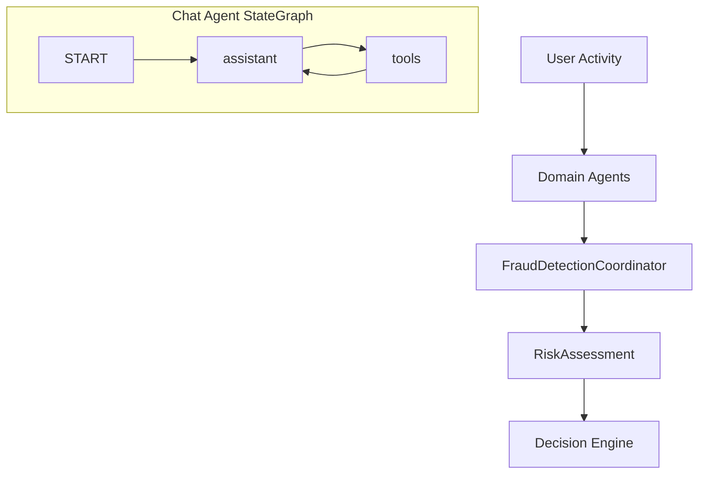

# Olorin Fraud Detection System

A comprehensive, multi-agent fraud detection system designed to analyze and detect suspicious activities in real-time. The system uses multiple data sources and sophisticated analysis techniques to provide accurate risk assessments.

## Table of Contents
- [Overview](#overview)
- [System Architecture](#system-architecture)
- [Installation](#installation)
- [Configuration](#configuration)
- [Usage](#usage)
- [Testing](#testing)
- [Monitoring](#monitoring)
- [Contributing](#contributing)
- [License](#license)

## Overview

The Olorin Fraud Detection System is a distributed, agent-based solution that combines multiple analysis techniques to detect potential fraud:

- Location-based analysis
- Network pattern analysis
- Device fingerprinting
- Splunk log analysis

### Key Features

- Real-time risk assessment
- Multi-factor analysis
- Configurable risk thresholds
- Comprehensive logging
- Scalable architecture
- Mock implementations for testing
- Reactive programming support

## System Architecture

### Components

1. **Core System**
   - `OlorinApplication`: Central coordination and risk assessment
   - `ConfigurationManager`: YAML-based configuration management
   - `RiskAssessment`: Risk scoring and decision making

2. **Agent System**

   **a. Chat Agent (LangGraph)**  
   - Orchestrated via a LangGraph `StateGraph` and exposed on the FastAPI `/v1/agent/invoke` endpoint.
   - **assistant** node (LLM) for free-form user Q&A and reasoning.
   - **tools** node for function-calling to external tools (Splunk, Chronos, CDC, OII, etc.).

   **b. Domain Agents**  
   Exposed under the `/api` prefix for fine‑grained, domain-specific pipelines (no LangGraph involvement):
   - `DeviceAgent`: Device fingerprinting and analysis
   - `LocationAgent`: Geolocation and location-based analysis
   - `NetworkAgent`: Network behavior and pattern analysis
   - `SplunkAgent`: Log analysis and security event processing
   - `AnomalyDetectionAgent`: Aggregates and scores risk across other agents

### Data Flow



## Installation

### Prerequisites

- Splunk instance
- API access to location services

### Setup

```bash
# Clone the repository
git clone https://github.com/your-org/olorin.git
cd olorin

# Copy environment template
cp .env.example .env

# Build the project
```
cd olorin
python3 -m venv .venv && source .venv/bin/activate
pip install poetry
poetry lock
poetry install
```

## Configuration

### Environment Setup

1. Copy the environment template:
   ```bash
   cp .env.example .env
   ```

2. Update the `.env` file with your actual configuration values:
   - Splunk credentials
   - MySQL database settings
   - API keys for location services
   - SMTP settings for notifications

### Application Configuration

The system uses YAML configuration files located in `src/main/resources`:

```yaml
agents:
  splunk:
    enabled: true
    host: ${SPLUNK_HOST}
    port: ${SPLUNK_PORT}
    username: ${SPLUNK_USERNAME}
    password: ${SPLUNK_PASSWORD}
  
  location:
    enabled: true
    cache_timeout: 300
    api_key: ${LOCATION_API_KEY}
  
  network:
    enabled: true
    vpn_risk_threshold: 0.7
    proxy_risk_threshold: 0.8
  
  device:
    enabled: true
    device_change_threshold: 3
    browser_change_threshold: 2
```

## Usage

### Running the System

```bash
# Run with specific user ID
java -jar target/olorin-1.0-SNAPSHOT-jar-with-dependencies.jar <user_id>
```

### Example Usage

```java
public class Example {
    public static void main(String[] args) {
        String userId = "test_user_123";
        OlorinApplication app = new OlorinApplication();
        app.initialize();
        app.startFraudDetection(userId);
    }
}
```

## Testing

### Running Tests

```bash
# Run all tests
mvn test

# Run with specific test
mvn test -Dtest=OlorinApplicationTest

# Run with coverage
mvn verify
```

### Test Scenarios

The system includes comprehensive tests for various fraud scenarios:
- Location-based anomalies
- Network pattern analysis
- Device fingerprint changes
- Suspicious log patterns

## Monitoring

### Logging

The system uses SLF4J with Logback for logging. Logs include:
- System initialization
- Agent operations
- Risk assessments
- Errors and warnings

### Metrics

Future implementations will include:
- Prometheus metrics export
- Grafana dashboards
- Performance monitoring
- Agent health checks

## Contributing

1. Fork the repository
2. Create a feature branch
3. Make your changes
4. Run tests
5. Submit a pull request

### Code Style

- Follow Java code conventions
- Include JavaDoc comments
- Write unit tests
- Use meaningful variable names
- Follow reactive programming patterns

## Security Notes

1. Never commit the `.env` file containing real credentials
2. Keep API keys and passwords secure
3. Use strong passwords for all services
4. Regularly rotate API keys and credentials

## License

This project is proprietary and confidential. Unauthorized copying or distribution is prohibited. 