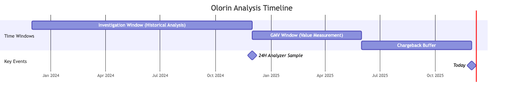
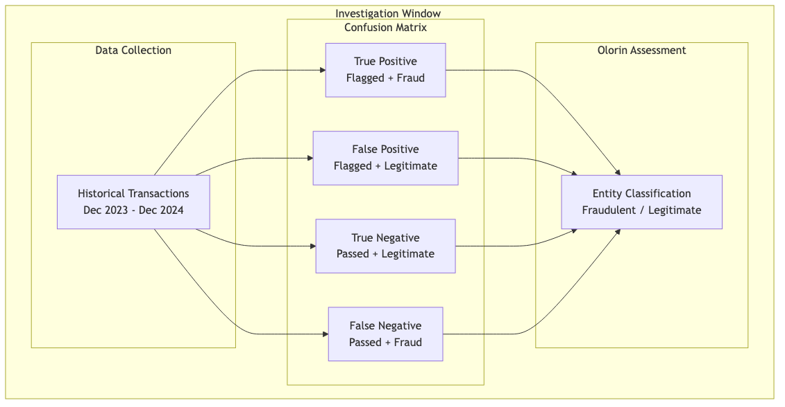
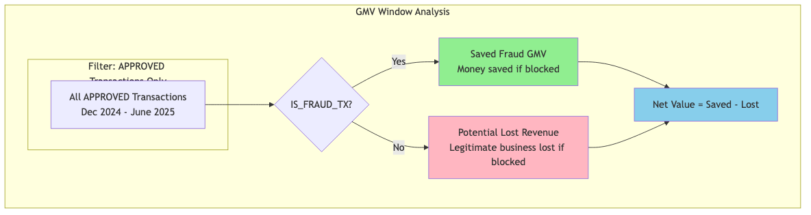
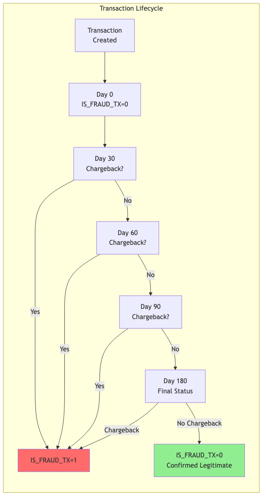
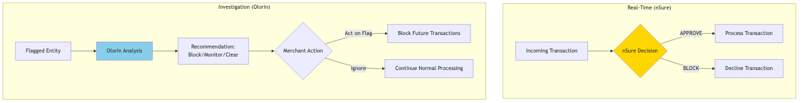

# Olorin Timeline Analysis

This document explains the three temporal windows used in Olorin's fraud detection and value measurement system.

## Overview

Olorin uses three distinct time windows to identify fraudulent entities, analyze their historical behavior, and measure the potential value of acting on Olorin's recommendations.



## The Three Timelines

### 1. 24H Analyzer Window (Entity Discovery)

**When**: A single 24-hour period sampled from ~12 months ago

**Purpose**: Identify entities (emails/IPs) that had transactions with `IS_FRAUD_TX=1`


**Key Insight**: The `IS_FRAUD_TX` label is **retroactive**. A transaction from December 2024 might have been marked as fraud anytime between then and now (up to 180 days for chargebacks to arrive). When we sample "December 2024 transactions," the fraud labels reflect accumulated chargeback data through approximately June 2025.

**Output**: List of entities to investigate

---

### 2. Investigation Window (Historical Pattern Analysis)

**When**: 24 months ago → 12 months ago (e.g., Dec 2023 → Dec 2024)

**Purpose**: Build the confusion matrix (TP/FP/TN/FN) by analyzing the entity's historical behavior



**What's Measured**:

| Category | Description |
|----------|-------------|
| True Positives | Transactions correctly flagged as fraud |
| False Positives | Legitimate transactions incorrectly flagged |
| True Negatives | Legitimate transactions correctly passed |
| False Negatives | Fraudulent transactions that were missed |

**Output**: Olorin's assessment of whether the entity is fraudulent based on historical patterns

---

### 3. GMV Window (Olorin Value Measurement)

**When**: 12 months ago → 6 months ago (e.g., Dec 2024 → June 2025)

**Purpose**: Measure what would happen **if the merchant acted on Olorin's flag**



**What's Measured**:

| Metric | Formula | Description |
|--------|---------|-------------|
| Saved Fraud GMV | `APPROVED + FRAUDULENT` | Money that would have been saved if merchant blocked based on Olorin's flag |
| Potential Lost Revenue | `APPROVED + LEGITIMATE` | Legitimate business that would have been lost if merchant blocked |
| Net Value | `Saved - Lost` | Overall value of acting on Olorin's recommendation |

**Key Distinction**: We only look at **APPROVED** transactions because we're measuring Olorin's potential value, not nSure's actual decisions. nSure is the real-time decision engine that approves/blocks transactions. Olorin is an investigation tool that flags entities for review.

**Output**: Financial impact analysis of Olorin's recommendations

---

## Visual Timeline

```
|-------- Investigation Window --------|-------- GMV Window --------|--- Now ---|
     24 months ago              12 months ago                 6 months ago
     (Dec 2023)                 (Dec 2024)                    (June 2025)
                                    ↑
                            24H Analyzer Sample
                            (entities discovered here)
```

---

## The IS_FRAUD_TX Temporality

The fraud label is not static—it evolves as chargebacks arrive over 30-180 days.



**Implications**:
- When analyzing the GMV window (Dec 2024 → June 2025), transactions near the end might not yet have complete fraud labels
- The 6-month buffer before "now" ensures most chargebacks have been processed
- Historical data is more reliable than recent data for fraud classification

---

## System Architecture


---

## Olorin vs nSure: Key Distinction



**nSure**: Real-time decision engine that approves or blocks individual transactions as they occur.

**Olorin**: Investigation tool that analyzes entity patterns over time and flags entities for merchant review. Olorin's value is measured by what would happen IF the merchant acted on its recommendations.

---

## Example Calculation

For entity `user@example.com` flagged by Olorin:

| Window | Transactions | Result |
|--------|--------------|--------|
| **Investigation** (Dec 2023 - Dec 2024) | 50 transactions | TP=10, FP=5, TN=30, FN=5 |
| **GMV** (Dec 2024 - June 2025) | 20 APPROVED transactions | 15 Legitimate ($1,500), 5 Fraud ($500) |

**Financial Impact**:
- Saved Fraud GMV: $500 (5 fraudulent transactions that would have been blocked)
- Potential Lost Revenue: $1,500 (15 legitimate transactions that would have been blocked)
- Net Value: -$1,000 (blocking this entity would cost $1,000)

**Interpretation**: For this entity, Olorin correctly identified fraud patterns, but the cost of blocking (losing legitimate business) outweighs the fraud savings. The merchant should monitor rather than block.
