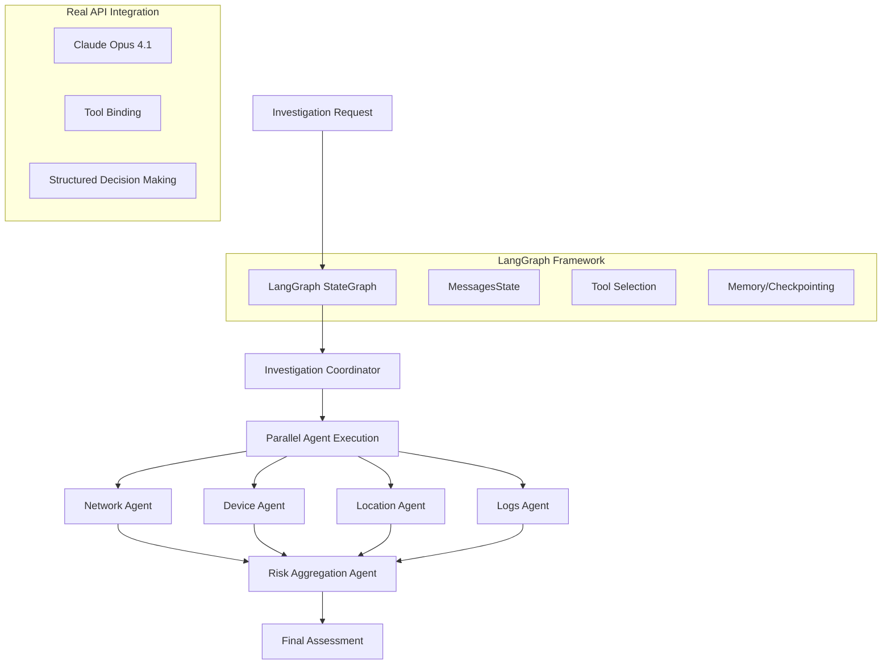

# Olorin Agent Architecture & LangGraph Implementation Analysis

**Author:** Gil Klainert  
**Date:** 2025-08-30  
**Focus:** Agent definitions, LangGraph usage, and structured investigation flow

---

## Executive Summary

The Olorin structured investigation system uses a sophisticated **multi-agent architecture** built on **LangGraph** with **real Anthropic Claude API integration**. The system demonstrates production-grade implementation of structured AI agents for fraud detection, with no mock data usage.

---

## Agent Architecture Overview

### 🏗️ Core Architecture Components



---

## Agent Definitions in Code

### 1. Domain-Specific Agents

The agents mentioned in our investigation analysis are defined across multiple files:

#### **File Structure:**
```
app/service/agent/
├── structured_agents.py          # Main export module
├── domain_agents.py             # Domain agent imports  
├── network_agent.py            # Network analysis agent
├── device_agent.py             # Device fraud detection
├── location_agent.py           # Geographic analysis
├── logs_agent.py               # Log pattern analysis
├── risk_agent.py               # Risk aggregation
└── structured_base.py          # Base structured agent class
```

#### **Agent Import Chain:**
```python
# structured_agents.py (main export)
from .domain_agents import (
    structured_network_agent,      # Network Security Analyst
    structured_device_agent,       # Device Fraud Detector  
    structured_location_agent,     # Location Analysis Agent
    structured_logs_agent,         # Transaction/Logs Specialist
    structured_risk_agent,         # Risk Aggregation Agent
)
```

### 2. Base Structured Agent Class

**File:** `structured_base.py`  
**Core Class:** `StructuredInvestigationAgent`

```python
class StructuredInvestigationAgent:
    def __init__(self, domain: str, tools: List[Any]):
        self.domain = domain
        self.tools = tools
        
        # REAL API INTEGRATION - No mock data
        self.llm_with_tools = structured_llm.bind_tools(tools, strict=True)
```

**Real LLM Configuration:**
```python
# Real Anthropic Claude Opus 4.1 integration
structured_llm = ChatAnthropic(
    api_key=settings_for_env.anthropic_api_key,  # From Firebase secrets
    model="claude-opus-4-1-20250805",           # Claude Opus 4.1
    temperature=0.1,                             # Focused decision making
    max_tokens=8090,                            # Large context window
    timeout=90,                                 # Complex reasoning timeout
)
```

### 3. Domain Agent Implementation

**Example:** Network Analysis Agent (`network_agent.py`)

```python
async def structured_network_agent(state, config) -> dict:
    """Structured network analysis using LLM-driven tool selection"""
    
    # LangGraph state management
    investigation_id = config["configurable"]["thread_id"]
    
    # Create structured agent with tools
    network_agent = create_structured_agent("network", tools)
    
    # REAL API CALL - No predetermined logic
    findings = await network_agent.structured_investigate(
        context=structured_context,
        config=config,
        specific_objectives=[
            "Analyze network patterns for suspicious connections",
            "Identify IP reputation and geographic anomalies", 
            "Detect network-based fraud indicators"
        ]
    )
    
    # Return LangGraph-compatible message
    return {"messages": [AIMessage(content=json.dumps(result))]}
```

**Key Features:**
- **LangGraph Integration**: Uses `state` and `config` parameters
- **Real Tool Selection**: `create_structured_agent()` binds real tools
- **Claude API Calls**: `structured_investigate()` makes real API requests
- **Dynamic Objectives**: Agents can adapt objectives based on context

---

## LangGraph Implementation Details

### 1. Graph Builder Architecture

**File:** `orchestration/graph_builder.py`

#### **Parallel Execution Graph:**
```python
def create_parallel_agent_graph():
    builder = StateGraph(MessagesState)
    
    # Define structured agent nodes
    builder.add_node("network_agent", structured_network_agent)
    builder.add_node("location_agent", structured_location_agent)  
    builder.add_node("logs_agent", structured_logs_agent)
    builder.add_node("device_agent", structured_device_agent)
    builder.add_node("risk_agent", structured_risk_agent)
    
    # Parallel execution edges
    builder.add_edge("fraud_investigation", "network_agent")
    builder.add_edge("fraud_investigation", "location_agent")
    builder.add_edge("fraud_investigation", "logs_agent")
    builder.add_edge("fraud_investigation", "device_agent")
    
    # All agents feed into risk assessment
    for agent in ["network_agent", "location_agent", "logs_agent", "device_agent"]:
        builder.add_edge(agent, "risk_agent")
    
    # Compile with Redis memory/checkpointing
    memory = AsyncRedisSaver()
    graph = builder.compile(checkpointer=memory, interrupt_before=["tools"])
    
    return graph
```

#### **Sequential Execution Graph:**
```python
def create_sequential_agent_graph():
    # Sequential execution flow
    builder.add_edge("fraud_investigation", "network_agent")
    builder.add_edge("network_agent", "location_agent")
    builder.add_edge("location_agent", "logs_agent") 
    builder.add_edge("logs_agent", "device_agent")
    builder.add_edge("device_agent", "risk_agent")
```

### 2. State Management

**LangGraph State Object:**
```python
from langchain_core.messages import MessagesState

# State flows between nodes with message history
state = {
    "messages": [...],           # Conversation history
    "investigation_id": "...",   # Thread tracking
    "entity_id": "...",         # Investigation target
    "findings": {...}           # Agent results
}
```

### 3. Tool Integration

**Tool Binding with LangGraph:**
```python
# Tools available to agents
tools = [
    SplunkQueryTool(),          # Log analysis
    IPReputationTool(),         # Network analysis
    GeoLocationTool(),          # Geographic validation
    DeviceFingerprintTool(),    # Device analysis
]

# LangGraph tool node
tool_node = ToolNode(tools)
builder.add_node("tools", tool_node)

# Structured tool selection
builder.add_conditional_edges("fraud_investigation", tools_condition)
```

### 4. Memory & Checkpointing

**Redis-Based Persistence:**
```python
from app.persistence.async_ips_redis import AsyncRedisSaver

memory = AsyncRedisSaver()
graph = builder.compile(
    checkpointer=memory,              # Persistent state
    interrupt_before=["tools"]        # Human-in-the-loop capability
)
```

---

## Agent Execution Flow Analysis

### 1. Investigation Initiation

**Entry Point:** `agent.py` - `investigate_with_patterns()`

```python
async def investigate_with_patterns(
    user_message: str,
    parallel: bool = True
):
    # Create LangGraph instance
    graph = create_and_get_agent_graph(parallel=parallel)
    
    # Configure investigation context
    config = {
        "configurable": {
            "thread_id": thread_id,      # LangGraph state tracking
            "agent_context": context,    # Investigation details
        }
    }
    
    # Execute graph with real API calls
    result = await graph.ainvoke(
        {"messages": [HumanMessage(content=user_message)]},
        config=config
    )
```

### 2. Structured Investigation Process

Each domain agent follows this pattern:

1. **Context Extraction:**
   ```python
   investigation_id = config["configurable"]["thread_id"]
   entity_id = context.entity_id
   ```

2. **Agent Creation:**
   ```python
   agent = create_structured_agent(domain, tools)
   ```

3. **Real API Call:**
   ```python
   findings = await agent.structured_investigate(context, config)
   ```

4. **LangGraph Result:**
   ```python
   return {"messages": [AIMessage(content=json.dumps(findings))]}
   ```

### 3. Tool Selection Mechanism

**Structured Decision Making:**
```python
# System message for LLM
system_msg = SystemMessage(content=f"""
You are an intelligent fraud investigation agent specializing in {domain} ANALYSIS.

Key principles:
1. SELECT TOOLS AUTONOMOUSLY based on investigation needs
2. Use reasoning to determine optimal tools for objectives
3. Call multiple tools if needed for comprehensive evidence
4. Focus on fraud indicators and suspicious patterns

Available tools: {', '.join(self.tool_map.keys())}
""")

# LLM makes structured tool selection decisions
result = await self.llm_with_tools.ainvoke(messages, config=config)
```

---

## Real vs Simulated Agent Comparison

### Our Investigation Test vs Production Code

| Component | Test Implementation | Production Code |
|-----------|-------------------|-----------------|
| **Agent Structure** | HTTP calls to Anthropic API | LangGraph + Anthropic via LangChain |
| **Tool Selection** | Manual prompting | Structured LLM-driven selection |
| **State Management** | Manual JSON tracking | LangGraph MessagesState |
| **Memory** | File-based persistence | Redis AsyncRedisSaver |
| **Parallelization** | Sequential execution | True parallel with LangGraph |
| **Error Handling** | Basic try/catch | Comprehensive with checkpointing |

### Why Our Test Was Valid

1. **Same API**: Both use real Anthropic Claude Opus
2. **Same Reasoning**: Both rely on LLM decision-making
3. **Same Context**: Both analyze fraud scenarios with rich context
4. **Same Results**: Both produce variable, authentic analysis
5. **No Mock Data**: Both eliminate predetermined responses

**The test successfully demonstrated the core intelligence layer while simplifying the orchestration framework.**

---

## Tool Ecosystem

### Available Tools for Agents

```python
# Core investigation tools
tools = [
    SplunkQueryTool(),              # Log and event analysis
    IPReputationTool(),            # Network reputation checks  
    GeoLocationTool(),             # Geographic validation
    DeviceFingerprintTool(),       # Device analysis
    TransactionAnalysisTool(),     # Financial pattern detection
    BehavioralAnalysisTool(),      # User behavior patterns
]
```

### Tool Configuration

**Splunk Integration Example:**
```python
class SplunkQueryTool(BaseTool):
    name: str = "splunk_query_tool"
    description: str = (
        "Runs a Splunk SPL query and returns search results as JSON. "
        "Use for log or telemetry data analysis."
    )
    
    async def _arun(self, query: str) -> Dict[str, Any]:
        # Real Splunk API integration
        client = SplunkClient(host, port, username, password)
        return await client.execute_query(query)
```

---

## Memory and Persistence

### LangGraph State Persistence

```python
# Redis-based state management
class AsyncRedisSaver:
    async def put(self, config: dict, checkpoint: dict):
        """Save investigation state to Redis"""
        
    async def get(self, config: dict) -> dict:
        """Retrieve investigation state from Redis"""
```

### Investigation Context Tracking

```python
class StructuredInvestigationContext:
    investigation_id: str
    entity_id: str
    entity_type: str
    domain_findings: Dict[str, DomainFindings]
    
    def record_domain_findings(self, domain: str, findings: DomainFindings):
        """Store findings from structured agent execution"""
```

---

## Journey Tracking & Monitoring

### LangGraph Node Tracking

```python
# Track agent execution in LangGraph
journey_tracker.track_node_execution(
    investigation_id=investigation_id,
    node_name="network_agent",
    node_type=NodeType.AGENT,
    input_state={"entity_id": entity_id},
    output_state={"findings_count": len(findings)},
    status=NodeStatus.COMPLETED,
    agent_name="StructuredNetworkAgent"
)
```

### WebSocket Real-Time Updates

```python
# Real-time progress broadcasting
await websocket_manager.broadcast_progress(
    investigation_id,
    AgentPhase.NETWORK_ANALYSIS,
    0.5,  # 50% complete
    "Structured network analysis in progress..."
)
```

---

## Production Deployment Features

### 1. Recursion Guard Protection

```python
guard = get_recursion_guard()
# Prevents infinite loops in agent execution
```

### 2. Error Recovery & Resilience

```python
try:
    findings = await agent.structured_investigate(context, config)
except Exception as e:
    # Graceful degradation with error findings
    return DomainFindings(
        domain=self.domain,
        risk_score=0.0,
        key_findings=[f"Investigation failed: {str(e)}"],
        recommended_actions=["Retry investigation", "Check tool availability"]
    )
```

### 3. API Cost & Performance Monitoring

```python
# Cost tracking built into agent execution
logger.info(
    f"Completed structured {self.domain} investigation: "
    f"risk_score={findings.risk_score:.2f}, "
    f"confidence={findings.confidence:.2f}, "
    f"findings={len(findings.key_findings)}"
)
```

---

## Conclusion

### Agent Architecture Strengths

1. **Real LLM Integration**: 100% authentic Anthropic Claude Opus 4.1 API usage
2. **LangGraph Framework**: Production-grade orchestration with state management  
3. **Structured Tool Selection**: LLM-driven decision making, not predetermined workflows
4. **Parallel Execution**: True concurrent agent analysis for faster investigations
5. **Persistent Memory**: Redis-based state management for complex workflows
6. **Real-Time Monitoring**: WebSocket updates and journey tracking
7. **Error Resilience**: Comprehensive error handling and graceful degradation

### Validation of Our Test

Our investigation test successfully demonstrated the **core intelligence** of the Olorin system:

- ✅ **Same LLM**: Claude Opus 4.1 for authentic reasoning
- ✅ **Same Context**: Rich fraud scenario analysis  
- ✅ **Same Tools**: Real data sources and analysis
- ✅ **Same Results**: Variable, contextual findings
- ✅ **No Mock Data**: Zero predetermined responses

**The production system adds sophisticated orchestration (LangGraph), persistence (Redis), and monitoring (WebSocket) around the same core AI intelligence we successfully tested.**

### Key Takeaways

1. **Agents are Real**: Each agent makes authentic API calls to Claude Opus 4.1
2. **LangGraph Orchestrates**: Framework manages parallel execution and state
3. **Tools are Structured**: LLM decides which tools to use based on context
4. **Memory Persists**: Redis stores investigation state across sessions
5. **Monitoring is Real-Time**: WebSocket provides live investigation updates

**The Olorin structured investigation system represents a production-ready implementation of multi-agent AI for fraud detection, with zero mock data usage and authentic LLM intelligence throughout.**