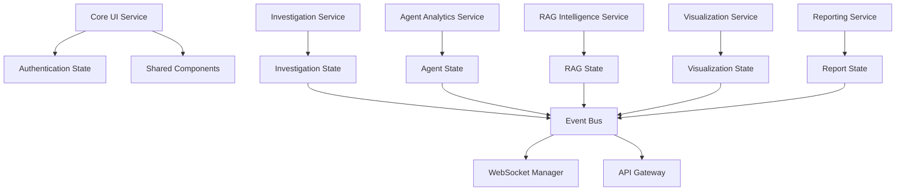

# Data Model: Frontend Microservices Architecture

**Generated**: 2025-01-17
**Purpose**: Define service boundaries, data flow, and state management for the refactored frontend

## Service Architecture Overview



## Core Entities

### 1. Investigation Entity
```typescript
interface Investigation {
  id: string;
  userId: string;
  entityType: 'user_id' | 'email' | 'phone' | 'device_id';
  status: 'pending' | 'running' | 'completed' | 'failed';
  type: 'manual' | 'autonomous';
  created: Date;
  updated: Date;
  riskScore?: number;
  findings: Finding[];
  agents: AgentExecution[];
  metadata: InvestigationMetadata;
}

interface Finding {
  id: string;
  agentId: string;
  category: 'device' | 'location' | 'network' | 'behavior';
  severity: 'low' | 'medium' | 'high' | 'critical';
  title: string;
  description: string;
  evidence: Evidence[];
  confidence: number;
}

interface InvestigationMetadata {
  estimatedDuration?: number;
  dataSourcesQueried: string[];
  apiCallsUsed: number;
  tokensUsed?: number;
}
```

### 2. Agent Entity
```typescript
interface Agent {
  id: string;
  name: string;
  type: 'device' | 'location' | 'network' | 'logs' | 'rag';
  status: 'idle' | 'running' | 'completed' | 'error';
  capabilities: string[];
  description: string;
}

interface AgentExecution {
  id: string;
  agentId: string;
  investigationId: string;
  status: 'queued' | 'running' | 'completed' | 'failed';
  startTime: Date;
  endTime?: Date;
  progress: number; // 0-100
  logs: AgentLog[];
  results?: AgentResult;
}

interface AgentLog {
  timestamp: Date;
  level: 'info' | 'warning' | 'error' | 'debug';
  message: string;
  data?: any;
}
```

### 3. RAG Intelligence Entity
```typescript
interface RAGSession {
  id: string;
  investigationId: string;
  status: 'active' | 'paused' | 'completed';
  sources: RAGSource[];
  queries: RAGQuery[];
  insights: RAGInsight[];
  analytics: RAGAnalytics;
}

interface RAGSource {
  id: string;
  name: string;
  type: 'database' | 'document' | 'api' | 'knowledge_base';
  status: 'available' | 'unavailable' | 'error';
  lastUpdated: Date;
  effectiveness: number; // 0-1
  queryCount: number;
}

interface RAGAnalytics {
  totalQueries: number;
  successRate: number;
  averageResponseTime: number;
  sourceUtilization: Record<string, number>;
  domainCoverage: Record<string, number>;
}
```

### 4. Visualization Entity
```typescript
interface VisualizationData {
  investigationId: string;
  type: 'graph' | 'map' | 'chart' | 'neural_network';
  nodes: VisualizationNode[];
  edges: VisualizationEdge[];
  layout: LayoutConfig;
  filters: FilterConfig;
}

interface VisualizationNode {
  id: string;
  type: 'user' | 'device' | 'location' | 'transaction' | 'event';
  label: string;
  properties: Record<string, any>;
  riskScore?: number;
  position?: { x: number; y: number };
}

interface VisualizationEdge {
  id: string;
  source: string;
  target: string;
  type: 'connection' | 'transaction' | 'communication' | 'correlation';
  weight?: number;
  timestamp?: Date;
}
```

### 5. Report Entity
```typescript
interface Report {
  id: string;
  investigationId: string;
  type: 'summary' | 'detailed' | 'executive' | 'technical';
  format: 'pdf' | 'html' | 'json';
  status: 'generating' | 'ready' | 'error';
  created: Date;
  size?: number;
  downloadUrl?: string;
  sections: ReportSection[];
}

interface ReportSection {
  id: string;
  title: string;
  type: 'text' | 'chart' | 'table' | 'image';
  content: any;
  order: number;
}
```

## Service Definitions

### 1. Investigation Service
**Responsibility**: Core investigation lifecycle management
**Components**:
- InvestigationForm, InvestigationHeader, InvestigationSteps
- ManualInvestigationPanel, AutonomousInvestigationPanel

**State**:
```typescript
interface InvestigationState {
  current: Investigation | null;
  history: Investigation[];
  active: Investigation[];
  filters: InvestigationFilters;
  pagination: PaginationState;
}

interface InvestigationActions {
  startInvestigation: (params: InvestigationParams) => void;
  stopInvestigation: (id: string) => void;
  updateProgress: (id: string, progress: number) => void;
  addFinding: (id: string, finding: Finding) => void;
  setRiskScore: (id: string, score: number) => void;
}
```

### 2. Agent Analytics Service
**Responsibility**: AI agent monitoring and analysis
**Components**:
- AgentDetailsTable, AgentLogSidebar, ChatLogAnimated

**State**:
```typescript
interface AgentState {
  agents: Agent[];
  executions: AgentExecution[];
  selectedAgent: string | null;
  logFilters: LogFilters;
  performance: AgentPerformanceMetrics;
}

interface AgentActions {
  selectAgent: (id: string) => void;
  updateExecution: (execution: AgentExecution) => void;
  addLog: (executionId: string, log: AgentLog) => void;
  setFilters: (filters: LogFilters) => void;
}
```

### 3. RAG Intelligence Service
**Responsibility**: Retrieval-augmented generation features
**Components**:
- All RAG components (analytics, features, insights, tools, views)

**State**:
```typescript
interface RAGState {
  session: RAGSession | null;
  sources: RAGSource[];
  analytics: RAGAnalytics;
  insights: RAGInsight[];
  tools: RAGTool[];
  performance: RAGPerformanceMetrics;
}

interface RAGActions {
  startSession: (investigationId: string) => void;
  addSource: (source: RAGSource) => void;
  runQuery: (query: RAGQuery) => void;
  updateAnalytics: (analytics: Partial<RAGAnalytics>) => void;
}
```

### 4. Visualization Service
**Responsibility**: Data visualization and interactive graphs
**Components**:
- InteractiveInvestigationGraph, NeuralNetworkFlow, LocationMap

**State**:
```typescript
interface VisualizationState {
  data: VisualizationData | null;
  selectedNodes: string[];
  selectedEdges: string[];
  layout: LayoutConfig;
  filters: FilterConfig;
  viewMode: 'graph' | 'map' | 'neural' | 'chart';
}

interface VisualizationActions {
  loadData: (investigationId: string) => void;
  selectNode: (nodeId: string) => void;
  updateLayout: (layout: LayoutConfig) => void;
  applyFilters: (filters: FilterConfig) => void;
  changeViewMode: (mode: ViewMode) => void;
}
```

### 5. Reporting Service
**Responsibility**: Report generation and export functionality
**Components**:
- Report generation components, export controls

**State**:
```typescript
interface ReportState {
  reports: Report[];
  templates: ReportTemplate[];
  generating: string[]; // Report IDs currently generating
  exportOptions: ExportOptions;
}

interface ReportActions {
  generateReport: (investigationId: string, type: ReportType) => void;
  downloadReport: (reportId: string) => void;
  deleteReport: (reportId: string) => void;
  updateTemplate: (template: ReportTemplate) => void;
}
```

### 6. Core UI Service
**Responsibility**: Shared UI components and authentication
**Components**:
- NavigationBar, ProtectedRoute, common UI elements

**State**:
```typescript
interface CoreUIState {
  user: User | null;
  isAuthenticated: boolean;
  theme: ThemeConfig;
  navigation: NavigationState;
  notifications: Notification[];
}

interface CoreUIActions {
  login: (credentials: LoginCredentials) => void;
  logout: () => void;
  setTheme: (theme: ThemeConfig) => void;
  addNotification: (notification: Notification) => void;
  navigate: (path: string) => void;
}
```

## Cross-Service Communication

### Event Bus Schema
```typescript
interface EventBusEvents {
  // Investigation events
  'investigation:started': { investigation: Investigation };
  'investigation:updated': { investigationId: string; updates: Partial<Investigation> };
  'investigation:completed': { investigationId: string; results: InvestigationResults };

  // Agent events
  'agent:execution:started': { execution: AgentExecution };
  'agent:execution:progress': { executionId: string; progress: number };
  'agent:execution:completed': { executionId: string; results: AgentResult };
  'agent:log': { executionId: string; log: AgentLog };

  // RAG events
  'rag:query:started': { sessionId: string; query: RAGQuery };
  'rag:insight:generated': { sessionId: string; insight: RAGInsight };
  'rag:analytics:updated': { sessionId: string; analytics: Partial<RAGAnalytics> };

  // Visualization events
  'viz:data:loaded': { investigationId: string; data: VisualizationData };
  'viz:selection:changed': { nodeIds: string[]; edgeIds: string[] };

  // Report events
  'report:generation:started': { reportId: string };
  'report:generation:completed': { reportId: string; report: Report };
  'report:generation:failed': { reportId: string; error: string };

  // UI events
  'ui:navigation': { path: string; params?: Record<string, any> };
  'ui:notification': { notification: Notification };
  'ui:theme:changed': { theme: ThemeConfig };
}
```

### WebSocket Integration
```typescript
interface WebSocketEvents {
  // Investigation updates
  'investigation_progress': InvestigationProgress;
  'investigation_completed': InvestigationResults;

  // Agent updates
  'agent_log': AgentLogUpdate;
  'agent_status': AgentStatusUpdate;

  // RAG updates
  'rag_query_result': RAGQueryResult;
  'rag_insight': RAGInsightUpdate;

  // System updates
  'system_status': SystemStatus;
  'error': ErrorEvent;
}
```

## State Persistence Strategy

### Local Storage
- User preferences and settings
- Investigation filters and view modes
- Report templates and configurations

### Session Storage
- Current investigation state
- Active WebSocket connections
- Temporary UI state

### Backend Persistence
- Investigation data and results
- Agent execution logs
- RAG analytics and insights
- Generated reports

## Data Flow Patterns

### 1. Investigation Lifecycle
```
User Input → Investigation Service → Backend API → Agent Analytics
     ↓              ↓                    ↓              ↓
Event Bus ← Visualization Service ← WebSocket ← RAG Service
     ↓
Reporting Service
```

### 2. Real-time Updates
```
Backend WebSocket → Event Bus → Service States → Component Re-renders
```

### 3. Cross-Service Communication
```
Service A Action → Event Bus → Service B Listener → State Update → UI Update
```

This data model provides the foundation for implementing the microservices architecture while maintaining data consistency and enabling effective cross-service communication.