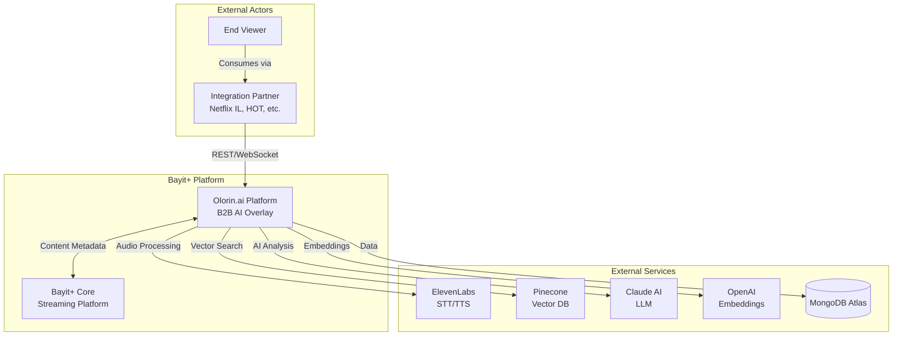
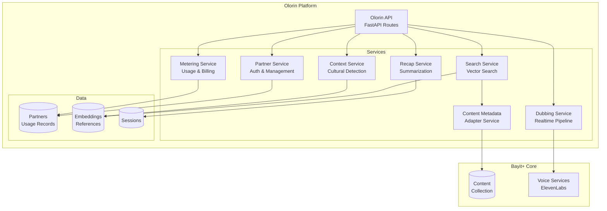
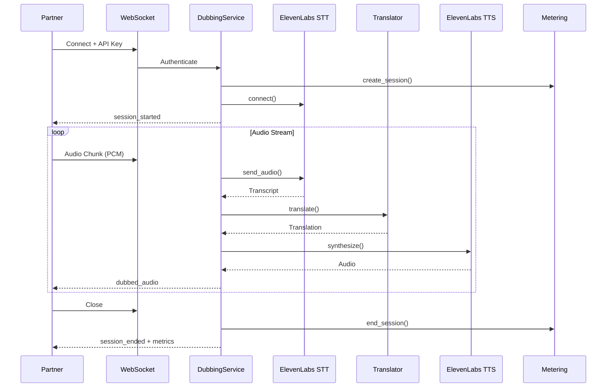
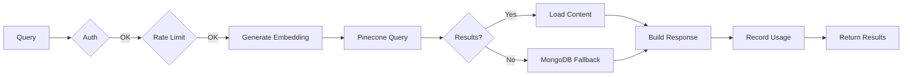
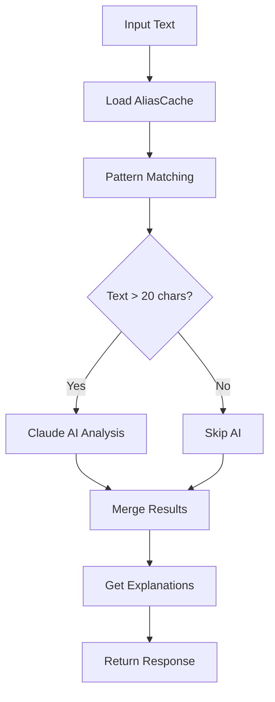
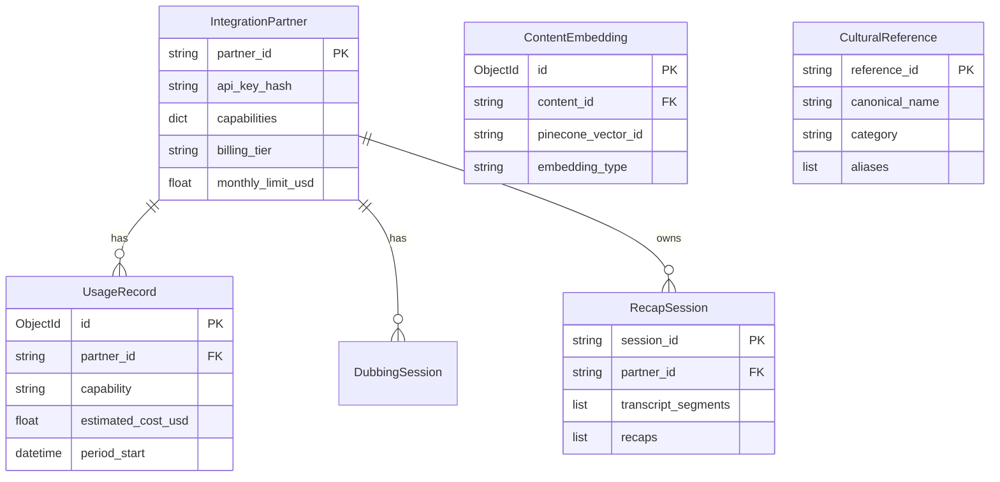
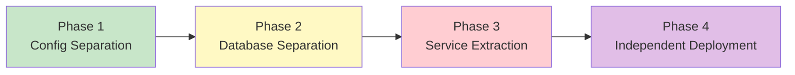

# Olorin Ecosystem Architectural Analysis

## Executive Summary

**Architecture Pattern**: Modular Monolith with strong internal separation but tight infrastructure coupling.

### Key Metrics
- **59 Olorin-specific files** across services, API routes, models, and configuration
- **4 major capabilities**: Dubbing, Search, Cultural Context, Recap
- **5 external service dependencies**: ElevenLabs, Pinecone, OpenAI, Claude, MongoDB

### Critical Issues Found

| Severity | Issue | Location |
|----------|-------|----------|
| **HIGH** | Hard-coded costs (no per-partner pricing) | `services/olorin/metering/costs.py` |
| **HIGH** | AliasCache loaded entirely in-memory | `services/olorin/context/cache.py` |
| **HIGH** | RecapSession unbounded transcript growth | `models/content_embedding.py` |
| **MEDIUM** | No API versioning | `api/routes/olorin/__init__.py` |
| **MEDIUM** | Direct ElevenLabs coupling (no abstraction) | `services/olorin/dubbing/service.py` |
| **MEDIUM** | Global feature flags (not per-partner) | `core/olorin_config.py` |

---

## Current Architecture

### C4 Level 1: System Context



### C4 Level 2: Container Diagram



### Service Dependency Graph

```mermaid
graph LR
    subgraph "API Layer"
        A1[/partner]
        A2[/dubbing]
        A3[/search]
        A4[/context]
        A5[/recap]
        A6[/webhooks]
    end

    subgraph "Auth"
        D1[get_current_partner]
        D2[RequireCapability]
    end

    subgraph "Services"
        S1[PartnerService]
        S2[MeteringService]
        S3[DubbingService]
        S4[SearchService]
        S5[ContextService]
        S6[RecapService]
    end

    subgraph "External"
        E1[ElevenLabs]
        E2[Pinecone]
        E3[OpenAI]
        E4[Claude]
    end

    A1 & A2 & A3 & A4 & A5 & A6 --> D1 --> S1
    A2 & A3 & A4 & A5 --> D2 --> S2

    S3 --> E1
    S4 --> E2 & E3
    S5 --> E4
    S6 --> E4

    style E1 fill:#ffcdd2
    style S3 fill:#fff9c4
```

---

## Data Flow Diagrams

### Realtime Dubbing Pipeline



### Semantic Search Flow



### Cultural Context Detection



---

## Database Schema



---

## Separation of Concerns Analysis

### Current Layer Boundaries

| Layer | Components | Status |
|-------|-----------|--------|
| **Presentation** | API Routes, WebSocket Handlers | Good separation |
| **Application** | Services, Dependencies | Singleton coupling |
| **Domain** | Pydantic Models | Mixed with infrastructure |
| **Infrastructure** | Beanie Documents, External Clients | Direct imports |

### Coupling Hotspots

| Component | Coupling Type | Severity | Fix |
|-----------|--------------|----------|-----|
| `costs.py` | Hard-coded values | HIGH | Move to partner config |
| `AliasCache` | In-memory only | HIGH | Add Redis + pagination |
| `ElevenLabs` | Direct import | MEDIUM | Add provider interface |
| `Content` model | Direct import in searcher | MEDIUM | Use ContentMetadataService |
| Singletons | Global state | MEDIUM | Use DI container |

### Responsibility Overlaps

| Service | Primary | Overlapping |
|---------|---------|-------------|
| `PartnerService` | Partner CRUD | API key gen, webhook config |
| `MeteringService` | Usage tracking | Rate limit checking |
| `dependencies.py` | Authentication | Capability verification |

---

## High-Level Issues (Strategic)

### 1. Database Coupling
- **Status**: Phase 1 (shared DB), Phase 2 config exists but disabled
- **Files**: `database_olorin.py`, `olorin_config.py:162-191`
- **Impact**: Cannot scale independently

### 2. Configuration Management
- **Status**: Well-structured OlorinSettings, but global flags
- **Files**: `olorin_config.py`
- **Issue**: Feature flags apply to ALL partners

### 3. External Service Dependencies
- **ElevenLabs**: Direct import, no abstraction
- **Pinecone/OpenAI**: Singleton client, no circuit breaker
- **Claude**: Optional import, no retry logic

---

## Low-Level Issues (Tactical)

### 1. Memory Management
```
AliasCache: Loads entire DB into memory
RecapSession.transcript_segments: Unbounded list growth
```

### 2. Missing Abstractions
- No `SpeechToTextProvider` protocol
- No `TextToSpeechProvider` protocol
- No `VectorDatabase` protocol
- No `PricingStrategy` interface

### 3. Error Handling
- Most errors map to generic 400/403/429
- No circuit breaker pattern
- No retry with exponential backoff
- No correlation ID propagation

---

## Recommended Improvements

### Short-Term (Quick Wins)

| Task | Effort | Impact | File |
|------|--------|--------|------|
| Add API versioning `/v1/olorin/*` | Low | Medium | `routes/olorin/__init__.py` |
| Paginate AliasCache loading | Low | High | `context/cache.py` |
| Add transcript segment limit | Low | High | `recap_agent_service.py` |
| Add correlation ID header | Low | Medium | `dependencies.py` |

### Medium-Term (Refactors)

| Task | Effort | Impact |
|------|--------|--------|
| Per-partner pricing | Medium | High |
| Provider abstractions (STT, TTS, LLM) | Medium | High |
| Circuit breaker for external services | Medium | High |
| Event-driven metering | Medium | Medium |
| Redis-based AliasCache | Medium | High |

### Long-Term (Architectural)



---

## Critical Files Reference

### Configuration
- `/backend/app/core/olorin_config.py` - Nested settings
- `/backend/app/core/database_olorin.py` - DB connection

### Services (32 files)

#### Partner & Metering
- `/backend/app/services/olorin/partner_service.py` - Partner management
- `/backend/app/services/olorin/metering_service.py` - Usage tracking facade
- `/backend/app/services/olorin/metering/service.py` - Main metering service
- `/backend/app/services/olorin/metering/sessions.py` - Session tracking
- `/backend/app/services/olorin/metering/usage.py` - Usage recording
- `/backend/app/services/olorin/metering/summary.py` - Usage summaries
- `/backend/app/services/olorin/metering/costs.py` - Cost calculations

#### Dubbing
- `/backend/app/services/olorin/realtime_dubbing_service.py` - Dubbing facade
- `/backend/app/services/olorin/dubbing/service.py` - Main dubbing orchestration
- `/backend/app/services/olorin/dubbing/pipeline.py` - Audio processing pipeline
- `/backend/app/services/olorin/dubbing/models.py` - Dubbing-specific models
- `/backend/app/services/olorin/dubbing/translation.py` - Translation provider

#### Search
- `/backend/app/services/olorin/vector_search_service.py` - Search facade
- `/backend/app/services/olorin/search/service.py` - Main search service
- `/backend/app/services/olorin/search/client.py` - Pinecone client
- `/backend/app/services/olorin/search/embedding.py` - Embedding generation
- `/backend/app/services/olorin/search/indexer.py` - Content indexing
- `/backend/app/services/olorin/search/searcher.py` - Search execution
- `/backend/app/services/olorin/search/helpers.py` - Utility functions

#### Cultural Context
- `/backend/app/services/olorin/cultural_context_service.py` - Context facade
- `/backend/app/services/olorin/context/service.py` - Main context service
- `/backend/app/services/olorin/context/detection.py` - Reference detection
- `/backend/app/services/olorin/context/explanation.py` - Reference explanations
- `/backend/app/services/olorin/context/cache.py` - Alias caching
- `/backend/app/services/olorin/context/crud.py` - Database operations

#### Recap & Content
- `/backend/app/services/olorin/recap_agent_service.py` - Summarization
- `/backend/app/services/olorin/content_metadata_service.py` - Content adapter

### API Routes (14 files)

#### Core Routes
- `/backend/app/api/routes/olorin/__init__.py` - Router registry
- `/backend/app/api/routes/olorin/partner.py` - Partner endpoints
- `/backend/app/api/routes/olorin/search.py` - Search endpoints
- `/backend/app/api/routes/olorin/context.py` - Context endpoints
- `/backend/app/api/routes/olorin/recap.py` - Recap endpoints
- `/backend/app/api/routes/olorin/webhooks.py` - Webhook management
- `/backend/app/api/routes/olorin/dependencies.py` - Auth/rate limit
- `/backend/app/api/routes/olorin/errors.py` - Error handling

#### Dubbing Routes
- `/backend/app/api/routes/olorin/dubbing.py` - Dubbing facade
- `/backend/app/api/routes/olorin/dubbing_routes/__init__.py` - Dubbing router
- `/backend/app/api/routes/olorin/dubbing_routes/sessions.py` - Session management
- `/backend/app/api/routes/olorin/dubbing_routes/websocket.py` - WebSocket streaming
- `/backend/app/api/routes/olorin/dubbing_routes/state.py` - Session state
- `/backend/app/api/routes/olorin/dubbing_routes/models.py` - Request/response models

### Models (3 files)
- `/backend/app/models/integration_partner.py` - Partner & usage models
- `/backend/app/models/content_embedding.py` - Embeddings & recap sessions
- `/backend/app/models/cultural_reference.py` - Cultural knowledge base

---

## Verification Checklist

- [x] All file paths verified to exist
- [x] Mermaid diagrams use valid syntax
- [x] Critical issues mapped to specific files
- [x] Recommendations prioritized by effort/impact
- [x] C4 model hierarchy (Context -> Container -> Component)

---

## Related Documentation

- **Full Architecture Analysis**: `docs/architecture/OLORIN_ECOSYSTEM_ARCHITECTURE_ANALYSIS.md`
- **B2B API Reference**: `docs/platform/OLORIN_B2B_API_REFERENCE.md`

---

*Generated: January 2026*
*Review Cycle: Quarterly*
