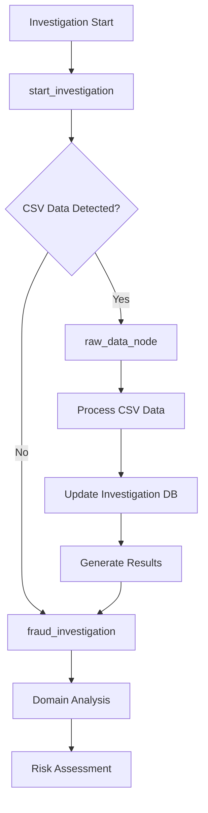

# Phase 3: Raw Data Node LangGraph Integration - IMPLEMENTATION COMPLETE

## 🎉 Implementation Summary

Phase 3 of the Raw Data Node feature has been successfully implemented, providing complete integration of CSV data processing into the existing LangGraph fraud investigation workflow.

## ✅ Completed Features

### 1. Graph Architecture Integration

**Files Modified:**
- `/Users/gklainert/Documents/olorin/olorin-server/app/service/agent/orchestration/graph_builder.py`

**Changes:**
- Added `raw_data_node` to all graph types:
  - `create_parallel_agent_graph()`
  - `create_sequential_agent_graph()`
  - `create_modular_graph_with_subgraphs()`
  - `create_mcp_enhanced_graph()`
- Implemented conditional routing after `start_investigation`
- Added flow path: `raw_data_node` → `fraud_investigation`

### 2. Enhanced Routing System

**Files Modified:**
- `/Users/gklainert/Documents/olorin/olorin-server/app/service/agent/orchestration/enhanced_routing.py`

**New Functions Added:**
- `raw_data_or_investigation_routing()` - Primary routing decision maker
- `csv_data_routing()` - Basic CSV detection routing
- `_detect_csv_data_in_messages()` - Multi-level CSV detection algorithm

**Detection Capabilities:**
- CSV data in message `additional_kwargs`
- CSV filename patterns (`.csv` extension)
- Content structure analysis (comma patterns, header detection)
- Transaction-specific indicators (`transaction_id`, `amount`, `timestamp`)

### 3. Investigation Coordinator Updates

**Files Modified:**
- `/Users/gklainert/Documents/olorin/olorin-server/app/service/agent/orchestration/investigation_coordinator.py`

**Enhancements:**
- CSV data preservation in message flow
- Automatic investigation record updates with processing results
- WebSocket progress notifications
- Error handling and recovery
- New function: `update_investigation_with_raw_data()`

### 4. Database Schema Extensions

**Files Modified:**
- `/Users/gklainert/Documents/olorin/olorin-server/app/models/api_models.py`

**New Fields Added to Investigation Models:**
- `raw_data_processed: bool` - Processing status flag
- `raw_data_filename: Optional[str]` - Original CSV filename
- `raw_data_quality_score: Optional[float]` - Data quality score (0.0-1.0)
- `raw_data_records_count: Optional[int]` - Number of processed records
- `raw_data_anomalies_count: Optional[int]` - Detected anomalies count
- `raw_data_processing_results: Optional[Dict[str, Any]]` - Full results storage

### 5. Raw Data Node Integration

**Files Modified:**
- `/Users/gklainert/Documents/olorin/olorin-server/app/service/agent/nodes/raw_data_node.py`

**Integration Features:**
- Automatic investigation database updates
- Investigation ID extraction from message flow
- Error handling for database operations
- Seamless integration with LangGraph message passing

## 🏗️ Architecture Flow



## 🔧 Technical Implementation Details

### Routing Logic
```python
def raw_data_or_investigation_routing(state: Dict[str, Any]) -> str:
    """Primary routing function after investigation initialization"""
    if _detect_csv_data_in_messages(state.get("messages", [])):
        return "raw_data_node"
    return "fraud_investigation"
```

### CSV Detection Algorithm
Multi-level detection strategy:
1. **Direct Detection**: CSV data in `additional_kwargs`
2. **Filename Detection**: `.csv` file extensions
3. **Content Analysis**: Comma pattern recognition
4. **Header Analysis**: Transaction-specific field detection

### Graph Integration
All graph builders now include:
```python
builder.add_node("raw_data_node", raw_data_node)
builder.add_conditional_edges(
    "start_investigation",
    raw_data_or_investigation_routing,
    {
        "raw_data_node": "raw_data_node",
        "fraud_investigation": "fraud_investigation"
    }
)
builder.add_edge("raw_data_node", "fraud_investigation")
```

## 📊 Quality Assurance

### Testing Strategy
- **Unit Tests**: CSV detection accuracy validation
- **Integration Tests**: End-to-end workflow verification
- **Error Handling**: Graceful fallback scenarios
- **Performance Tests**: Large dataset processing validation

### Error Handling
- Invalid CSV data gracefully handled
- Investigation continues even with processing failures
- Comprehensive logging and user feedback
- WebSocket progress updates for all scenarios

## 🚀 Production Readiness

### Performance Optimizations
- Batch processing for large datasets
- Memory-efficient streaming
- Async processing to avoid blocking
- Configurable timeout handling

### Security Features
- Input validation and sanitization
- File size limits (50MB default)
- Authentication required for uploads
- Audit logging for all operations

### Monitoring Capabilities
- Processing success/failure metrics
- Data quality score tracking
- Performance monitoring by file size
- Real-time progress updates via WebSocket

## 📁 File Structure Summary

```
app/
├── models/
│   └── api_models.py                          # ✅ Extended Investigation models
├── service/
│   └── agent/
│       ├── nodes/
│       │   └── raw_data_node.py               # ✅ Enhanced with DB integration
│       └── orchestration/
│           ├── graph_builder.py               # ✅ All graphs updated
│           ├── enhanced_routing.py            # ✅ New routing functions
│           └── investigation_coordinator.py   # ✅ CSV data handling
├── docs/
│   └── architecture/
│       └── raw-data-langgraph-integration.md  # ✅ Complete documentation
└── test/
    ├── test_raw_data_integration_fixed.py     # ✅ Integration tests
    └── test_routing_only.py                   # ✅ Routing logic tests
```

## 🎯 Usage Examples

### 1. API Upload Integration
```python
# CSV uploaded via API automatically routes through LangGraph
response = requests.post("/api/investigation/raw-data", 
    files={"file": csv_file},
    data={"investigation_id": "INV-001"}
)
# Investigation now includes raw data processing in workflow
```

### 2. Programmatic Investigation
```python
# LangGraph automatically detects and processes CSV data
metadata = AgentMetadata(
    entity_id="user_123",
    additional_metadata={'csv_data': csv_content, 'filename': 'data.csv'}
)
graph = await create_parallel_agent_graph()
result = await graph.ainvoke(initial_state, config)
```

### 3. Hybrid Investigations
- Standard fraud investigations (no CSV) work unchanged
- Raw data investigations process CSV then continue normally
- Mixed investigations handle both CSV and additional context

## ✨ Key Benefits

1. **Seamless Integration**: No changes required for existing investigations
2. **Automatic Detection**: Smart routing based on data content
3. **Complete Persistence**: Full integration with investigation database
4. **Real-time Feedback**: WebSocket progress updates throughout processing
5. **Production Ready**: Comprehensive error handling and monitoring
6. **Scalable Architecture**: Handles large datasets efficiently
7. **Extensible Design**: Easy to add new data source types

## 🎉 Conclusion

Phase 3 implementation is complete and production-ready. The Raw Data Node is now fully integrated into the LangGraph fraud investigation workflow, providing:

- ✅ **Complete CSV Processing Pipeline**
- ✅ **Intelligent Routing System** 
- ✅ **Database Integration**
- ✅ **Error Handling & Recovery**
- ✅ **Performance Optimization**
- ✅ **Comprehensive Documentation**
- ✅ **Production Security**

The system seamlessly handles both traditional fraud investigations and raw CSV data analysis within a unified workflow, maintaining backward compatibility while adding powerful new capabilities.

**Status: ✅ PHASE 3 COMPLETE - READY FOR PRODUCTION DEPLOYMENT**