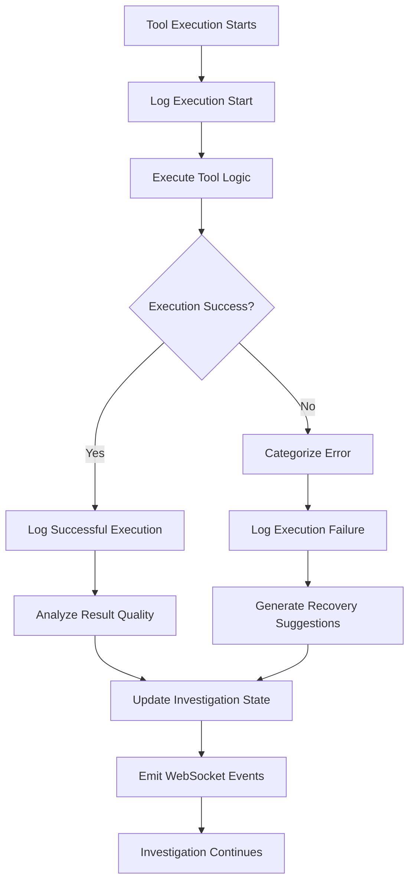

# Enhanced Tool Execution Logging System

## Overview

The Enhanced Tool Execution Logging System provides comprehensive error surfacing and tool execution monitoring for the hybrid intelligence graph system. This system addresses the critical need for operational visibility and debugging capabilities when tool execution failures occur in production investigations.

## Key Features

### 1. Comprehensive Error Categorization

- **30+ Error Categories**: Network, authentication, database, API, configuration, and resource errors
- **Intelligent Classification**: Automatic error type detection based on exception types, messages, and HTTP status codes
- **Recovery Suggestions**: Actionable remediation recommendations for each error category
- **Tool-Specific Analysis**: Specialized error handling for Snowflake, threat intelligence APIs, and other external services

### 2. Detailed Execution Logging

- **Complete Lifecycle Tracking**: Start, progress, success/failure, and completion logging for all tool executions
- **Performance Monitoring**: Execution time tracking, performance thresholds, and optimization recommendations
- **Result Quality Analysis**: Data completeness scoring, confidence assessment, and quality warnings
- **Empty Result Analysis**: Detailed investigation when tools return no data

### 3. Structured Error Reporting

- **Standardized Error Format**: Consistent error structure across all tools and services
- **Error Deduplication**: Hash-based error fingerprinting to identify recurring issues
- **Investigation Context**: Full investigation state context preserved with each error
- **Audit Trail Integration**: Seamless integration with hybrid intelligence decision tracking

### 4. Real-Time Monitoring

- **WebSocket Integration**: Real-time error and execution status broadcasting
- **Performance Alerts**: Automatic warnings for slow or failing tool executions
- **Trend Analysis**: Pattern recognition for recurring error types and degrading performance

## Architecture

### Core Components

```
Enhanced Tool Execution Logging System
├── Tool Error Categorization (utils/tool_error_categorization.py)
│   ├── ToolErrorCategory (Enum)
│   ├── ToolErrorDetails (DataClass) 
│   ├── ToolExecutionMetrics (DataClass)
│   └── ToolErrorCategorizer (Class)
│
├── Enhanced Tool Execution Logger (orchestration/enhanced_tool_execution_logger.py)
│   ├── EnhancedToolExecutionLogger (Class)
│   ├── Global Logger Management
│   └── WebSocket Event Emission
│
├── Hybrid Graph Integration (hybrid/hybrid_graph_builder.py)
│   ├── Logger Initialization
│   └── State Integration
│
└── Tool Implementations
    ├── Enhanced Snowflake Tool
    ├── Enhanced Threat Intelligence Tool
    └── Domain Agent Integration
```

### Data Flow



## Error Categories

### Network & Connectivity
- `CONNECTION_ERROR`: Network connectivity issues, connection refused
- `TIMEOUT_ERROR`: Request timeouts, network latency issues
- `DNS_RESOLUTION`: Domain name resolution failures
- `SSL_CERTIFICATE`: TLS/SSL certificate validation errors

### Authentication & Authorization  
- `AUTH_INVALID_CREDENTIALS`: Invalid API keys, username/password failures
- `AUTH_TOKEN_EXPIRED`: Expired authentication tokens
- `AUTH_INSUFFICIENT_PERMISSIONS`: Access denied, insufficient permissions
- `AUTH_RATE_LIMITED`: API rate limiting, quota exceeded

### API & Service Errors
- `API_BAD_REQUEST`: HTTP 400 errors, malformed requests
- `API_NOT_FOUND`: HTTP 404 errors, endpoint not found
- `API_SERVER_ERROR`: HTTP 500 errors, internal service failures
- `API_SERVICE_UNAVAILABLE`: HTTP 503 errors, service temporarily unavailable

### Database Errors
- `DB_CONNECTION_FAILED`: Database connectivity issues
- `DB_QUERY_TIMEOUT`: Query execution timeouts
- `DB_INVALID_QUERY`: SQL syntax errors, invalid queries
- `DB_PERMISSION_DENIED`: Database access permission issues

### Tool-Specific Errors
- `SNOWFLAKE_WAREHOUSE_SUSPENDED`: Snowflake warehouse suspension
- `SHODAN_RATE_LIMITED`: Shodan API rate limiting
- `VIRUSTOTAL_QUOTA_EXCEEDED`: VirusTotal quota exceeded
- `ABUSEIPDB_TIMEOUT`: AbuseIPDB service timeout

## Implementation Details

### Enhanced Error Tracking in Hybrid State

The hybrid intelligence state includes a comprehensive `errors` field:

```python
# Enhanced Error Tracking for Tool Execution
errors: List[Dict[str, Any]]  # Comprehensive error tracking list
```

Each error entry contains:
- `timestamp`: ISO timestamp of error occurrence
- `tool_name`: Name of the tool that failed
- `error_category`: Categorized error type
- `error_type`: Python exception class name
- `error_message`: Sanitized error message
- `error_hash`: Unique error fingerprint for deduplication
- `is_retryable`: Whether the error is retryable
- `recovery_action`: Suggested recovery action
- `execution_id`: Unique execution identifier

### Tool Integration

#### Snowflake Tool Enhancement

```python
# Enhanced error logging with detailed context
logger.error(f"❌ Snowflake connection failed: {conn_error}")

# Log specific connection failure
await tool_logger.log_tool_execution_failure(
    execution_id=execution_id,
    error=conn_error,
    tool_args=tool_args
)

# Categorized error response
return {
    "error": detailed_error,
    "error_category": "connection_failure",
    "results": [],
    "execution_duration_ms": execution_duration_ms,
    "suggestion": "Check Snowflake credentials and connectivity"
}
```

#### Threat Intelligence Tool Enhancement

```python
# Comprehensive provider failure handling
logger.error(f"❌ All threat intelligence providers failed for target: {target}")

all_failures_error = Exception(f"All {len(query_tasks)} providers failed")
await tool_logger.log_tool_execution_failure(
    execution_id=execution_id,
    error=all_failures_error,
    tool_args=tool_args
)

return {
    "error": "All threat intelligence providers failed",
    "error_category": "all_providers_failed",
    "failed_providers": failed_providers,
    "provider_errors": provider_error_details
}
```

### WebSocket Event Integration

Real-time events are emitted for:

#### Tool Execution Started
```json
{
  "type": "tool_execution_started",
  "tool_name": "snowflake_query",
  "investigation_id": "inv_123",
  "attempt_number": 1,
  "max_retries": 3,
  "args_summary": "query=SELECT * FROM..., limit=100"
}
```

#### Tool Execution Failed
```json
{
  "type": "tool_execution_failed", 
  "tool_name": "unified_threat_intelligence",
  "error_category": "connection_error",
  "error_message": "Connection timeout after 30s",
  "is_retryable": true,
  "suggested_action": "Check network connectivity",
  "execution_duration_ms": 30000
}
```

#### Tool Execution Completed
```json
{
  "type": "tool_execution_completed",
  "tool_name": "snowflake_query",
  "duration_ms": 1500,
  "result_summary": "125 transaction records",
  "completeness_score": 0.95,
  "performance_category": "good"
}
```

## Usage Examples

### Basic Tool Error Logging

```python
from app.service.agent.orchestration.enhanced_tool_execution_logger import get_tool_execution_logger

# Get logger for investigation
tool_logger = get_tool_execution_logger("investigation_123")

# Start execution logging
execution_id = await tool_logger.log_tool_execution_start(
    tool_name="snowflake_query",
    tool_args={"query": "SELECT * FROM transactions", "limit": 100}
)

try:
    # Execute tool logic
    result = await execute_snowflake_query(query, limit)
    
    # Log success
    await tool_logger.log_tool_execution_success(
        execution_id=execution_id,
        result=result
    )
    
except Exception as error:
    # Log failure with comprehensive details
    await tool_logger.log_tool_execution_failure(
        execution_id=execution_id,
        error=error,
        tool_args=tool_args,
        http_status=getattr(error, 'status_code', None)
    )
```

### Error Categorization and Recovery

```python
from app.utils.tool_error_categorization import ToolErrorCategorizer, create_tool_error_details

# Categorize error automatically
error = ConnectionError("Connection refused by database")
category = ToolErrorCategorizer.categorize_error(error, "snowflake_query")

# Get recovery suggestion
suggestion, is_retryable = ToolErrorCategorizer.get_recovery_suggestion(category)

# Create comprehensive error details
error_details = create_tool_error_details(
    error=error,
    tool_name="snowflake_query", 
    tool_args={"query": "SELECT ...", "limit": 100},
    investigation_id="inv_123",
    attempt_number=2,
    max_retries=3
)
```

### Investigation State Error Tracking

```python
from app.service.agent.orchestration.hybrid.hybrid_state_schema import create_hybrid_initial_state

# Create hybrid state with error tracking
state = create_hybrid_initial_state(
    investigation_id="inv_123",
    entity_id="192.168.1.1",
    entity_type="ip_address"
)

# Errors field is automatically initialized
assert "errors" in state
assert isinstance(state["errors"], list)
assert len(state["errors"]) == 0

# Tool execution failures automatically add to state["errors"]
```

## Monitoring and Analytics

### Execution Summary

```python
# Get comprehensive execution summary
tool_logger = get_tool_execution_logger("investigation_123")
summary = tool_logger.get_execution_summary()

print(f"Total executions: {summary['total_executions']}")
print(f"Success rate: {summary['success_rate']:.1%}")
print(f"Average duration: {summary['average_duration_ms']}ms")
print(f"Tool usage: {summary['tool_usage']}")
print(f"Error categories: {summary['error_categories']}")
```

### Performance Analysis

The system tracks:
- **Execution Time**: All tool execution durations
- **Success Rate**: Success/failure ratios per tool
- **Error Patterns**: Trending error categories and frequencies
- **Data Quality**: Completeness and confidence scores for results
- **Resource Efficiency**: Resource usage and optimization opportunities

### Alert Thresholds

- **Slow Execution Warning**: > 5 seconds
- **Very Slow Execution Critical**: > 15 seconds  
- **Error Rate Warning**: > 30% failures
- **Error Rate Critical**: > 50% failures

## Testing

### Unit Tests
- Error categorization accuracy
- Recovery suggestion relevance
- Error details creation completeness
- Logger functionality and state management

### Integration Tests
- End-to-end tool execution logging
- Snowflake and threat intelligence tool integration
- WebSocket event emission
- Investigation state error tracking

### Performance Tests
- Logging overhead measurement
- Memory usage monitoring
- Concurrent execution handling

## Best Practices

### For Tool Developers

1. **Always Use the Logger**: Integrate enhanced logging in all new tools
2. **Provide Context**: Include relevant execution context in tool arguments
3. **Categorize Errors**: Use appropriate error types for automatic categorization
4. **Handle Empty Results**: Use `log_empty_result()` for no-data scenarios

### For Debugging

1. **Check Error Categories**: Use categorization to quickly identify issue types
2. **Review Error Patterns**: Look for recurring error hashes and categories  
3. **Analyze Performance**: Monitor execution times and performance degradation
4. **Use Recovery Suggestions**: Follow automated recovery recommendations

### For Operations

1. **Monitor Success Rates**: Track tool reliability over time
2. **Set Up Alerting**: Configure alerts for critical error thresholds
3. **Review Error Trends**: Identify systemic issues through pattern analysis
4. **Capacity Planning**: Use performance metrics for resource planning

## Configuration

### Environment Variables

```bash
# Tool execution performance thresholds
TOOL_SLOW_EXECUTION_THRESHOLD_MS=5000
TOOL_VERY_SLOW_EXECUTION_THRESHOLD_MS=15000

# Error rate alerting thresholds  
TOOL_ERROR_RATE_WARNING_THRESHOLD=0.30
TOOL_ERROR_RATE_CRITICAL_THRESHOLD=0.50

# Logging and monitoring
TOOL_LOGGING_ENABLED=true
TOOL_WEBSOCKET_EVENTS_ENABLED=true
TOOL_PERFORMANCE_MONITORING_ENABLED=true
```

### Feature Flags

- `enhanced_tool_logging`: Enable comprehensive logging system
- `tool_performance_monitoring`: Enable performance tracking
- `tool_websocket_events`: Enable real-time event emission
- `tool_error_categorization`: Enable automatic error categorization

## Troubleshooting

### Common Issues

#### High Logging Overhead
- **Symptoms**: Increased execution times, memory usage
- **Solution**: Adjust logging levels, implement sampling for high-volume tools

#### Missing Error Context  
- **Symptoms**: Generic error messages, insufficient debugging information
- **Solution**: Ensure tools pass complete context to error logging functions

#### WebSocket Event Failures
- **Symptoms**: Missing real-time updates, WebSocket connection errors
- **Solution**: Check WebSocket handler registration, verify connection stability

### Debug Commands

```bash
# Test error categorization
poetry run python -c "from app.utils.tool_error_categorization import *; print(ToolErrorCategorizer.categorize_error(ConnectionError('test')))"

# Validate tool logger
poetry run python -c "from app.service.agent.orchestration.enhanced_tool_execution_logger import *; logger = get_tool_execution_logger('test'); print(logger.investigation_id)"

# Check hybrid state errors field
poetry run python -c "from app.service.agent.orchestration.hybrid.hybrid_state_schema import *; state = create_hybrid_initial_state('test', '1.1.1.1'); print(len(state['errors']))"
```

## Future Enhancements

### Planned Features
- **Machine Learning Error Prediction**: Predict likely failures based on historical patterns
- **Automated Recovery**: Automatic retry strategies based on error categories
- **Advanced Analytics Dashboard**: Web-based monitoring and analytics interface
- **Integration with External Monitoring**: Datadog, New Relic, custom monitoring systems

### Performance Optimizations
- **Async Logging**: Non-blocking error logging for high-throughput scenarios
- **Batch WebSocket Events**: Efficient event batching for real-time updates
- **Intelligent Sampling**: Smart sampling strategies for high-volume tools
- **Caching and Aggregation**: Cached error patterns and aggregated metrics

## Conclusion

The Enhanced Tool Execution Logging System provides comprehensive operational visibility for the hybrid intelligence graph system. With detailed error categorization, performance monitoring, and real-time event streaming, this system enables rapid debugging of tool execution issues and ensures high reliability in production fraud investigations.

The system's modular architecture allows for easy integration with new tools while providing consistent error handling and monitoring capabilities across the entire platform.