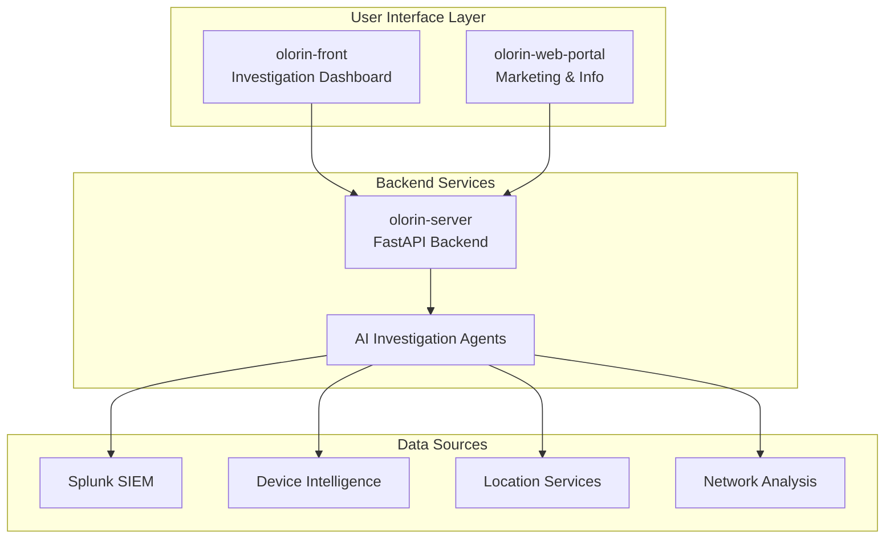
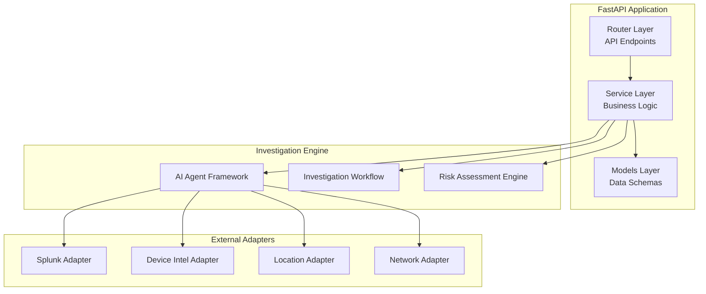
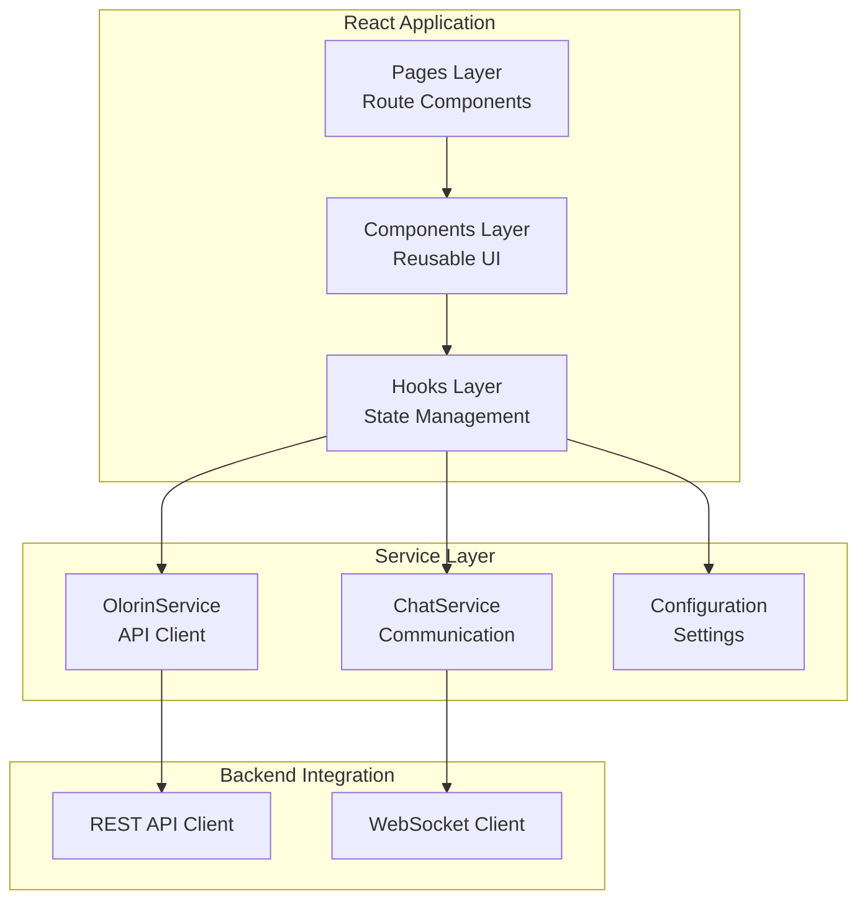

# OLORIN ECOSYSTEM DIAGRAMS GENERATION PLAN

**Plan Date:** January 31, 2025  
**Objective:** Create comprehensive Mermaid diagram collection for Olorin fraud investigation platform  
**Complexity:** Level 3 - Comprehensive System Documentation  
**Estimated Time:** 8-12 hours (2-3 days)  

---

## 🎯 PLAN OVERVIEW

### 📋 OBJECTIVE
Generate a complete collection of Mermaid diagrams documenting the **Olorin Ecosystem** (formerly Gaia) covering system architecture, component details, process flows, and all technical diagrams required for comprehensive system understanding.

### 🗂️ TARGET STRUCTURE
```
docs/diagrams/
├── README.md                           # Diagram navigation guide
├── system/                             # System-level diagrams
│   ├── olorin-ecosystem-overview.md    # Complete system overview
│   ├── deployment-architecture.md      # Production deployment view
│   ├── data-flow-architecture.md       # System-wide data flows
│   └── integration-topology.md         # External integrations
├── components/                         # Component-specific diagrams
│   ├── olorin-server/                  # Backend service diagrams
│   ├── olorin-front/                   # Frontend application diagrams
│   └── olorin-web-portal/              # Web portal diagrams
├── flows/                              # Process flow diagrams
│   ├── investigation-workflow.md       # Core investigation process
│   ├── risk-assessment-flow.md         # Risk analysis process
│   ├── authentication-flow.md          # Auth and security flows
│   └── agent-orchestration-flow.md     # AI agent coordination
├── domains/                            # Analysis domain diagrams
│   ├── device-analysis-domain.md       # Device fingerprinting
│   ├── location-analysis-domain.md     # Geographic analysis
│   ├── network-analysis-domain.md      # Network security analysis
│   └── logs-analysis-domain.md         # SIEM log analysis
└── technical/                          # Technical architecture diagrams
    ├── api-architecture.md             # API design and endpoints
    ├── database-schema.md              # Data models and schemas
    ├── security-architecture.md        # Security and compliance
    └── monitoring-architecture.md      # Observability and monitoring
```

---

## 📊 DETAILED DIAGRAM SPECIFICATIONS

### 🌐 PHASE 1: SYSTEM-LEVEL DIAGRAMS (3-4 hours)

#### 1.1 **Olorin Ecosystem Overview** (`system/olorin-ecosystem-overview.md`)
**Purpose**: Complete system architecture showing all components and their relationships

**Mermaid Diagram Types Needed:**


#### 1.2 **Deployment Architecture** (`system/deployment-architecture.md`)
**Purpose**: Production deployment topology with infrastructure components

**Diagrams Included:**
- Container orchestration architecture
- Load balancing and CDN setup
- Database and caching layer
- Monitoring and logging infrastructure

#### 1.3 **Data Flow Architecture** (`system/data-flow-architecture.md`)
**Purpose**: System-wide data movement and processing flows

**Diagrams Included:**
- Investigation data pipeline
- Risk assessment data aggregation
- External data source integration flows
- Report generation and export flows

#### 1.4 **Integration Topology** (`system/integration-topology.md`)
**Purpose**: External system integrations and API connections

**Diagrams Included:**
- Splunk SIEM integration architecture
- Device intelligence service connections
- Location service integrations
- Vector search and analysis connections

### 🔧 PHASE 2: COMPONENT-SPECIFIC DIAGRAMS (4-5 hours)

#### 2.1 **olorin-server Component Diagrams** (`components/olorin-server/`)

**2.1.1 Backend Service Architecture**


**2.1.2 AI Agent Architecture**
- Agent framework overview
- Individual agent implementations
- Agent communication patterns
- Tool integration architecture

**2.1.3 API Endpoint Architecture** 
- REST API structure
- Authentication flow
- Request/response patterns
- Error handling architecture

#### 2.2 **olorin-front Component Diagrams** (`components/olorin-front/`)

**2.2.1 Frontend Application Architecture**


**2.2.2 Investigation Dashboard Architecture**
- Component hierarchy and data flow
- State management patterns
- Real-time update mechanisms
- Export and reporting components

**2.2.3 User Interface Flow**
- User journey mapping
- Navigation architecture
- Form and input handling
- Visualization component structure

#### 2.3 **olorin-web-portal Component Diagrams** (`components/olorin-web-portal/`)

**2.3.1 Marketing Site Architecture**
- Static site generation structure
- Content management system
- Multi-language support architecture
- Contact form and lead generation flow

### 🔄 PHASE 3: PROCESS FLOW DIAGRAMS (2-3 hours)

#### 3.1 **Investigation Workflow** (`flows/investigation-workflow.md`)
**Purpose**: Complete investigation process from initiation to completion

```mermaid
sequenceDiagram
    participant User as Investigation User
    participant Frontend as olorin-front
    participant Backend as olorin-server
    participant Agents as AI Agents
    participant Sources as Data Sources
    
    User->>Frontend: Initiate Investigation
    Frontend->>Backend: Create Investigation Request
    Backend->>Agents: Orchestrate Multi-Domain Analysis
    
    parallel
        Agents->>Sources: Device Analysis Query
        Agents->>Sources: Location Analysis Query
        Agents->>Sources: Network Analysis Query
        Agents->>Sources: Logs Analysis Query
    end
    
    Sources-->>Agents: Analysis Results
    Agents->>Backend: Risk Assessment Data
    Backend->>Backend: Aggregate Risk Analysis
    Backend-->>Frontend: Investigation Results
    Frontend-->>User: Risk Assessment Display
```

#### 3.2 **Risk Assessment Flow** (`flows/risk-assessment-flow.md`)
**Purpose**: Multi-domain risk analysis and scoring process

#### 3.3 **Authentication Flow** (`flows/authentication-flow.md`)
**Purpose**: User authentication and authorization processes

#### 3.4 **Agent Orchestration Flow** (`flows/agent-orchestration-flow.md`)
**Purpose**: AI agent coordination and data aggregation

### 🎯 PHASE 4: DOMAIN-SPECIFIC DIAGRAMS (2-3 hours)

#### 4.1 **Device Analysis Domain** (`domains/device-analysis-domain.md`)
**Purpose**: Device fingerprinting and behavioral analysis architecture

#### 4.2 **Location Analysis Domain** (`domains/location-analysis-domain.md`)
**Purpose**: Geographic analysis and location intelligence architecture

#### 4.3 **Network Analysis Domain** (`domains/network-analysis-domain.md`)
**Purpose**: Network security analysis and threat detection architecture

#### 4.4 **Logs Analysis Domain** (`domains/logs-analysis-domain.md`)
**Purpose**: SIEM log analysis and behavioral pattern detection architecture

### 🔧 PHASE 5: TECHNICAL ARCHITECTURE DIAGRAMS (1-2 hours)

#### 5.1 **API Architecture** (`technical/api-architecture.md`)
**Purpose**: REST API design, endpoints, and communication patterns

#### 5.2 **Database Schema** (`technical/database-schema.md`)
**Purpose**: Data models, relationships, and persistence architecture

#### 5.3 **Security Architecture** (`technical/security-architecture.md`)
**Purpose**: Authentication, authorization, and data protection architecture

#### 5.4 **Monitoring Architecture** (`technical/monitoring-architecture.md`)
**Purpose**: Observability, logging, and performance monitoring architecture

---

## 🛠️ IMPLEMENTATION STRATEGY

### 📋 PREPARATION PHASE (30 minutes)
1. **Create Directory Structure**
   ```bash
   mkdir -p docs/diagrams/{system,components,flows,domains,technical}
   mkdir -p docs/diagrams/components/{olorin-server,olorin-front,olorin-web-portal}
   ```

2. **Setup Diagram Standards**
   - Consistent color schemes and styling
   - Standardized component naming conventions
   - Template structures for different diagram types

### 🔍 RESEARCH PHASE (1 hour)
1. **Architecture Analysis**
   - Review existing architecture documentation
   - Analyze codebase structure and patterns
   - Identify all integration points and data flows

2. **Component Mapping**
   - Map all system components and their relationships
   - Document API endpoints and service connections
   - Catalog external integrations and data sources

### 🎨 GENERATION PHASE (6-8 hours)
1. **System Diagrams First** - Establish overall context
2. **Component Diagrams** - Detail each major component
3. **Flow Diagrams** - Document processes and workflows
4. **Domain Diagrams** - Specialized analysis domains
5. **Technical Diagrams** - Infrastructure and implementation details

### ✅ VALIDATION PHASE (1 hour)
1. **Technical Accuracy Review**
   - Verify all components and connections are correct
   - Validate API endpoints and data flows
   - Confirm external integration details

2. **Documentation Quality Check**
   - Ensure diagram readability and clarity
   - Verify consistent styling and conventions
   - Test diagram rendering in documentation tools

---

## 📊 DELIVERABLES & SUCCESS CRITERIA

### 📦 DELIVERABLES
1. **Complete Diagram Collection** - 25+ Mermaid diagrams covering all aspects
2. **Navigation Guide** - `docs/diagrams/README.md` with diagram index
3. **Diagram Standards** - Consistent styling and conventions
4. **Integration Examples** - How to embed diagrams in documentation

### ✅ SUCCESS CRITERIA
- [ ] **Complete System Coverage** - All major components and flows documented
- [ ] **Technical Accuracy** - Diagrams reflect actual system architecture
- [ ] **Visual Clarity** - Diagrams are clear, readable, and well-organized
- [ ] **Navigation-Friendly** - Easy to find and reference specific diagrams
- [ ] **Maintainable** - Diagrams can be easily updated as system evolves

### 📋 QUALITY METRICS
- **Diagram Count**: Target 25+ comprehensive diagrams
- **Coverage Completeness**: 100% of major system components included
- **Technical Accuracy**: All API endpoints, services, and integrations correctly represented
- **Visual Standards**: Consistent styling and professional presentation

---

## 🚀 EXECUTION PLAN

### ⚡ IMMEDIATE NEXT STEPS
1. **Create base directory structure** for diagram organization
2. **Generate system overview diagram** as foundation
3. **Begin component-specific diagrams** starting with olorin-server
4. **Iterate through all planned diagram categories**
5. **Create comprehensive navigation guide**

### 📅 TIMELINE
- **Day 1**: System and component diagrams (Phases 1-2)
- **Day 2**: Flow and domain diagrams (Phases 3-4)  
- **Day 3**: Technical diagrams and quality validation (Phase 5)

### 🎯 IMMEDIATE START
**Ready for implementation** - All planning complete, clear deliverables defined, technical requirements understood.

**Recommended Next Mode:** **IMPLEMENT** - Execute diagram generation according to this plan. 