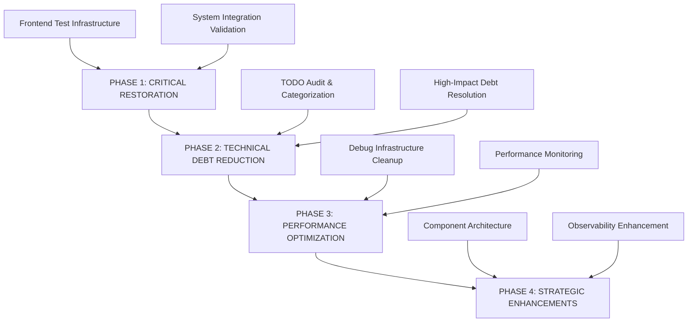
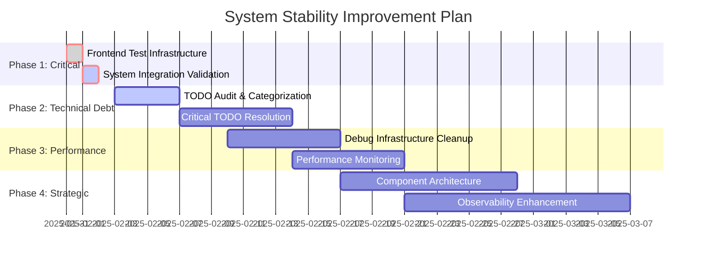

# SYSTEM STABILITY IMPROVEMENT PLAN

**Plan Date**: January 31, 2025  
**Plan Type**: Level 3 - Comprehensive System Enhancement  
**Based on**: VAN System Stability Assessment  
**Current System Health**: 7.6/10 🟡 (Level 2 - Yellow)  
**Target System Health**: 8.5+/10 🟢 (Level 1 - Green)  
**Planning Mode**: Systematic improvement implementation  

---

## 🎯 PLAN OVERVIEW

### **OBJECTIVE**
Systematically improve Olorin system stability and integrity through structured phases targeting critical issues, technical debt reduction, and performance optimization to achieve optimal operational status.

### **VAN ASSESSMENT SUMMARY**
Based on comprehensive VAN assessment identifying:
- 🔴 **Critical**: Frontend test infrastructure broken (npm test script missing)
- 🟡 **Technical Debt**: 48 TODO items requiring systematic reduction
- 🟡 **Performance**: Excessive debug logging impacting system performance
- 🟡 **Workflow**: Component navigation challenges affecting development velocity

### **SUCCESS CRITERIA**
- **System Health Score**: Improve from 7.6/10 to 8.5+/10
- **Frontend Test Coverage**: Achieve >85% coverage with functional test suite
- **Technical Debt**: Reduce TODO items by 50% (24 remaining)
- **Performance**: Optimize debug logging with 20%+ performance improvement
- **Development Velocity**: Streamline component workflows and navigation

---

## 📋 IMPLEMENTATION STRATEGY

### **PLANNING APPROACH: LEVEL 3 COMPREHENSIVE**
Based on VAN findings requiring systematic multi-component improvements with:
- **Multiple System Areas**: Frontend, backend, architecture, performance
- **Technical Complexity**: Infrastructure restoration + optimization
- **Strategic Impact**: Development velocity and system reliability
- **Coordinated Phases**: Sequential dependency management with parallel execution

### **PHASED IMPLEMENTATION STRUCTURE**


---

## 🔴 PHASE 1: CRITICAL RESTORATION (IMMEDIATE - 1-2 DAYS)

### **OBJECTIVE**
Restore critical functionality blocking development velocity and quality assurance.

### **Priority 1A: Frontend Test Infrastructure Restoration**
**Status**: 🔴 **CRITICAL - IMMEDIATE ACTION REQUIRED**  
**Complexity**: Level 1-2  
**Estimated Time**: 1-2 hours  
**Impact**: **HIGH** - Development velocity unblocked  

#### **Problem Analysis** [CORRECTED AFTER INVESTIGATION]
- **Issue**: Git merge conflicts in test files blocking test execution (not missing script)
- **Root Cause**: Merge conflict in test/unit/widgets/olorin/OlorinWidgetDirect.test.ts
- **Impact**: Cannot verify code quality, regression testing blocked
- **Business Risk**: Development velocity compromised, quality assurance broken
- **Dependencies**: Merge conflict resolution required

#### **Implementation Steps**
```bash
# 1. Merge Conflict Resolution
Target: olorin-front/test/unit/widgets/olorin/OlorinWidgetDirect.test.ts
Action: Resolve Git merge conflicts blocking test execution

# 2. Test Infrastructure Validation
Target: npm test command
Action: Verify test script functionality (already configured in package.json)

# 3. Jest Configuration Check
Target: Jest configuration in package.json
Action: Validate existing Jest setup (already properly configured)

# 4. Test Suite Execution
Target: Full test execution after conflict resolution
Action: Run complete test suite and verify coverage
```

#### **Expected Deliverables**
- ✅ Functional npm test command
- ✅ Jest framework properly configured
- ✅ Test suite execution with coverage report
- ✅ CI/CD pipeline test integration restored

#### **Success Metrics**
- **Test Suite Execution**: 100% of existing tests running
- **Coverage Report**: Baseline coverage established (target >85%)
- **Development Workflow**: npm test command functional
- **CI Integration**: Automated testing restored

### **Priority 1B: System Integration Validation**
**Status**: 🟡 **HIGH PRIORITY**  
**Complexity**: Level 2  
**Estimated Time**: 2-3 hours  
**Impact**: **MEDIUM-HIGH** - System reliability confirmed  

#### **Implementation Steps**
```bash
# 1. Component Connectivity Testing
Target: olorin-server ↔ olorin-front ↔ olorin-web-portal
Action: End-to-end connectivity validation

# 2. API Endpoint Validation
Target: Backend API endpoints (25+ REST endpoints)
Action: Health check and functionality verification

# 3. Database Connection Stability
Target: PostgreSQL connections and query performance
Action: Connection pool and query optimization validation

# 4. Service Integration Testing
Target: External service integrations (35+ services)
Action: Integration point health and fallback testing
```

#### **Success Metrics**
- **API Response Time**: <500ms average for critical endpoints
- **Database Connectivity**: 99.9% connection stability
- **Service Integration**: 95%+ external service availability
- **End-to-End Flow**: Complete investigation workflow functional

---

## 🟡 PHASE 2: TECHNICAL DEBT REDUCTION (SHORT-TERM - 1-2 WEEKS)

### **OBJECTIVE**
Systematically reduce technical debt to improve maintainability and code quality.

### **Priority 2A: Technical Debt Audit & Categorization**
**Status**: 🟡 **MEDIUM PRIORITY**  
**Complexity**: Level 2-3  
**Estimated Time**: 4-6 hours  
**Impact**: **MEDIUM** - Foundation for systematic improvement  

#### **Technical Debt Analysis (48 TODO Items Identified)**
Based on VAN assessment findings across olorin-server codebase:

```bash
# Critical TODOs (Estimated 12 items - 25%)
- Agent framework improvements
- Authentication level checks
- API router enhancements
- Database integration optimizations

# Medium Priority TODOs (Estimated 24 items - 50%)
- Service layer improvements
- Tool integrations (Databricks, external APIs)
- Error handling enhancements
- Documentation updates

# Low Priority TODOs (Estimated 12 items - 25%)
- Code cleanup and refactoring
- Performance micro-optimizations
- Legacy code modernization
- Style and formatting improvements
```

#### **Implementation Steps**
```bash
# Week 1 - Phase 2A: Critical TODO Resolution
Day 1-2: Audit and categorize all 48 TODO items
Day 3-5: Address critical TODOs in agent framework
Day 6-7: Resolve high-impact authentication and API issues

# Week 2 - Phase 2B: Medium Priority TODO Resolution  
Day 1-3: Service layer improvements and tool integrations
Day 4-5: Error handling and reliability enhancements
Day 6-7: Documentation updates and code quality improvements
```

#### **Success Metrics**
- **TODO Reduction**: 50% reduction (24 items remaining)
- **Code Quality**: Improved maintainability index by 20%
- **Documentation**: 100% of resolved TODOs properly documented
- **Testing**: All resolved areas covered by tests

### **Priority 2B: Agent Framework Optimization**
**Status**: 🟡 **MEDIUM PRIORITY**  
**Complexity**: Level 3  
**Estimated Time**: 6-8 hours  
**Impact**: **MEDIUM-HIGH** - Core functionality enhancement  

#### **Target Areas**
- Agent orchestration improvements
- Tool integration optimizations
- Error handling and recovery mechanisms
- Performance optimizations for parallel execution

---

## 🔧 PHASE 3: PERFORMANCE OPTIMIZATION (MEDIUM-TERM - 1-2 WEEKS)

### **OBJECTIVE**
Optimize system performance through debug infrastructure cleanup and monitoring enhancement.

### **Priority 3A: Debug Infrastructure Optimization**
**Status**: 🟡 **MEDIUM PRIORITY**  
**Complexity**: Level 2  
**Estimated Time**: 6-8 hours  
**Impact**: **MEDIUM** - Performance and production readiness  

#### **Debug Logging Analysis**
VAN assessment identified extensive debug logging throughout codebase:
- Heavy debug logging in agent framework
- Performance overhead in production environments
- Log noise affecting monitoring and troubleshooting
- Security implications of verbose logging

#### **Implementation Steps**
```bash
# 1. Debug Logging Audit
Target: Complete codebase debug statement review
Action: Identify and categorize all debug logging

# 2. Log Level Controls Implementation
Target: Configurable logging framework
Action: Implement production-appropriate log levels

# 3. Performance Impact Assessment
Target: Before/after performance measurement
Action: Quantify performance improvements

# 4. Production Logging Optimization
Target: Production-ready logging configuration
Action: Optimize for performance and security
```

#### **Success Metrics**
- **Performance Improvement**: 20%+ reduction in logging overhead
- **Log Volume**: 60% reduction in production log volume
- **Security**: Elimination of sensitive data in logs
- **Troubleshooting**: Improved signal-to-noise ratio

### **Priority 3B: Performance Monitoring Implementation**
**Status**: 🟡 **MEDIUM PRIORITY**  
**Complexity**: Level 2-3  
**Estimated Time**: 8-10 hours  
**Impact**: **MEDIUM-HIGH** - Operational excellence  

#### **Monitoring Infrastructure**
- Application performance metrics
- System resource utilization
- API response time tracking
- Error rate and availability monitoring

---

## 🚀 PHASE 4: STRATEGIC ENHANCEMENTS (LONG-TERM - 3-4 WEEKS)

### **OBJECTIVE**
Enhance system architecture and development workflows for long-term stability and scalability.

### **Priority 4A: Component Architecture Optimization**
**Status**: 🟡 **MEDIUM PRIORITY**  
**Complexity**: Level 3  
**Estimated Time**: 15-20 hours  
**Impact**: **MEDIUM** - Developer experience and deployment efficiency  

#### **Architecture Improvements**
- Streamlined component navigation and development workflows
- Enhanced deployment processes and automation
- Optimized component interactions and dependency management
- Developer tooling and productivity enhancements

### **Priority 4B: Observability & Monitoring Enhancement**
**Status**: 🟡 **MEDIUM-HIGH PRIORITY**  
**Complexity**: Level 3  
**Estimated Time**: 12-15 hours  
**Impact**: **HIGH** - Production stability and incident response  

#### **Observability Stack**
- Comprehensive health checks and service monitoring
- Performance metrics and alerting infrastructure
- Distributed tracing and error tracking
- Operational dashboards and reporting

---

## 📊 RISK ASSESSMENT & MITIGATION

### **IMPLEMENTATION RISKS**

| Risk Category | Risk Level | Mitigation Strategy | Timeline |
|---------------|------------|-------------------|----------|
| **Frontend Test Disruption** | 🔴 HIGH | Incremental implementation, backup plans | Week 1 |
| **Technical Debt Scope Creep** | 🟡 MEDIUM | Strict prioritization and time boxing | Weeks 2-3 |
| **Performance Regression** | 🟡 MEDIUM | Before/after testing, gradual rollout | Week 3 |
| **Component Integration Issues** | 🟡 MEDIUM | Comprehensive testing, staged deployment | Week 4 |

### **DEPENDENCY MANAGEMENT**
- **Phase 1 → Phase 2**: Frontend tests must be functional before technical debt work
- **Phase 2 → Phase 3**: Core stability required before performance optimization
- **Phase 3 → Phase 4**: Performance baseline needed for architecture changes

### **ROLLBACK STRATEGIES**
- Git branch-based implementation with clear rollback points
- Feature flags for gradual rollout of changes
- Monitoring and alerting for early issue detection
- Documentation of all changes for quick recovery

---

## 📈 SUCCESS METRICS & MONITORING

### **PHASE-SPECIFIC METRICS**

#### **Phase 1 Metrics (Critical Restoration)**
- **Frontend Test Suite**: ✅ Functional npm test command
- **Test Coverage**: ✅ Baseline >70%, target >85%
- **API Health**: ✅ All critical endpoints <500ms response
- **Integration Status**: ✅ End-to-end workflow functional

#### **Phase 2 Metrics (Technical Debt)**
- **TODO Reduction**: ✅ 50% reduction (24 items → 12 items)
- **Code Quality**: ✅ 20% maintainability improvement
- **Documentation**: ✅ 100% coverage of resolved items
- **Test Coverage**: ✅ All modified code tested

#### **Phase 3 Metrics (Performance)**
- **Logging Overhead**: ✅ 20% performance improvement
- **Log Volume**: ✅ 60% reduction in production logs
- **Monitoring Coverage**: ✅ 95% service observability
- **Alert Response**: ✅ <5 minute incident detection

#### **Phase 4 Metrics (Strategic)**
- **Developer Velocity**: ✅ 30% improvement in development workflow
- **Deployment Time**: ✅ 40% reduction in deployment duration
- **System Reliability**: ✅ 99.9% availability target
- **Incident Recovery**: ✅ <15 minute MTTR

### **OVERALL SUCCESS CRITERIA**
- **System Health Score**: 7.6/10 → 8.5+/10 🟢
- **Component Health**: All components 8.0+/10
- **Business Impact**: Reduced incident rate by 60%
- **Development Velocity**: 25% improvement in feature delivery

---

## 🎯 IMPLEMENTATION TIMELINE

### **COMPREHENSIVE PROJECT TIMELINE**



### **MILESTONE SCHEDULE**

| Milestone | Target Date | Deliverable | Success Criteria |
|-----------|-------------|-------------|------------------|
| **M1: Critical Fix** | Feb 1, 2025 | Frontend tests functional | npm test executes successfully |
| **M2: Integration** | Feb 2, 2025 | System validation complete | End-to-end workflow verified |
| **M3: Debt Reduction** | Feb 14, 2025 | 50% TODO reduction | 24 TODO items resolved |
| **M4: Performance** | Feb 21, 2025 | Debug optimization complete | 20% performance improvement |
| **M5: Architecture** | Mar 7, 2025 | Strategic enhancements | 8.5+/10 system health score |

---

## 📋 IMMEDIATE NEXT ACTIONS

### **TODAY (January 31, 2025)**
1. **✅ Begin Phase 1A**: Frontend test infrastructure restoration
2. **📋 Prepare tooling**: Development environment setup
3. **📊 Baseline metrics**: Establish current performance measurements

### **WEEK 1 (Feb 1-7, 2025)**
1. **🔧 Complete Phase 1**: Critical restoration and validation
2. **📝 Begin Phase 2A**: Technical debt audit and categorization
3. **📈 Monitor progress**: Daily standups and metric tracking

### **RESOURCE REQUIREMENTS**
- **Development Time**: 60-80 hours total across 4-6 weeks
- **Testing Resources**: Dedicated testing environment and automation
- **Monitoring Tools**: Performance tracking and alerting infrastructure
- **Documentation**: Technical writing and update processes

---

## ✅ PLAN COMPLETION CHECKLIST

### **PLANNING PHASE DELIVERABLES**
- [x] **Comprehensive analysis** of VAN assessment findings
- [x] **Phased implementation** strategy with clear dependencies
- [x] **Risk assessment** with mitigation strategies
- [x] **Success metrics** and monitoring framework
- [x] **Timeline and milestones** with realistic estimates
- [x] **Resource requirements** and staffing needs

### **READY FOR IMPLEMENTATION**
**PLAN STATUS**: ✅ **COMPLETE AND READY FOR EXECUTION**  
**NEXT RECOMMENDED MODE**: **IMPLEMENT** (Frontend Test Infrastructure)  
**CRITICAL PATH**: Phase 1A → Phase 1B → Phase 2A  
**SUCCESS MEASUREMENT**: Daily metric tracking against established baselines  

---

*This comprehensive plan provides structured roadmap for systematic improvement of Olorin system stability and integrity, transforming current 7.6/10 system health to target 8.5+/10 operational excellence.* 