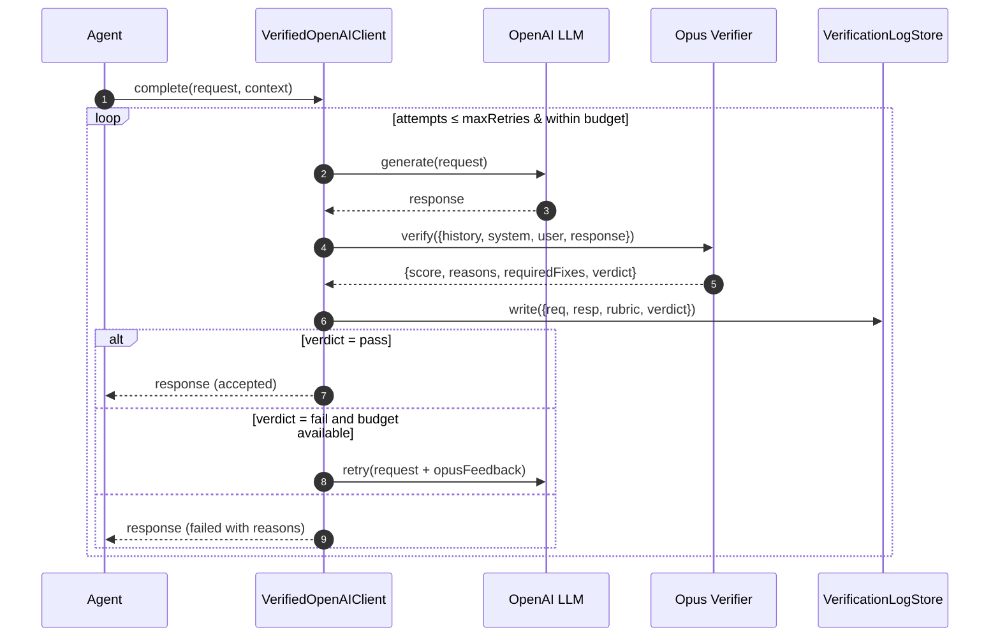

# Verification LLM Service Plan — Opus-validated OpenAI

**Owner**: Platform AI Team  
**Date**: 2025-02-01  
**Status**: Draft → To Implement  
**Scope**: Backend (`olorin-server`) — Validate every OpenAI response with Claude Opus; iterate with structured feedback until passing.

## 1) Objectives and Non-Goals
- Ensure every OpenAI response is valid, instruction-following, safe, and structured as required.
- Provide a deterministic acceptance gate with measurable scoring and transparent telemetry.
- Support iterative retry with targeted feedback from Opus to improve response quality.
- Non-goals: Replace OpenAI provider; change frontend contracts.

## 2) Success Criteria
- ≥99% of OpenAI responses pass validation on first or second attempt within latency SLO.
- P95 end-to-end latency increase ≤ +2.5s with 1 retry; P99 ≤ +6s with 2 retries.
- Zero PII/secret leakage to Opus (verified via redactor + tests).
- Audit trail: 100% of requests have a verification record with rubric scores and verdict.

## 3) High-Level Architecture
- Verified LLM client wraps OpenAI calls.
- Opus verifier evaluates original prompt+history+response using a strict rubric and JSON output.
- Policy engine decides acceptance, retry count, and thresholds by task type (e.g., Risk Analysis).
- Storage and observability capture all verification metadata.



## 4) Core Components (Python, `olorin-server`)
- `LLMProvider` (interface): `complete(prompt, options) -> LLMResult`
- `OpenAIProvider`: calls OpenAI; configurable model/params.
- `OpusVerifier`: `verify(context: VerificationContext) -> VerificationReport`
- `ValidationPolicy`: thresholds, maxRetries, budgets per task type.
- `VerifiedOpenAIClient`: orchestrates call → verify → accept/retry.
- `VerificationLogStore`: writes structured logs to Redis/DB/files.
- `Redactor`: strips PII/secrets before sending to Opus.

Suggested paths:
- `olorin-server/app/service/llm/providers/openai_provider.py`
- `olorin-server/app/service/llm/verification/opus_verifier.py`
- `olorin-server/app/service/llm/verification/policies.py`
- `olorin-server/app/service/llm/verified_client.py`
- `olorin-server/app/models/llm_verification.py` (pydantic models)
- `olorin-server/app/utils/redaction.py`

## 5) Verification Rubric and Output Schema
- Categories (0-1 each, weighted):
  - Correctness (0.35)
  - Completeness vs. request (0.25)
  - Instruction/format adherence (0.20)
  - Factual grounding/no hallucinations (0.10)
  - Safety and compliance (0.10)
- Acceptance: weighted score ≥ threshold (default 0.85) AND all hard-gates pass:
  - JSON schema validity (if applicable)
  - Required fields present (task-specific)
  - No red flags (PII, policy violations, refusals when not warranted)

Opus JSON output (example):
```json
{
  "weighted_score": 0.88,
  "category_scores": {
    "correctness": 0.9,
    "completeness": 0.85,
    "adherence": 0.9,
    "grounding": 0.8,
    "safety": 0.95
  },
  "verdict": "pass",
  "hard_gate_failures": [],
  "required_fixes": [],
  "rationale": "Meets rubric; structure correct.",
  "suggested_retry_suffix": "Clarify transaction timeframe and include confidence intervals."
}
```

## 6) Opus Prompt Template (system)
- Provide strict instructions to return ONLY the JSON schema above.
- Inputs: system prompt, conversation history, user request, OpenAI response, task_type, schema (if any).
- Ask for specific `required_fixes` list with short, actionable directives suitable for prompt suffixing.

Example excerpt:
```
You are a validator. Evaluate the OpenAI response for task_type='{task_type}'.
Return ONLY valid JSON per the schema. No extra text.
Hard gates: JSON validity; required fields; safety; policy matching.
Provide a concise suggested_retry_suffix to append to the next OpenAI call.
```

## 7) Iteration Strategy
- `maxRetries`: default 1 (total 2 attempts), configurable up to 2.
- Budget guard: max added tokens and time per request; abort with best-effort result if exceeded.
- Retry prompt composition: append `suggested_retry_suffix` to the original user prompt and/or add tool-specific constraints.
- Dampening: if the delta between attempts < 0.05 score improvement, stop early.

## 8) Configuration (yaml)
- `config/verification.yaml`:
  - `enabled`: true
  - `model_opus`: "claude-opus-4.1" (configurable)
  - `threshold_default`: 0.85
  - `max_retries_default`: 1
  - `task_policies`:
    - `risk_analysis`: { threshold: 0.9, max_retries: 2, schema: risk_schema.json }
  - `budgets`: { max_added_tokens: 2000, max_added_ms: 6000 }
  - `sampling`: { percent: 1.0, percent_shadow: 0.0 }

## 9) Telemetry & Storage
- Log per-attempt: requestId, timestamps, tokens, OpenAI model/params, Opus model, scores, verdict, failure reasons, retry suffix, final accepted attempt.
- Persist to: file (short-term), then DB table `llm_verification_events` with TTL or archival.
- Expose admin endpoint `/admin/verification/stats` and Grafana dashboards.

## 10) Error Handling & Fallbacks
- If Opus unavailable or times out: soft-degrade to single-pass OpenAI (configurable) and tag as `unverified`.
- Circuit breaker on persistent Opus failures.
- Always redact secrets before sending to Opus.

## 11) Security & Privacy
- Redact API keys, tokens, emails, phone, SSNs, account numbers, and any configured regex.
- Do not include raw user PII in stored logs; store hashed identifiers.

## 12) Testing
- Unit: rubric aggregation; policy decisions; redaction; JSON schema validation; retry loop.
- Integration: golden transcripts for Risk Analysis; forced-fail then recover via retry.
- Chaos: Opus timeout; malformed JSON; OpenAI refusal.
- Performance: budget adherence; latency impact.

## 13) Rollout Plan
- Stage 1: Shadow verification (no blocking), sample=25%.
- Stage 2: Full verification blocking for `risk_analysis`, sample=100%.
- Stage 3: Extend to other task types; enable retries.
- Stage 4: Optimize prompts/weights from telemetry.

## 14) Risks & Mitigations
- Latency/cost: budgets, sampling, early-stop.
- Opus overstrict: tune weights/thresholds per task; maintain allowlist fixes.
- Prompt injection: rigorous redaction + system prompt hardening for Opus.

## 15) Timeline & Milestones
- Day 0-1: Abstractions + config + redactor.
- Day 2: Opus verifier + rubric JSON; unit tests.
- Day 3: Verified client + integration tests; shadow deploy.
- Day 4: Blocking for `risk_analysis`; dashboards.

## 16) Definition of Done
- All success criteria met; dashboards live; runbook documented; feature flag controllable at runtime.

## 🎨🎨🎨 ENTERING CREATIVE PHASE: Architecture — Verified LLM Orchestration

### Component Description
A verification-gated LLM client that wraps OpenAI calls, invokes Opus to score responses, and either accepts the output or retries OpenAI with targeted feedback.

### Requirements & Constraints
- Synchronous gate: every OpenAI response is verified before returning to caller
- Iterative retries (≤2) with Opus feedback within tight latency budget
- Horizontal scalability and future ability to move verification to a separate process
- Zero secret/PII leakage; strong observability and audit trail

### Options
1) In-process wrapper (library) inside `olorin-server`
- Pros: Lowest latency; simplest integration; no extra infra; easy feature flagging
- Cons: Shares failure domain with app; scale coupled to API workers

2) Sidecar/gateway microservice (REST/gRPC)
- Pros: Clear separation of concerns; independent scaling; polyglot client support
- Cons: Extra network hop; operational overhead; routing complexity

3) Async audit (queue) with eventual correction
- Pros: Minimal latency impact; robust buffering
- Cons: Violates gating requirement; bad outputs can leak; complex correction flow

### Recommended Approach
Adopt Option 1 (in-process wrapper) for v1 to meet gating/latency requirements, implemented behind a provider interface to allow an Option 2 migration later without changing call sites.

### Implementation Guidelines
- Introduce `LLMProvider` interface and route all OpenAI calls through `VerifiedOpenAIClient`
- Keep orchestration pure and side-effect free; inject `OpenAIProvider`, `OpusVerifier`, `ValidationPolicy`, `Redactor`, and `VerificationLogStore`
- Add feature flags: `verification.enabled`, `mode: shadow|blocking`, `sampling`
- Provide hooks to emit metrics and structured logs per attempt

### Verification Checkpoint
- Load test P95 overhead ≤ 2.5s with one retry; error budgets respected
- Fault injection: Opus timeout → soft-degrade; OpenAI error → retry/backoff respected

### 🎨🎨🎨 EXITING CREATIVE PHASE

---

## 🎨🎨🎨 ENTERING CREATIVE PHASE: Algorithm — Verification Rubric & Iteration

### Component Description
Decision logic to evaluate Opus scores and decide accept/fail/retry with strict hard-gates and budgets.

### Requirements & Constraints
- Transparent scoring and auditable verdicts
- Hard-gates for JSON/schema validity, required fields, and safety
- Configurable per task_type thresholds and retries

### Options
1) Weighted linear score + per-category minimums + hard-gates
- Pros: Simple, explainable, tunable; robust with minima
- Cons: Manual tuning required; limited nuance without history

2) Rule-only (no composite score)
- Pros: Deterministic and predictable
- Cons: Rigid; hard to balance competing qualities

3) Learned classifier (model-based)
- Pros: Potentially more accurate with training
- Cons: Data/ops heavy; low transparency; slower to iterate

### Recommended Approach
Option 1 with category minima (e.g., adherence ≥0.85, safety ≥0.9) and overall threshold (default 0.85; `risk_analysis` 0.9), plus hard-gates for schema/safety.

### Implementation Guidelines
- Compute weighted score from Opus `category_scores`; enforce minima and gates first
- Early-stop retries if improvement < 0.05 or budget exceeded
- Compose retry prompts by appending `suggested_retry_suffix`; for structured tasks, enable JSON schema/function calling on OpenAI when supported

### Verification Checkpoint
- Unit tests for boundary conditions around thresholds/minima
- Chaos tests: malformed JSON, missing required fields, refusal detection

### 🎨🎨🎨 EXITING CREATIVE PHASE

---

## 🎨🎨🎨 ENTERING CREATIVE PHASE: Prompt — Opus Validator JSON Critic

### Component Description
Opus system prompt and instruction template that returns strict JSON verdicts with actionable fixes.

### Requirements & Constraints
- JSON-only output; zero extraneous tokens
- Short, actionable `required_fixes` and `suggested_retry_suffix`
- Safety checks for PII, refusals, and policy compliance

### Options
1) Single-pass JSON-only rubric prompt (temperature 0)
- Pros: Fast; deterministic; minimal tokens
- Cons: Limited introspection

2) Two-pass (classification then rubric)
- Pros: Potentially clearer failure modes
- Cons: Higher latency/cost; more brittle flow

3) JSON+explanation (store explanation, return JSON)
- Pros: Better debugging
- Cons: Token overhead; risk of non-JSON leakage

### Recommended Approach
Option 1: Single-pass JSON-only. Include compact `rationale` field inside JSON for debugging while keeping schema small.

### Implementation Guidelines
- Use explicit schema in the system prompt and request strict adherence
- Set `temperature=0`, `top_p=0.1`, short `max_tokens`
- Provide `task_type`, schema snippet (if any), and minimal history sufficient to judge

### Verification Checkpoint
- Golden transcripts: verify consistent JSON-only compliance across cases
- Measure Opus token usage and latency; keep median ≤ 800ms

### 🎨🎨🎨 EXITING CREATIVE PHASE

---

## 🎨🎨🎨 ENTERING CREATIVE PHASE: Data Contract — Risk Analysis JSON Schema

### Component Description
Strict JSON schema for Risk Analysis responses enabling objective validation and downstream parsing.

### Requirements & Constraints
- Must capture findings, risk score, rationale, evidences, and remediation
- Backward-compatible evolution; versioned schema

### Options
1) Minimal schema (flat fields)
- Pros: Easy to validate; compact
- Cons: Limited expressiveness for evidences

2) Structured schema (nested evidences and metrics)
- Pros: Rich context; future-proof
- Cons: Slightly larger payloads; stricter validation

### Recommended Approach
Option 2: Structured schema with versioning.

### Proposed v1 Schema (excerpt)
```json
{
  "$schema": "https://json-schema.org/draft/2020-12/schema",
  "$id": "https://olorin.ai/schemas/risk_analysis.v1.json",
  "title": "RiskAnalysisResult",
  "type": "object",
  "required": ["version", "overall_risk", "findings", "confidence", "summary"],
  "properties": {
    "version": { "type": "string", "const": "v1" },
    "overall_risk": { "type": "number", "minimum": 0, "maximum": 1 },
    "confidence": { "type": "number", "minimum": 0, "maximum": 1 },
    "summary": { "type": "string", "minLength": 10 },
    "findings": {
      "type": "array",
      "minItems": 1,
      "items": {
        "type": "object",
        "required": ["id", "title", "severity", "evidence"],
        "properties": {
          "id": { "type": "string" },
          "title": { "type": "string" },
          "severity": { "type": "string", "enum": ["low", "medium", "high", "critical"] },
          "score": { "type": "number", "minimum": 0, "maximum": 1 },
          "evidence": {
            "type": "array",
            "minItems": 1,
            "items": {
              "type": "object",
              "required": ["type", "description"],
              "properties": {
                "type": { "type": "string", "enum": ["log", "ip", "device", "location", "auth", "other"] },
                "description": { "type": "string" },
                "references": { "type": "array", "items": { "type": "string" } }
              }
            }
          },
          "remediation": { "type": "string" }
        }
      }
    }
  }
}
```

### Implementation Guidelines
- Store schema in `olorin-server/app/schemas/risk_analysis.v1.json`
- Validate OpenAI outputs locally before Opus; Opus still judges higher-level qualities
- Include schema `const` version and enforce via hard-gate

### Verification Checkpoint
- Unit tests with valid/invalid payloads; ensure strict failures on missing required fields
- Backward-compat tests when v2 introduced

### 🎨🎨🎨 EXITING CREATIVE PHASE

---

## Creative Phase Verification
- All flagged components addressed with ≥2 options each
- Pros/cons analyzed; recommendations justified to meet latency, safety, and gating requirements
- Implementation guidelines provided; verification checkpoints defined

→ Ready for IMPLEMENT MODE for `VerifiedOpenAIClient`, `OpusVerifier`, and `risk_analysis` schema.
