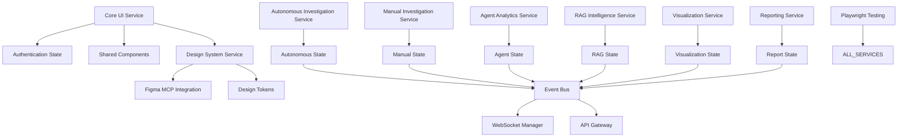

# Enhanced Data Model: Frontend Microservices Architecture with 8 Services

**Generated**: 2025-01-17
**Purpose**: Define service boundaries, data flow, and state management for the enhanced 8-microservice frontend architecture

## Enhanced Service Architecture Overview



## Enhanced Core Entities

### 1. Autonomous Investigation Entity
```typescript
interface AutonomousInvestigation {
  id: string;
  userId: string;
  entityType: 'user_id' | 'email' | 'phone' | 'device_id';
  status: 'initializing' | 'analyzing' | 'orchestrating' | 'completed' | 'escalated';
  aiMode: 'aggressive' | 'balanced' | 'conservative';
  orchestration: AIOrchestration;
  automatedFindings: AutomatedFinding[];
  riskCalculation: RiskCalculation;
  escalationCriteria: EscalationRule[];
  created: Date;
  updated: Date;
  completedAt?: Date;
}

interface AIOrchestration {
  id: string;
  strategy: 'parallel' | 'sequential' | 'adaptive';
  activeAgents: string[];
  completedAgents: string[];
  pendingAgents: string[];
  decisionTree: DecisionNode[];
  confidenceThreshold: number;
}

interface AutomatedFinding {
  id: string;
  agentId: string;
  type: 'anomaly' | 'pattern' | 'violation' | 'correlation';
  confidence: number;
  severity: 'low' | 'medium' | 'high' | 'critical';
  automatedAction?: string;
  requiresReview: boolean;
}
```

### 2. Manual Investigation Entity
```typescript
interface ManualInvestigation {
  id: string;
  investigatorId: string;
  userId: string;
  entityType: 'user_id' | 'email' | 'phone' | 'device_id';
  status: 'draft' | 'in_progress' | 'review' | 'completed' | 'archived';
  workflow: InvestigationWorkflow;
  manualFindings: ManualFinding[];
  evidence: Evidence[];
  collaborators: Collaborator[];
  template?: InvestigationTemplate;
  created: Date;
  updated: Date;
  completedAt?: Date;
}

interface InvestigationWorkflow {
  id: string;
  currentStep: number;
  totalSteps: number;
  steps: WorkflowStep[];
  customSteps: CustomStep[];
  skipReason?: string;
}

interface ManualFinding {
  id: string;
  investigatorId: string;
  category: string;
  description: string;
  evidence: string[];
  severity: 'info' | 'low' | 'medium' | 'high' | 'critical';
  timestamp: Date;
  notes: string;
}

interface Collaborator {
  id: string;
  name: string;
  role: 'lead' | 'reviewer' | 'viewer';
  permissions: string[];
  lastActive: Date;
}
```

### 3. Design System Entity
```typescript
interface DesignSystem {
  version: string;
  tokens: DesignTokens;
  components: ComponentLibrary;
  figmaSync: FigmaSync;
  validation: DesignValidation;
}

interface DesignTokens {
  colors: ColorTokens;
  typography: TypographyTokens;
  spacing: SpacingTokens;
  shadows: ShadowTokens;
  borderRadius: BorderRadiusTokens;
  animations: AnimationTokens;
  breakpoints: BreakpointTokens;
  lastUpdated: Date;
  source: 'figma' | 'manual' | 'generated';
}

interface ComponentLibrary {
  components: Map<string, ComponentDefinition>;
  variants: Map<string, ComponentVariant[]>;
  compositions: Map<string, ComponentComposition>;
  version: string;
}

interface FigmaSync {
  fileId: string;
  lastSync: Date;
  syncStatus: 'synced' | 'syncing' | 'outdated' | 'error';
  componentMappings: FigmaComponentMapping[];
  autoSync: boolean;
  syncInterval: number;
}

interface ComponentDefinition {
  id: string;
  name: string;
  category: string;
  figmaNodeId?: string;
  tailwindClasses: string[];
  props: ComponentProp[];
  examples: ComponentExample[];
  tests: ComponentTest[];
}
```

### 4. Testing Entity (Playwright)
```typescript
interface TestSuite {
  id: string;
  name: string;
  type: 'unit' | 'service' | 'integration' | 'e2e' | 'visual';
  microservices: string[];
  tests: TestCase[];
  coverage: TestCoverage;
  lastRun: TestRun;
}

interface TestCase {
  id: string;
  name: string;
  description: string;
  category: string;
  steps: TestStep[];
  assertions: Assertion[];
  fixtures: TestFixture[];
  retryCount: number;
  timeout: number;
}

interface VisualRegressionTest {
  id: string;
  componentName: string;
  figmaReference: string;
  threshold: number;
  viewport: Viewport[];
  lastSnapshot: string;
  diffPercentage?: number;
}

interface TestRun {
  id: string;
  suiteId: string;
  status: 'running' | 'passed' | 'failed' | 'flaky';
  duration: number;
  failedTests: string[];
  flakyTests: string[];
  coverage: number;
  timestamp: Date;
  artifacts: TestArtifact[];
}
```

## Enhanced Service Definitions

### 1. Autonomous Investigation Service
**Responsibility**: AI-driven automated fraud investigations
**Port**: 3001

**State**:
```typescript
interface AutonomousInvestigationState {
  activeInvestigations: AutonomousInvestigation[];
  aiOrchestration: AIOrchestrationState;
  automationRules: AutomationRule[];
  escalationQueue: EscalationItem[];
  performanceMetrics: AIPerformanceMetrics;
}

interface AutonomousInvestigationActions {
  startAutonomousInvestigation: (params: AutoInvestigationParams) => void;
  configureAIStrategy: (strategy: AIStrategy) => void;
  updateOrchestration: (id: string, updates: Partial<AIOrchestration>) => void;
  escalateToManual: (id: string, reason: string) => void;
  generateAutomatedReport: (id: string) => void;
}
```

### 2. Manual Investigation Service
**Responsibility**: Human-driven guided investigations
**Port**: 3002

**State**:
```typescript
interface ManualInvestigationState {
  activeInvestigations: ManualInvestigation[];
  workflows: InvestigationWorkflow[];
  templates: InvestigationTemplate[];
  collaborationSessions: CollaborationSession[];
  evidenceLibrary: Evidence[];
}

interface ManualInvestigationActions {
  startManualInvestigation: (params: ManualInvestigationParams) => void;
  updateWorkflowStep: (id: string, step: number) => void;
  addEvidence: (investigationId: string, evidence: Evidence) => void;
  inviteCollaborator: (investigationId: string, collaborator: Collaborator) => void;
  submitForReview: (id: string) => void;
}
```

### 3. Agent Analytics Service
**Responsibility**: AI agent monitoring and performance analysis
**Port**: 3003

**State**:
```typescript
interface AgentAnalyticsState {
  agents: Agent[];
  executions: AgentExecution[];
  performanceMetrics: AgentPerformanceMetrics[];
  anomalies: AgentAnomaly[];
  recommendations: OptimizationRecommendation[];
}

interface AgentAnalyticsActions {
  trackExecution: (execution: AgentExecution) => void;
  analyzePerformance: (agentId: string, timeRange: TimeRange) => void;
  detectAnomalies: () => void;
  generateOptimizationPlan: (agentId: string) => void;
}
```

### 4. RAG Intelligence Service
**Responsibility**: Retrieval-augmented generation and knowledge management
**Port**: 3004

**State & Actions remain similar to original design**

### 5. Visualization Service
**Responsibility**: Data visualization and interactive analysis
**Port**: 3005

**State & Actions remain similar to original design**

### 6. Reporting Service
**Responsibility**: Report generation and document export
**Port**: 3006

**State & Actions remain similar to original design**

### 7. Core UI Service
**Responsibility**: Shared UI components and authentication
**Port**: 3007

**Enhanced State**:
```typescript
interface CoreUIState {
  user: User | null;
  isAuthenticated: boolean;
  theme: ThemeConfig;
  navigation: NavigationState;
  notifications: Notification[];
  serviceHealth: ServiceHealthMap;
  featureFlags: FeatureFlags;
}

interface CoreUIActions {
  login: (credentials: LoginCredentials) => void;
  logout: () => void;
  setTheme: (theme: ThemeConfig) => void;
  addNotification: (notification: Notification) => void;
  navigate: (path: string) => void;
  checkServiceHealth: () => void;
  toggleFeature: (feature: string) => void;
}
```

### 8. Design System Service ⭐ NEW
**Responsibility**: Figma-integrated design system management
**Port**: 3008

**State**:
```typescript
interface DesignSystemState {
  tokens: DesignTokens;
  components: ComponentLibrary;
  figmaSync: FigmaSync;
  validation: ValidationResults;
  componentUsage: UsageAnalytics;
}

interface DesignSystemActions {
  syncWithFigma: () => Promise<SyncResult>;
  updateTokens: (tokens: Partial<DesignTokens>) => void;
  validateComponent: (componentId: string) => ValidationResult;
  generateComponent: (figmaNodeId: string) => Promise<ComponentDefinition>;
  trackUsage: (componentId: string, context: UsageContext) => void;
  exportTokens: (format: 'css' | 'json' | 'scss') => string;
}
```

## Enhanced Cross-Service Communication

### Extended Event Bus Schema
```typescript
interface EnhancedEventBusEvents {
  // Autonomous Investigation events
  'auto:investigation:started': { investigation: AutonomousInvestigation };
  'auto:investigation:escalated': { id: string; reason: string; targetService: 'manual' };
  'auto:ai:decision': { investigationId: string; decision: AIDecision };
  'auto:risk:calculated': { investigationId: string; score: number; factors: RiskFactor[] };

  // Manual Investigation events
  'manual:investigation:started': { investigation: ManualInvestigation };
  'manual:workflow:updated': { investigationId: string; step: number };
  'manual:evidence:added': { investigationId: string; evidence: Evidence };
  'manual:collaboration:invited': { investigationId: string; collaborator: Collaborator };

  // Design System events
  'design:tokens:updated': { tokens: DesignTokens; source: string };
  'design:component:generated': { component: ComponentDefinition };
  'design:figma:synced': { components: string[]; timestamp: Date };
  'design:validation:failed': { componentId: string; errors: ValidationError[] };

  // Testing events (Playwright)
  'test:suite:started': { suiteId: string; type: string };
  'test:case:failed': { testId: string; error: Error; screenshot?: string };
  'test:visual:regression': { componentId: string; diff: number };
  'test:coverage:updated': { service: string; coverage: number };

  // Existing events (Agent, RAG, Visualization, Reporting, UI)
  // ... [previous event definitions remain]
}
```

### Service Communication Patterns

#### 1. Investigation Handoff Pattern
```typescript
// Autonomous to Manual Investigation Handoff
class InvestigationHandoff {
  async escalateToManual(
    autoInvestigation: AutonomousInvestigation,
    reason: EscalationReason
  ): Promise<ManualInvestigation> {
    // 1. Create manual investigation from autonomous
    const manualInvestigation = this.transformToManual(autoInvestigation);

    // 2. Transfer context and findings
    manualInvestigation.evidence = await this.gatherEvidence(autoInvestigation);
    manualInvestigation.workflow = this.selectWorkflow(reason);

    // 3. Emit handoff event
    eventBus.emit('auto:investigation:escalated', {
      id: autoInvestigation.id,
      reason: reason.description,
      targetService: 'manual'
    });

    // 4. Initialize manual investigation
    eventBus.emit('manual:investigation:started', {
      investigation: manualInvestigation
    });

    return manualInvestigation;
  }
}
```

#### 2. Design System Update Pattern
```typescript
// Figma to All Services Design Update
class DesignSystemUpdater {
  async propagateDesignChanges(figmaUpdate: FigmaUpdate) {
    // 1. Update design tokens
    const newTokens = await this.extractTokens(figmaUpdate);

    // 2. Validate changes
    const validation = await this.validateTokens(newTokens);

    if (validation.passed) {
      // 3. Update all services
      eventBus.emit('design:tokens:updated', {
        tokens: newTokens,
        source: 'figma'
      });

      // 4. Trigger component regeneration
      for (const component of figmaUpdate.components) {
        await this.regenerateComponent(component);
      }

      // 5. Run visual regression tests
      await this.triggerVisualTests();
    }
  }
}
```

#### 3. Test Orchestration Pattern
```typescript
// Playwright Cross-Service Testing
class TestOrchestrator {
  async runCrossServiceTests() {
    const services = [
      'autonomousInvestigation',
      'manualInvestigation',
      'agentAnalytics',
      'ragIntelligence',
      'visualization',
      'reporting',
      'coreUI',
      'designSystem'
    ];

    // 1. Health check all services
    for (const service of services) {
      await this.checkServiceHealth(service);
    }

    // 2. Run service isolation tests
    const isolationResults = await this.runIsolationTests(services);

    // 3. Run integration tests
    const integrationResults = await this.runIntegrationTests();

    // 4. Run E2E user journeys
    const e2eResults = await this.runE2ETests();

    // 5. Generate consolidated report
    return this.generateTestReport({
      isolation: isolationResults,
      integration: integrationResults,
      e2e: e2eResults
    });
  }
}
```

## Data Flow Patterns (Enhanced)

### 1. Autonomous Investigation Flow
```
User Input → Autonomous Service → AI Orchestration → Agent Analytics
     ↓              ↓                    ↓                 ↓
Event Bus ← Risk Calculation ← RAG Intelligence ← WebSocket
     ↓
Manual Service (if escalated) → Reporting Service
```

### 2. Manual Investigation Flow
```
User Input → Manual Service → Workflow Engine → Evidence Collection
     ↓              ↓                ↓                 ↓
Event Bus ← Collaboration ← Visualization ← Agent Analytics
     ↓
Reporting Service → Export
```

### 3. Design System Flow
```
Figma → Design System Service → Token Generation → Component Library
            ↓                        ↓                    ↓
       Event Bus → All Services → UI Updates → Visual Tests
```

### 4. Testing Flow
```
Code Changes → Playwright Tests → Service Tests → Integration Tests
      ↓              ↓                 ↓                ↓
   Unit Tests → Visual Tests → E2E Tests → Coverage Report
```

## State Persistence Strategy (Enhanced)

### Local Storage
- User preferences and settings
- Investigation filters and view modes
- Report templates and configurations
- Design token overrides
- Test session data

### Session Storage
- Current investigation state (both auto and manual)
- Active WebSocket connections
- Temporary UI state
- Test execution context
- Collaboration session data

### Backend Persistence
- Investigation data and results
- Agent execution logs
- RAG analytics and insights
- Generated reports
- Design system versions
- Test results and artifacts

### Figma Cloud
- Design source of truth
- Component definitions
- Design tokens
- Visual assets

## Service Health Monitoring

```typescript
interface ServiceHealth {
  service: string;
  status: 'healthy' | 'degraded' | 'down';
  latency: number;
  errorRate: number;
  lastCheck: Date;
  dependencies: DependencyHealth[];
}

interface HealthMonitor {
  checkAllServices(): Promise<ServiceHealth[]>;
  getServiceMetrics(service: string): ServiceMetrics;
  alertOnDegradation(threshold: number): void;
  autoRecover(service: string): Promise<boolean>;
}
```

This enhanced data model provides the foundation for implementing the 8-microservice architecture with advanced testing and design integration capabilities.