# How Investigation Results Flow Into Revenue Calculations

**Document Version**: 1.1
**Date**: 2024-12-06
**Feature**: 024-revenue-implication-tracking

---

## Executive Summary

This document explains the complete data flow from investigation results to revenue calculations in the Olorin fraud detection platform.

**CRITICAL FIX (v1.1)**: Revenue calculation now **VALIDATES** predictions before claiming savings.

### The Problem (Fixed)

Previously, revenue calculation queried Snowflake directly without checking if Olorin actually predicted the entity as fraudulent. This meant we could claim "Olorin would have saved $X" even for entities Olorin never identified as risky.

### The Solution

Revenue calculation now:

1. **Queries Postgres `predictions` table FIRST**
2. **Verifies `predicted_label = 1`** (Olorin flagged as fraud)
3. **Only then** proceeds to calculate **BOTH** Saved Fraud GMV **AND** Lost Revenues

If no predictions exist or `predicted_label = 0`, the **entire revenue calculation is SKIPPED** (both Saved and Lost = $0).

### Why Both Metrics Depend on Prediction

| Metric | What It Measures | Why It Requires `predicted_label = 1` |
|--------|------------------|---------------------------------------|
| **Saved Fraud GMV** | APPROVED + FRAUD transactions | "If Olorin had blocked, we'd have saved this" - only valid if Olorin predicted fraud |
| **Lost Revenues** | BLOCKED + LEGITIMATE transactions | "Cost of false positives from blocking" - only a cost if Olorin recommended blocking |

**Key Insight**: Lost Revenues represents the cost of Olorin's false positives. If Olorin didn't predict the entity as fraud (`predicted_label = 0`), Olorin wouldn't have recommended blocking, so there's no "lost revenue" to attribute to Olorin.

---

## The Causality Chain (Now Enforced)

**Investigation findings ARE used** - and now **verified** before revenue calculation:

1. **Investigation** → Produces `risk_score` for entity → Classifies as "fraud" or "legitimate"
2. **Prediction Storage** → Stores `predicted_label = 1` (fraud) based on investigation finding
3. **Confusion Matrix** → PROVES the prediction was correct by comparing to actual `IS_FRAUD_TX`
4. **Revenue Calculation** → **CHECKS Postgres predictions** → Only calculates **BOTH metrics** if `predicted_label = 1`

The revenue calculation now **actively validates** that Olorin's investigation correctly identified the entity as fraudulent before calculating any revenue implications (both savings and losses).

---

## Table of Contents

0. [The Critical Question: How Do We Prove Olorin Works?](#0-the-critical-question-how-do-we-prove-olorin-works)
1. [The Two-Phase Architecture](#1-the-two-phase-architecture)
2. [What Does an Investigation Produce?](#2-what-does-an-investigation-produce)
3. [How Does Revenue Calculation Work?](#3-how-does-revenue-calculation-work)
4. [The Time Window Strategy](#4-the-time-window-strategy)
5. [Complete Data Flow](#5-complete-data-flow)
6. [Worked Examples](#6-worked-examples)
7. [Key Relationships Explained](#7-key-relationships-explained)
8. [Technical Reference](#8-technical-reference)

---

## 0. The Critical Question: How Do We Prove Olorin Works?

### The Question

> "If the investigation findings are not used in revenue calculation, how can we know if Olorin could have identified the fraud?"

### The Answer

**Investigation findings ARE used** - through a chain of causality that proves Olorin's detection capability:

```mermaid
flowchart TB
    subgraph Step1["STEP 1: Investigation Finding"]
        I1["Analyze entity: fraud@example.com"]
        I2["AI Agents produce risk_score = 0.75"]
        I3["Threshold = 0.20"]
        I4["Conclusion: risk_score >= threshold"]
        I5["🎯 FINDING: Entity IS FRAUDULENT"]
        I1 --> I2 --> I3 --> I4 --> I5
    end

    subgraph Step2["STEP 2: Prediction Storage"]
        P1["Store in PREDICTIONS table"]
        P2["predicted_label = 1 (fraud)"]
        P3["For ALL transactions of this entity"]
        P1 --> P2 --> P3
    end

    subgraph Step3["STEP 3: Confusion Matrix Validation"]
        C1["Join predictions to ground truth"]
        C2["Compare: predicted_label vs IS_FRAUD_TX"]
        C3["Calculate TP, FP, TN, FN"]
        C4["✅ TP > 0 means: Olorin was RIGHT"]
        C1 --> C2 --> C3 --> C4
    end

    subgraph Step4["STEP 4: Revenue Implication"]
        R1["Query future APPROVED+FRAUD transactions"]
        R2["These WOULD have been blocked"]
        R3["Sum their GMV = Saved Fraud GMV"]
        R4["💰 PROOF: Olorin adds value"]
        R1 --> R2 --> R3 --> R4
    end

    Step1 -->|"Finding stored"| Step2
    Step2 -->|"Predictions validated"| Step3
    Step3 -->|"If TP > 0, assumption valid"| Step4

    style Step1 fill:#e3f2fd
    style Step2 fill:#fff3e0
    style Step3 fill:#c8e6c9
    style Step4 fill:#ffecb3
```



### The Logic Chain

| Step | What Happens | What It Proves |
|------|--------------|----------------|
| **1. Investigation** | Produces `risk_score = 0.75` for entity | Olorin identified this entity as risky |
| **2. Prediction** | `predicted_label = 1` stored for all entity transactions | Olorin's official stance: "This is fraud" |
| **3. Confusion Matrix** | TP=15, meaning 15 predictions were correct | Olorin's prediction matched reality |
| **4. Revenue** | APPROVED+FRAUD transactions in GMV window = $50,000 | If blocked, we'd have saved $50,000 |

### The Critical Assumption (And Its Validation)

The revenue calculation rests on this assumption:

> **"If Olorin identified an entity as fraudulent (risk_score >= threshold),
> and we had blocked that entity, then all future fraudulent transactions
> from that entity would have been prevented."**

**The confusion matrix VALIDATES this assumption:**

```
If Confusion Matrix shows:
  - High TP (True Positives) → Olorin correctly identifies fraud
  - High Recall → Olorin catches most fraud

Then the assumption is SOUND:
  - Blocking based on Olorin's finding WOULD prevent fraud
  - Saved Fraud GMV is a VALID measure of value
```

### Example: Full Causality Chain


**Reading the example:**
1. Investigation found `fraud@example.com` with risk_score 0.75 → **FRAUDULENT**
2. All transactions got `predicted_label = 1`
3. Confusion matrix shows TP=15 → **Olorin was correct 15 times**
4. In the future (GMV window), 10 APPROVED transactions were fraud → **$50,000 could have been saved**
5. Because Olorin correctly identified this entity (proven by TP=15), blocking it would have prevented the $50,000 loss

### Why This Matters

Without the confusion matrix validation:
- We couldn't claim the revenue calculation is meaningful
- We'd just be saying "here's fraud that happened" without proving Olorin detected it

With the confusion matrix:
- We PROVE Olorin's investigation finding was correct (TP > 0)
- Therefore, blocking based on that finding would have worked
- Therefore, Saved Fraud GMV is real prevented loss

---

## 1. The Two-Phase Architecture

The system uses a **two-phase architecture** where investigation and revenue calculation are deliberately separated:


**Key Point**: Revenue does NOT use investigation findings. It uses the entity identifier to run completely independent database queries.

---

## 2. What Does an Investigation Produce?

### Investigation Output Structure


### What Investigation Finds

| Component | Description | Time Window |
|-----------|-------------|-------------|
| **Entity Identification** | Email, device, IP flagged as risky | Investigation window |
| **Risk Patterns** | AI agent findings (device analysis, location, network, logs) | Investigation window |
| **Confusion Matrix** | TP/FP/TN/FN based on predictions vs ground truth | Fixed 14-day window |

---

## 3. How Does Revenue Calculation Work?

### Revenue Calculation is Independent


### What Revenue Calculator Queries

**Saved Fraud GMV Query:**
```sql
SELECT SUM(PAID_AMOUNT_VALUE_IN_CURRENCY) as saved_fraud_gmv
FROM transactions
WHERE EMAIL = 'fraud@example.com'
  AND TX_DATETIME >= '2024-06-01'  -- GMV window start
  AND TX_DATETIME < '2024-12-01'   -- GMV window end
  AND NSURE_LAST_DECISION = 'APPROVED'
  AND IS_FRAUD_TX = 1
```

**Lost Revenues Query:**
```sql
SELECT SUM(PAID_AMOUNT_VALUE_IN_CURRENCY) as blocked_gmv
FROM transactions
WHERE EMAIL = 'fraud@example.com'
  AND TX_DATETIME >= '2024-06-01'
  AND TX_DATETIME < '2024-12-01'
  AND NSURE_LAST_DECISION IN ('BLOCK', 'REJECT', 'DECLINE')
  AND (IS_FRAUD_TX = 0 OR IS_FRAUD_TX IS NULL)
```

---

## 4. The Time Window Strategy

### Why Two Different Windows?


### The Business Logic

```
┌─────────────────────────────────────────────────────────────────────────────┐
│                        WHY SEPARATE WINDOWS?                                 │
├─────────────────────────────────────────────────────────────────────────────┤
│                                                                              │
│  INVESTIGATION WINDOW (18-12 months ago)                                    │
│  ════════════════════════════════════════                                   │
│  Purpose: When did we DETECT the risk pattern?                              │
│  Answer: "This entity showed fraud signals during this period"              │
│                                                                              │
│                              ↓                                               │
│                     [DECISION POINT]                                         │
│            "If we had blocked this entity here..."                          │
│                              ↓                                               │
│                                                                              │
│  GMV WINDOW (12-6 months ago)                                               │
│  ════════════════════════════                                               │
│  Purpose: What happened AFTER we could have blocked them?                   │
│  Answer: "We would have PREVENTED these future losses"                      │
│                                                                              │
│  ═══════════════════════════════════════════════════════════════════════   │
│  RESULT: This proves Olorin's PREDICTIVE VALUE                             │
│          "If we had acted on the investigation, we would have saved $X"    │
└─────────────────────────────────────────────────────────────────────────────┘
```

### Configuration Values

| Parameter | Default | Description |
|-----------|---------|-------------|
| `investigation_window_start_months` | 18 | Start of investigation window |
| `investigation_window_end_months` | 12 | End of investigation window |
| `saved_fraud_gmv_start_months` | 12 | Start of GMV window |
| `saved_fraud_gmv_end_months` | 6 | End of GMV window |

---

## 5. Complete Data Flow

### Sequence Diagram


### Data Relationship Diagram


---

## 6. Worked Examples

### Example 1: High-Value Fraud Entity

**Scenario**: Email `highfraud@example.com` identified during investigation.


**Investigation Result:**
```json
{
  "investigation_id": "auto-comp-abc123",
  "entity_type": "email",
  "entity_value": "highfraud@example.com",
  "merchant_name": "AcmeCorp",
  "status": "completed",
  "findings": {
    "risk_level": "HIGH",
    "device_analysis": "Multiple devices, rapid switching",
    "location_analysis": "Impossible travel detected"
  }
}
```

**Revenue Calculation:**

| Step | Query | Result |
|------|-------|--------|
| 1. Query Saved Fraud GMV | APPROVED + FRAUD in 12-6mo window | $50,000 (10 transactions) |
| 2. Query Blocked Legit GMV | BLOCKED + LEGIT in 12-6mo window | $5,000 (2 transactions) |
| 3. Calculate Lost Revenues | $5,000 × 0.75% × 1x | $37.50 |
| 4. Calculate Net Value | $50,000 - $37.50 | **$49,962.50** |

**Interpretation:**
> If Olorin had blocked this entity at the end of the investigation (12 months ago),
> we would have **PREVENTED $50,000 in fraudulent transactions** while losing only
> **$37.50 in revenue** from blocked legitimate transactions.
>
> **Net Value: $49,962.50** - Olorin adds significant value!

---

### Example 2: False Positive Entity

**Scenario**: Email `legitimate@example.com` incorrectly flagged during investigation.


**Revenue Calculation:**

| Step | Query | Result |
|------|-------|--------|
| 1. Query Saved Fraud GMV | APPROVED + FRAUD in 12-6mo window | $0 (no fraud!) |
| 2. Query Blocked Legit GMV | BLOCKED + LEGIT in 12-6mo window | $20,000 (5 transactions) |
| 3. Calculate Lost Revenues | $20,000 × 0.75% × 1x | $150.00 |
| 4. Calculate Net Value | $0 - $150.00 | **-$150.00** |

**Interpretation:**
> If Olorin had blocked this entity, we would have saved **$0 in fraud** (there was none!)
> but lost **$150 in revenue** from blocking legitimate transactions.
>
> **Net Value: -$150.00** - This entity should NOT be blocked!

---

### Example 3: Mixed Entity

**Scenario**: Email `mixed@example.com` with both fraud and legitimate activity.

```mermaid
flowchart LR
    subgraph GMV["GMV Window Transactions"]
        direction TB
        T1["TX1: $500 APPROVED ✓ FRAUD ⚠️"]
        T2["TX2: $300 APPROVED ✓ LEGIT ✓"]
        T3["TX3: $1000 BLOCKED ✗ FRAUD ⚠️"]
        T4["TX4: $200 BLOCKED ✗ LEGIT ✓"]
        T5["TX5: $800 APPROVED ✓ FRAUD ⚠️"]
    end

    subgraph Saved["Saved Fraud GMV"]
        S1["TX1: $500"]
        S2["TX5: $800"]
        ST["Total: $1,300"]
    end

    subgraph Lost["Lost Revenues"]
        L1["TX4: $200"]
        LT["$200 × 0.75% = $1.50"]
    end

    T1 --> S1
    T5 --> S2
    T4 --> L1

    style T1 fill:#ffcdd2
    style T5 fill:#ffcdd2
    style T4 fill:#fff3e0
    style Saved fill:#c8e6c9
    style Lost fill:#ffe0b2
```



**Revenue Calculation:**

| Metric | Calculation | Value |
|--------|-------------|-------|
| Saved Fraud GMV | $500 + $800 (APPROVED + FRAUD) | **$1,300** |
| Blocked Legit GMV | $200 (BLOCKED + LEGIT) | $200 |
| Lost Revenues | $200 × 0.75% × 1x | **$1.50** |
| Net Value | $1,300 - $1.50 | **$1,298.50** |

---

## 7. Key Relationships Explained

### Confusion Matrix vs Revenue Metrics

```mermaid
flowchart TB
    subgraph CM["Confusion Matrix<br/>(Model Accuracy)"]
        direction LR
        TP["TP: Blocked Fraud<br/>✓ Good decision"]
        FP["FP: Blocked Legit<br/>✗ False positive"]
        TN["TN: Approved Legit<br/>✓ Good decision"]
        FN["FN: Approved Fraud<br/>✗ Missed fraud"]
    end

    subgraph REV["Revenue Metrics<br/>(Business Value)"]
        direction LR
        SAVED["Saved Fraud GMV<br/>= FN × GMV<br/>(What we'd prevent)"]
        LOST["Lost Revenues<br/>= FP × GMV × rate<br/>(Cost of errors)"]
    end

    FN -.->|"Same concept"| SAVED
    FP -.->|"Same concept"| LOST

    style CM fill:#e3f2fd
    style REV fill:#fff3e0
    style FN fill:#ffcdd2
    style FP fill:#ffe0b2
    style SAVED fill:#c8e6c9
    style LOST fill:#ffcc80
```



**Important**: While conceptually similar, they use **DIFFERENT time windows** and **DIFFERENT queries**.

| Aspect | Confusion Matrix | Revenue Calculation |
|--------|------------------|---------------------|
| **Purpose** | Measure model accuracy | Measure business value |
| **Time Window** | Fixed 14-day evaluation | GMV window (12-6 months) |
| **Data Source** | Predictions vs ground truth | Transaction GMV data |
| **Output** | TP/FP/TN/FN counts | Dollar values |
| **Relationship to Entity** | Aggregated across predictions | Specific to entity |

---

### What Investigation Provides vs What Revenue Uses

```mermaid
flowchart LR
    subgraph Provides["Investigation PROVIDES"]
        P1["✓ entity_type"]
        P2["✓ entity_value"]
        P3["✓ merchant_name"]
        P4["✓ investigation_id"]
        P5["✗ Confusion matrix"]
        P6["✗ Transaction data"]
        P7["✗ TP/FP/TN/FN"]
    end

    subgraph Uses["Revenue USES"]
        U1["✓ entity_type<br/>(for WHERE clause)"]
        U2["✓ entity_value<br/>(for WHERE clause)"]
        U3["✓ merchant_name<br/>(for context)"]
        U4["✓ investigation_id<br/>(for reference)"]
    end

    P1 --> U1
    P2 --> U2
    P3 --> U3
    P4 --> U4

    style P5 fill:#ffcdd2
    style P6 fill:#ffcdd2
    style P7 fill:#ffcdd2
```



---

## 8. Technical Reference

### File Locations

| File | Purpose |
|------|---------|
| `app/service/investigation/auto_comparison.py` | Orchestrates investigation + revenue flow |
| `app/service/investigation/revenue_calculator.py` | Revenue calculation with prediction validation |
| `app/service/investigation/prediction_storage.py` | Stores predictions to Postgres |
| `app/service/investigation/confusion_matrix_calculator.py` | Confusion matrix calculation |
| `app/config/revenue_config.py` | Time window configuration |
| `app/schemas/revenue_implication.py` | Revenue data structures + PredictionValidation |

### Key Code Paths

**STEP 0: Prediction Validation** (`revenue_calculator.py:76-190`):
```python
def validate_prediction_exists(self, entity_type, entity_value, investigation_id):
    """
    CRITICAL: Verify Olorin actually predicted this entity as fraudulent.
    Queries Postgres PREDICTIONS table.
    """
    query = """
        SELECT
            COUNT(*) as prediction_count,
            SUM(CASE WHEN predicted_label = 1 THEN 1 ELSE 0 END) as fraud_predictions,
            AVG(predicted_risk) as avg_predicted_risk
        FROM predictions
        WHERE entity_type = :entity_type
          AND entity_id = :entity_value
    """
    # Returns PredictionValidation with entity_predicted_as_fraud boolean
```

**Revenue Calculation Gate** (`revenue_calculator.py:909-944`):
```python
# In calculate_revenue_implication():
if not request.skip_prediction_validation:
    prediction_validation = self.validate_prediction_exists(
        request.entity_type,
        request.entity_value,
        request.investigation_id,
    )

    if not prediction_validation.entity_predicted_as_fraud:
        # Olorin did NOT predict this entity as fraud - cannot claim savings
        return RevenueImplication(
            skipped_due_to_prediction=True,
            error_message=prediction_validation.validation_message,
            # ... all metrics = 0
        )
```

**Investigation to Revenue Bridge** (`auto_comparison.py:185-199`):
```python
revenue_request = RevenueCalculationRequest(
    investigation_id=inv_id,           # ← Used for prediction lookup
    entity_type="email",               # ← Used for prediction lookup
    entity_value=email,                # ← Used for prediction lookup
    investigation_window_start=...,    # ← Documentation only
    investigation_window_end=...,      # ← Documentation only
    gmv_window_start=...,              # ← ACTUAL query window
    gmv_window_end=...,                # ← ACTUAL query window
)
# Revenue calculator now validates predictions BEFORE querying Snowflake
```

**Revenue Query Logic** (`revenue_calculator.py:192-248`) - Only executes if predictions validated:
```python
# Saved Fraud GMV: APPROVED + FRAUD in GMV window (Snowflake)
agg_query = f"""
SELECT SUM({gmv_col}) as saved_fraud_gmv
FROM {table_name}
WHERE {entity_clause}
  AND {datetime_col} >= '{window_start}'
  AND {datetime_col} < '{window_end}'
  AND UPPER({decision_col}) = 'APPROVED'
  AND {fraud_col} = 1
"""
```

### Database Usage Summary

| Database | Table | Purpose |
|----------|-------|---------|
| **Postgres** | `predictions` | Stores Olorin's predictions (`predicted_label`, `predicted_risk`) |
| **Snowflake** | TXS | Transaction data with `IS_FRAUD_TX`, `NSURE_LAST_DECISION`, GMV |

### Data Flow with Prediction Validation


**Why Lost Revenues is also skipped**: If Olorin predicted `predicted_label = 0` (not fraud), Olorin would NOT have recommended blocking this entity. Therefore, any blocked legitimate transactions are NOT attributable to Olorin's recommendation - they were blocked by some other mechanism (e.g., nSure's own rules). We cannot claim these as Olorin's "false positive cost."

---

## Summary


**The Bottom Line:**
- Investigation **identifies** risky entities and stores predictions to Postgres
- Revenue calculation **validates predictions in Postgres FIRST**
- Only if `predicted_label = 1` does it query Snowflake for GMV data
- This proves: "Olorin identified this entity as fraud, AND if we had blocked it, we would have saved $X"

**Critical Fix (v1.1):**
- Revenue calculation now **requires** prediction validation
- Cannot claim savings for entities Olorin didn't identify as risky
- `skipped_due_to_prediction` flag indicates when calculation was skipped
- `PredictionValidation` schema provides full transparency

---

*Document generated 2024-12-06*
