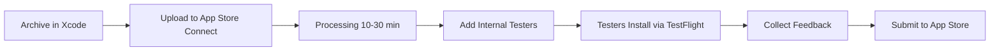

# tvOS App Store - Quick Reference

## 📱 Current Status

✅ **Build:** Ready for upload
✅ **Screenshots:** 3/10 (minimum met)
✅ **Metadata:** Configured
✅ **Certificates:** Valid

## 🚀 Quick Upload (3 Steps)

### Option A: Via Xcode (Easiest)

```bash
# 1. Open workspace
cd tvos-app
open tvos/BayitPlusTVOS.xcworkspace

# 2. In Xcode:
#    - Select "Any tvOS Device (arm64)"
#    - Product → Archive
#    - Distribute App → App Store Connect → Upload

# 3. Wait for processing in App Store Connect
```

### Option B: Add More Screenshots First

```bash
# Navigate to each section in simulator, then:
./scripts/capture-screenshot.sh vod
./scripts/capture-screenshot.sh radio
./scripts/capture-screenshot.sh podcasts
./scripts/capture-screenshot.sh search
```

## 📊 What You Have

| Item | Status | Location |
|------|--------|----------|
| **Build** | ✅ Ready | Xcode → Archive |
| **Bundle ID** | ✅ tv.bayit.plus.tv | Configured |
| **Version** | ✅ 1.0 (1) | Can increment |
| **Certificates** | ✅ Valid | Keychain |
| **Screenshots** | ✅ 3 images | `fastlane/screenshots/en-US/` |
| **Description** | ✅ Ready | `fastlane/metadata/en-US/description.txt` |
| **Keywords** | ✅ Ready | `fastlane/metadata/en-US/keywords.txt` |

## 🎯 TestFlight Workflow



## 📝 App Store Connect To-Do

After uploading build:

- [ ] Create app in App Store Connect (if not exists)
- [ ] Upload 3 screenshots (already have them)
- [ ] Add app description (from `description.txt`)
- [ ] Add keywords (from `keywords.txt`)
- [ ] Set age rating (likely 12+ or 17+)
- [ ] Configure privacy settings
- [ ] Add privacy policy URL
- [ ] Set pricing (Free or Paid)
- [ ] Add internal testers for TestFlight
- [ ] Submit for review

## 🔧 Common Commands

```bash
# Archive via Xcode
open tvos/BayitPlusTVOS.xcworkspace
# Then: Product → Archive

# Capture additional screenshots
./scripts/capture-screenshot.sh [section-name]

# Increment build number
agvtool next-version -all

# View current screenshots
ls -lh fastlane/screenshots/en-US/

# Check app status
open https://appstoreconnect.apple.com
```

## 📞 Need Help?

See detailed guides:
- **Upload Process:** [APPSTORE_UPLOAD_GUIDE.md](APPSTORE_UPLOAD_GUIDE.md)
- **Physical Testing:** [PHYSICAL_DEVICE_TESTING_GUIDE.md](PHYSICAL_DEVICE_TESTING_GUIDE.md)
- **Test Checklist:** [TEST_CHECKLIST.md](TEST_CHECKLIST.md)

## ⏭️ What's Next?

**Right Now:**
1. Upload build to App Store Connect via Xcode
2. Configure app in App Store Connect
3. Add TestFlight internal testers
4. Collect feedback

**Later:**
- Physical device testing via TestFlight
- Add more screenshots (optional, already have minimum 3)
- Final submission to App Store

---

**Ready to upload!** 🚀
